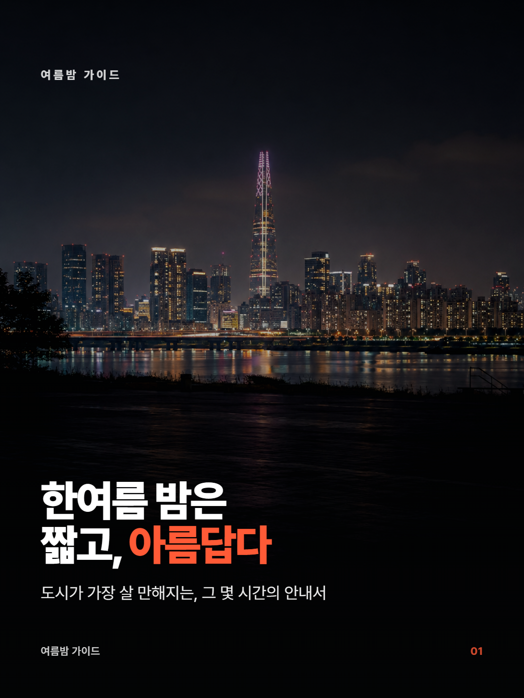
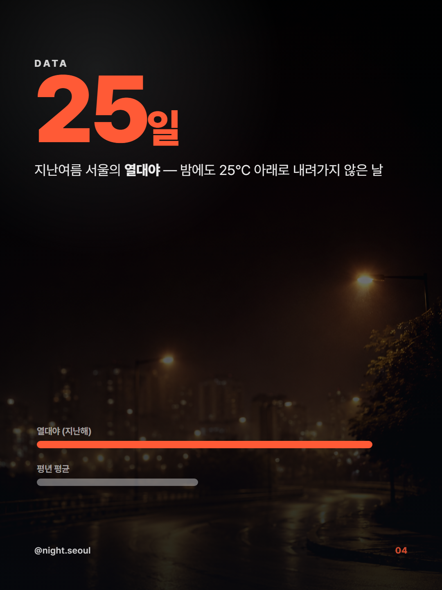
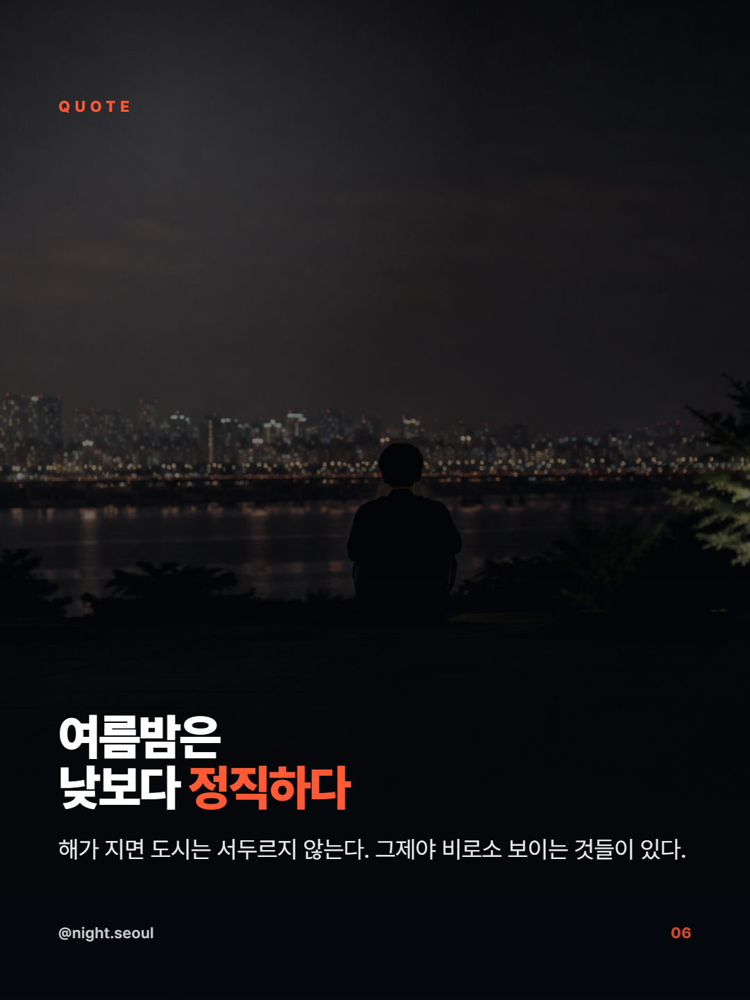

# Card-News — 인스타그램 사진 카드뉴스 (insta-cardnews)

카드 한 장마다 **전용 AI 사진 1장 + 가독성 필터 1겹**을 씌워 만드는 **1080×1440 (3:4 세로) 인스타그램 카드뉴스** 제작 **스킬**과 **예시**.

`raw-5-html`의 **정반대**입니다. 이미지 5장을 재사용하는 대신, **카드마다 목적에 맞는 사진 1장**을 만들고 `wash / tone / blend / material` 같은 **필터 한 겹**만 얹어 한글 텍스트가 또렷하게 읽히게 합니다. 모든 글자·숫자·차트는 여전히 **HTML/SVG**(이미지에 굽지 않음).

## Showcase — "한여름 밤을 즐기는 법" (8장, Dark Wash 프리셋)

<p align="center">
  
  
  
</p>

▶ **모바일 라이브 데모 (한 장씩 스와이프):**
https://laguna821.github.io/Achmage-Skills/Card-News/insta-cardnews/examples/summer-night/cardnews-proof.html

폰으로 열면 카드가 **한 장씩 화면을 꽉 채우며 스냅**됩니다. (자리표시 그라데이션 예제: [placeholder-proof.html](https://laguna821.github.io/Achmage-Skills/Card-News/insta-cardnews/examples/placeholder-proof.html))

## 두 가지 결과물 (한 번의 빌드)

1. **인스타 카세로셀** — [`examples/summer-night/export/`](insta-cardnews/examples/summer-night/export) 의 카드별 **1080×1440 PNG**. 순서대로 업로드하면 끝.
2. **모바일 HTML 링크** — `cardnews-proof.html` = **반응형 뷰어**(한 장씩 스냅). GitHub Pages / 정적 호스팅에 올려 링크로 뿌립니다.

> 두 결과물이 **같은 파일**에서 나옵니다 — 반응형 래퍼(`.slide`/`.frame` + 스크립트 + `<meta viewport>`)는 PNG export 시 자동 제거되어 export는 정확히 1080×1440로 나옵니다.

## 핵심 방법론

> **이미지는 재료이고, HTML은 진실이다.** (raw5 계보)

- 카드 = **[전면 사진]** × **[필터 1개]** × **[HTML/SVG 텍스트]**.
- **3 프리셋**: **A · Dark Wash**(다크·임팩트) / **B · Brand Tone**(브랜드색) / **C · Light Editorial**(밝은 매거진). 프리셋 하나로 시리즈 전체를 통일하고, **하나의 LUT**를 모든 사진에 적용해 20장의 서로 다른 사진이 **한 세트**처럼 보이게 합니다.
- 도형/프레임 크롭 계열은 **뺐습니다** — 사진 위에 얹는 **필터 오버레이 계열만**: `wash` · `tone` · `blend` · `dark-wash` · `material-image-card` (+ `luma-mask` · `blend-if` · `halftone` · `paper-grain` · `LUT`).

## 3단계 워크플로우 (Stage 2는 HARD STOP)

1. **카드 플랜** — 주제 · 청중 · 카드 수(≤20) · 프리셋 인터뷰 → 카드별 `message` 표(카드마다 실어 나를 한 문장).
2. **카드 이미지 프롬프트 (HARD STOP)** — 카드마다 **세로 이미지 프롬프트**를 emit하고 **멈춤**. GPT image 2는 한 번에 10장까지 만들 수 있어 **10장 배치**로 끊어 줍니다. 사용자가 생성해 `cards/`에 `card01.png…` 저장 → `"HTML로 진행"`.
3. **빌드 + Export** — proof.html 빌드 → DOM-eval QA → `export-cards.ps1`로 카드별 1080×1440 PNG.

## 🚀 설치 (Installation)

설치 후엔 **"인스타 카드뉴스 만들어줘 / 카드뉴스 만들어줘"** 라고 요청하면 `SKILL.md` description으로 자동 로드됩니다.

```bash
# 방법 A — npx (가장 간단)
npx skills add laguna821/Achmage-Skills
```

```text
# 방법 B — 플러그인 마켓플레이스
/plugin marketplace add laguna821/Achmage-Skills
/plugin install insta-cardnews@achmage-skills
```

```bash
# 방법 C — 수동 복사
git clone https://github.com/laguna821/Achmage-Skills
cp -r Achmage-Skills/Card-News/insta-cardnews ~/.claude/skills/insta-cardnews
```

## 🖨 PNG Export (Windows + Chrome)

```powershell
./export-cards.ps1 -Proof examples/summer-night/cardnews-proof.html
# → examples/summer-night/export/card01~08.png (각 1080×1440). Chrome(또는 Edge) 필요.
```

각 `.card`를 1080×1440 단일 문서로 떼어내 헤드리스 Chrome으로 스크린샷합니다. 입력 사진은 `cards/`, 최종 카드는 `export/` — 이름 충돌 없음.

## 📁 폴더

| 경로 | 내용 |
|---|---|
| `insta-cardnews/SKILL.md` | 역할 + 3단계 워크플로우 + 불변식(가독성/단일 액센트/≥70% 채움/세이프존/backdrop-filter 금지) |
| `insta-cardnews/references/` (6) | card-planner · image-prompts · filter-presets · card-runtime-css · export-and-qa · master-prompts |
| `insta-cardnews/export-cards.ps1` | 카드별 1080×1440 PNG export 러너 |
| `insta-cardnews/examples/placeholder-proof.html` | 그라데이션 자리표시 예제(자체완결, 가벼움) |
| `insta-cardnews/examples/summer-night/` | 실사 8장 예제 — `cardnews-proof.html` + `cards/`(원본 사진) + `export/`(최종 카드) |

## 라이선스 / 크레딧

- **License**: Apache-2.0 (repo 루트 `LICENSE`)
- **방법론 · 프리셋**: 안창현 (Achmage). raw5 "이미지는 재료, HTML은 진실" 철학 계승.
