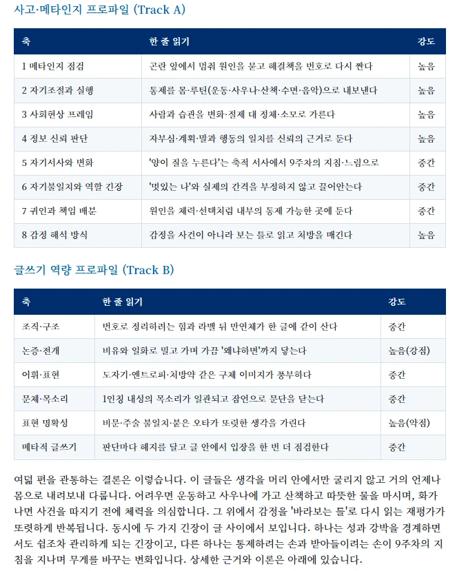
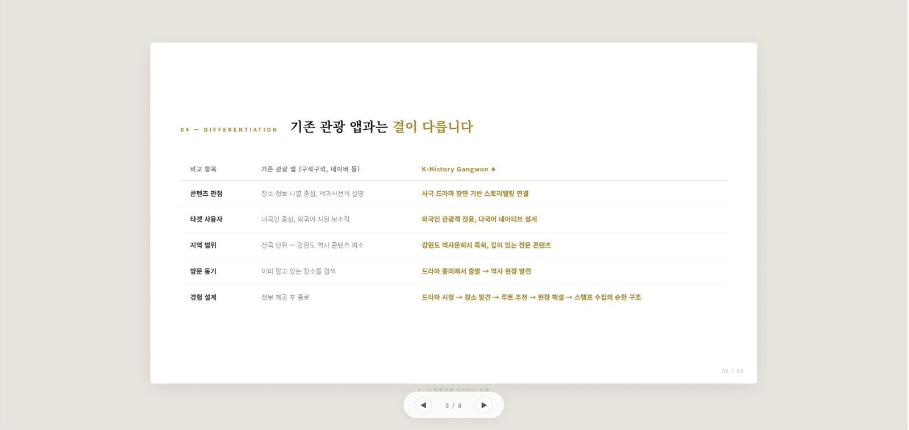
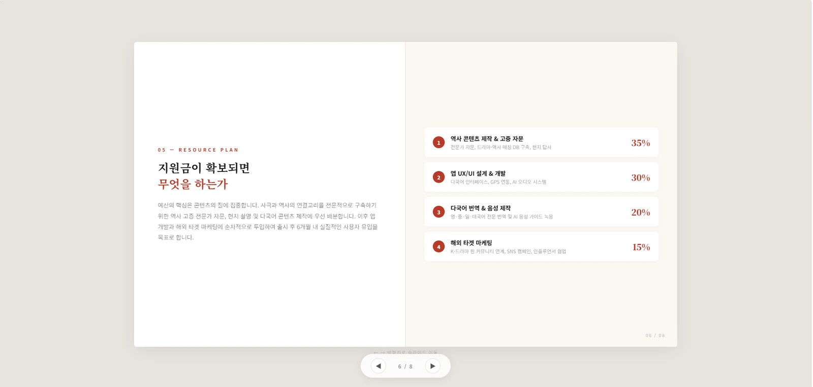

# Prescription — Educational Harness Engineering (실전 3호)

> `component-consulting-v3` **v3.4.0** · 코퍼스 3.0.0 (2026-08-28 빌드)
> 실행일 2026-08-29 · 산출 폴더 `60_Operational/output/educational-harness-engineering-web/`
> 원고 정본(Mode A): `Achmage/40. Meaning (M)/402. Teaching Materials/Educational Harness Engineering - AI 시대, 학생들의 꼼수에 강한 수업·평가를 설계하는 법 (미디어스쿨 하계 워크숍 7-6-2026).md`
> 보조 원고: 같은 폴더 `Educational-Harness-Engineering_자료정리모음_2026-07-06.md`
> 회귀 관측: `HARNESS-FRICTION-LOG.md` (F25~)

---

## 1. Consulting Brief

```
THESIS:    학생의 꼼수는 학생의 윤리 문제가 아니라 평가 설계의 실패다 —
           탐지도 금지도 이미 파산한 지금, 남은 답은 AI를 써도 자기 사고
           없이는 통과할 수 없게 만드는 '설계'다.
READER:    타 대학 교수자·교육 관계자. 동료가 보낸 링크나 검색으로 당도,
           데스크톱, "또 AI 시대 교육 얘기" 냉소를 안고 8–12초 안에
           "이 사람 실제로 해봤나"를 판정한다.
GENRE:     선언(매니페스토) × 증거보고(report/evidence) 하이브리드 —
           충돌 시 **증거가 이긴다**. 경험 부채: 닫을 때 독자는 자기
           다음 학기 과제 하나를 떠올리고 "이건 어떻게 뚫리지?"를
           스스로 물을 수 있게 된다.
GROUNDING: RICH  (장면·유물 ✓ / 실수치 ✓ / 스탠스 ✓ — 아래 소재 분류표)
TOKENS:    none — derive & emit (Step 2, `DESIGN.md` 본 폴더에 산출)
DELIVER:   live frontend  ·  HOUSE SYSTEM: none
CORPUS:    3.0.0
```

**추론으로 채운 항목(질문 상한 ≤5 준수 — 특히 이 줄을 veto 하십시오)**

- **CTA/후속 행동**: 판매물·등록·전환이 없는 페이지다. 따라서 정직한
  닫음은 "무엇을 신청하라"가 아니라 **독자가 가져갈 5가지 설계 질문**
  (보조 원고 Part 7) + **출처 인벤토리 접근**으로 잡았다. 실제 후속
  행동(워크숍 문의·자료 요청·연락처)이 있다면 이 줄이 바뀐다 —
  fit-rubric C2(backend honesty)상 **작동하지 않는 CTA 는 처방하지
  않는다**.
- **다크 스킴**: 미정으로 두고 Step 2 에서 결정한다. 만들면 활성 경로
  (토글 또는 `prefers-color-scheme`)까지 배선하고, 안 만들면 다크 토큰을
  emit 하지 않는다 (F21 반영분).

---

## 1.5 소재 분류표 (provenance × 시제) — Mode A 첫 실전 적용

> ①열 독법 주석: 분류표 ①은 "현재 **상품** 사실"로 쓰여 있으나 이 페이지는
> 파는 것이 없다. **"페이지가 지금 단언하는 대상(= 방법론 자체)에 대해 참인
> 것"**으로 읽었다 — 근거와 한계는 friction log **F25**.

### ① 현재 사실 — 방법론 자체에 대해 지금 참인 것 *(페이지가 단언할 수 있는 유일한 조건)*

| 소재 | 출처 위치 |
|---|---|
| EHE 정의 — 학생이 어떻게 평가를 깨뜨릴지 먼저 모델링 → 우회로를 좁힘 → 사고의 증거가 남도록 과제·기록·평가를 하나의 장치로 묶음 | 보조 Part 2.4 |
| Prompt → Context → Harness 의 진화 (구체화 = 제약 명시 = 하네스) | 정본 3.1 |
| 설계 원리 A(Input Design) / B(Output Evaluation) / C(Core) | 정본 5.5 |
| 독자가 가져갈 5가지 설계 질문 | 보조 Part 7 |
| **미확정 → 플레이스홀더로 가시화**: 후속 행동(CTA)의 실체 | — |

### ② 저자 이력 — I12(에토스) 격리 · **I2 로 세탁 금지**

| 소재 | 실수치 |
|---|---|
| 2026-07-06 미디어스쿨 하계 워크숍 **실제 진행** (`.hwpx` 배포본 동반) | 이력 단언 가능 |
| AI활용조사방법론 2026-1 운영 실적 | In-class 글쓰기 **8회** · 매일쓰기 **21일(6/1–6/21)** · 메타인지 리포트 **1회(6/12)** · **90% 이상**이 자기 사고 취약점을 스스로 설명 (기말 자필 기준) · 전원 eye-contact 구술 |
| AI-DGD 2026-1 운영 실적 | HTML PPT 기말 · 작업로그 미제출 **50% 즉시 감점** · 평균 채점 **5분 미만** |
| 소크라테스 문답 축어록 (교수자–학생) | 정본 4.1 |
| 교수자 채점 코멘트 4종 ("앱인데 앱 시안이 없어요?" 외) | 정본 5.4 |

**사용 규칙**: 반드시 **"안창현의 2026-1 수업에서"** 라는 주어를 달고 쓴다.
"이 방법론을 쓰면 90%가 메타인지를 얻는다"는 ②→I2 세탁이며 설득 장르에서
블로킹이다. 정직한 서술은 "안창현의 2026-1 수업에서 90% 이상이 …".

### ③ 논증 재료 — 시제 중립, 비트 move 재료로 자유 사용

| 묶음 | 핵심 수치·사실 |
|---|---|
| **사용 실태** | HEPI 2026(Report 199, n=1,054): 학업 AI 활용 **66%(2024) → 92% → 95%**; 유형 — 텍스트 생성 56 / 요약 38 / 교정 37 / 번역 31 / 이미지 22% · KRIVET 2024(n=726): 자료검색 **91.7%**, **60.2%** 가 사고력 저하 우려 · Turnitin 실측 2억 건 중 **2,200만 건 20%+**, **600만 건 80%+** |
| **집단적 부정 (예측 가능성)** | 연세대 비대면 중간고사 — 응답 **387명 중 211명 "커닝했다"** (2025-10) · 고려대 **1,400명** 강의, 카톡 오픈채팅 **약 500명** 문제·정답 공유 → 전면 무효화 (2025-10) · 영국: 셰필드 **6→92건(15배)**, 글래스고 36→130건, 131개 대학 **약 7,000건** |
| **탐지의 파산** | OpenAI Text Classifier **2023-07-20 폐기** (정탐 26% / 오탐 9%) · Liang et al. 2023 *Patterns*: 비원어민 TOEFL 에세이 오탐 **61.3%**, 입학 에세이 **70.0%**, 논문 초록 **43.9%**; 프롬프트 한 줄로 탐지율 **11.3% / 3.3% / 19.1%** 로 급락; 8학년 원어민 오탐 **5.1% → 56.9%** · Hadra, Cambridge & Mesbah 2026: Turnitin **32%**, Originality **37%**, 이공계 **49% / 42%** (인문 86 / 96%) · Vanderbilt: 1% 오탐 × 75,000편 = **약 750편** 오표시 → 비활성화 · Ardito 2024: 표절탐지(원본 대조) vs AI 탐지(독립 검증 수단 없음) + Alice/Bob 사고실험 |
| **학술 좌표** | Schneier 2008 Security Mindset(공격자처럼 생각하라) · Dawson 2016 *BJET*: BYOD 전자시험 **5개 공격 중 4개 실제 작동** · Dawson 2020 *Defending Assessment Security* · test/agent harness = 공학 기성 용어 |
| **왜 상위 인지인가** | Gerlich 2025 *Societies*(n=666): AI 사용 ↔ 비판적 사고 음의 상관, 인지적 오프로딩 매개 · Lee et al. CHI 2025(n=319): AI 신뢰↑ → 비판적 사고↓ · Fan et al. *BJET* 2025(n=117) RCT: ChatGPT 집단 **점수는 최대 향상, 지식 습득·전이는 유의차 없음** → "메타인지적 게으름" · 블룸 역전 (Rivers & Holland 2023) |
| **기관 합의** | TEQSA(Lodge et al. 2023) · QAA 2023 · Russell Group 2023 · UNESCO 2023 · van der Vleuten 2014 programmatic assessment(평가 시점 ≠ 결정 시점) |
| **회수 장치** | Sydney two-lane(Liu & Bridgeman 2023) · AIAS 5단계(Perkins et al. 2024) · U of T 12면체 주사위 구술 · Sotiriadou 2020 · Villarroel 2018 authentic 3차원 |
| **현장이 이미 과정을 채점한다** | SK AX AI역량인증(KBS 2026-06-01): 20년차 기자 B, 9년차 A, **S 등급 없음** · Northwestern GAIN: *interaction traces*(inputs·tool calls·outputs·인간 개입 시점) 제출 요구 · Nature 2025-05-14(연구자 약 5,000명): 프롬프트 공개 요구 **20–42%** |
| **학생 목소리 (언론 보도, 출처 표기 조건)** | 한국대학신문 2026-01-31 — 이 씨(20, 고려대 철학): "글쓰기 연습 왜 해요?" · 정 씨(26, 경북대 경제): "쉽게 해결하지만 나 자신은 그대로" · 배 씨(25, 단국대 정외): "사고 방식이 단순화된 기분" |

### ④ 사용 금지 / 조건부 — `fabricated_experience` 사전 차단 목록 (빌드까지 전파)

| 소재 | 판정 |
|---|---|
| 학생 결과물 — 기말 인용문 **학생A–D**(익명), AI 메타인지 리포트 예시화면 4장, AI-DGD 기말 결과물 화면 2장 | **저자 명시 승인(2026-08-29) → ③으로 승격.** 조건: **익명 유지**(실명·학번·식별정보 0), 원고에 실린 범위를 초과하지 않음. 근거·한계는 **F28** |
| ⚠️ 원문 대조 미완 인용 — Krathwohl 2002(재인용) · Schoonover 2026(Opinion) · Jonathan & Walsh 2025(초록이 'preliminary' 로 규정) · TEQSA 부차 수치(전문가 18명·다운로드 1만회) | **금지 유지.** 저자 승인은 *귀속*을 풀 수 있어도 *검증*을 풀지 못한다 — 페이지가 단언하지 않는다 (F28) |
| HEPI **2025 Policy Note 61** 계열 (과제용 53%→88%, n=1,041) | **미채택.** 정본이 채택한 2026 Report 199 계열(66→92→95, n=1,054)과 **별개 조사**다. 두 계열 혼재 = 수치 오염 (F27) |
| 보조 원고의 사례 연도 표기 "(아시아경제, 2024)" "(시사저널, 2024)" | **정본 우선 — 2025-10 확정.** 보조가 인용한 URL 자체가 2025-11-10 기사다 (F27) |
| 원고 이미지 전량이 `pub-…r2.dev` CDN **핫링크** | **회수 완료 (2026-08-29, 사용자 다운로드 승인).** airlock(비-Dropbox 임시 경로)에 6장 수신 → 멀티모달 검수 → 3장만 `assets/images/` 로 승격. 원본 CDN 링크는 페이지에서 미사용 |

**승인 자산 선별 기록 (④→③ 승격분의 실제 집행)**

승인은 "원고 그대로 전부"였으나, **워크숍 강의실 → 외부 공개 웹**이라는
지면 변경을 고려해 6장 중 3장만 채택했다. 선별은 처방 범위 안의 판단이며
(BEAT 9 는 리포트 화면 **1장**을 요구한다), 근거를 남긴다.

| 원본 | 내용 | 판정 |
|---|---|---|
| `report-b` → **`report-sample.webp`** | Track A 사고·메타인지 8축 + Track B 글쓰기 6축 프로파일, 축별 강도 | **채택** — BEAT 9 캡션의 주장("사고 8축 + 글쓰기 5축")과 화면이 정확히 일치. 학생 본문 축어 인용 없음, 해석 요약만 |
| `dgd-1` → **`dgd-final-1.webp`** | 학생 HTML PPT 5/8 — 기존 앱과의 차별화 비교표 | **채택** — 익명(이름·학번 0) |
| `dgd-2` → **`dgd-final-2.webp`** | 학생 HTML PPT 6/8 — "지원금이 확보되면 무엇을 하는가" 예산 배분 | **채택** — 익명. **교수자 채점 코멘트("왜 지원금을 받으면 개발을 그때부터 하겠다는 사람에게 예산을 줘야 하는가?")가 겨냥한 바로 그 슬라이드**라 유물과 비평이 한 지면에서 마주 본다 |
| `report-a` | Zone 1 요약표(8발견 × 주차 × 근거강도 × 이론) | 미채택 — report-b 와 기능 중복, BEAT 9 는 1장만 요구 |
| `report-c` | Zone 3 글쓰기 역량 — **학생 본문 축어 인용 다수** (사생활 성격의 서술 포함) | **미채택 (판단 기록).** 실명은 없어 ④열의 문자적 조건("동의 없는 실명")은 충족하나, 폐쇄된 워크숍 지면과 **공개 웹**은 다른 노출이다. 기능적으로도 불필요 — 메커니즘 증명은 report-b 가 이미 한다 |
| `report-d` | Zone 3 후반 | 미채택 — 동상 |

**Verdict: RICH** — 장면/유물(소크라테스 축어록·채점 코멘트·학생 인용·리포트 화면),
실수치(HEPI 95% · 211/387 · 61.3% · 5분 미만 · 90% 이상), 명시된 스탠스
("AI를 막지 마십시오. AI를 써도 '생각' 없이는 통과 못 하게 설계하십시오.")
3요소 모두 충족. **Full page allowed.**

---

## 2. Page-as-Text verdict

### R1 — 독자 (읽는 자세)

이 독자는 **한 학기를 이미 AI에 뺏겨본 교수자**다. 대개 동료가 카카오톡이나
메일로 보낸 링크를 **폰에서** 먼저 열고(한국 대학의 공유 경로가 그렇다), 나중에
연구실 데스크톱에서 다시 연다 — 그래서 이 페이지의 1차 도착 폭은 375 이고
데스크톱은 재열람 폭이다. 그는 이미 "AI 때문에 평가가 망가졌다"를 **믿고 있다**;
그러므로 그것을 다시 증명하는 페이지는 그의 시간을 훔친다. 그가 아직 믿지 않는
것은 **책임의 위치**다. 그는 형성평가·루브릭·블룸·표절을 안다 — 여기에 설명을
붙이면 모욕이고, 반대로 프롬프트/컨텍스트 엔지니어링·하네스·공격면·위협 모델링은
가르쳐야 할 새 어휘다. 그가 페이지를 떠나는 이유는 정확히 다섯 가지다: ①첫 화면이
"AI 시대가 왔습니다" 일반론일 때 ②수치 없이 훈계할 때 ③"이 사람도 실제로는 안
해봤구나" ④그라데이션 히어로 + 3열 기능 카드의 템플릿 냄새 ⑤판매 냄새. 그는
**8–12초** 안에 "이 사람 실제로 해봤나"를 판정하고, 냉소가 기본값이다 — "또 AI 시대
교육 얘기겠지"를 이미 여러 번 읽었기 때문이다.

### R2 — 장르와 경험 부채

내 말로 먼저: 이 페이지는 **"동료 교수에게 보내는, 근거로 무장한 설계 전향
권고문"**이다. `genre-map` 의 가까운 행은 **선언/매니페스토**(주) ×
**보고/증거**(증거 척추), 그리고 마지막에 실행 도구를 쥐여주는 **강의/튜토리얼의
꼬리**.

**충돌 시 이기는 계약 = 증거(report).** 근거: R1 의 이탈 사유 1·2위가
"근거 없는 훈계"다. 매니페스토의 전형적 실패는 hedging 이고 보고서의 전형적
실패는 *decorating evidence* 인데, **이 독자에게는 후자가 더 치명적이다** —
데이터를 장식하면 신뢰가 죽고, 신뢰가 죽으면 선언도 함께 죽는다. 그래서 이
페이지에서 **선언은 증거가 벌어들인 신뢰 위에서만 발화한다**. 이 판정은 비트
순서에 그대로 새겨진다 (증거 비트 2–5 → 선언 정점 8).

**경험 부채**: *"When this reader closes the tab, they should now **be able to**
자기 다음 학기 과제 하나를 떠올리고 '이건 어떻게 뚫리지?'를 스스로 묻고, 그
답을 자기 설계에 반영할 **첫 수(手)를 안다**."*
— 부채는 두 겹이다: (a) 질문이 물어질 수 있게 되는 것(태도), (b) 내일 쓸 첫
수가 손에 남는 것(실행). **둘 다 지급해야 계약이 끝난다.**

### R3a — 읽기 계약

- **첫 화면의 약속**: "당신의 평가는 이미 뚫려 있다 — 어떻게 뚫리는지, 그리고
  무엇을 하면 되는지 끝까지 말하겠다."
- **지급 비트**: 중간 증거 비트들이 **분납**이고, **BEAT 13(5가지 설계 질문)이
  최종 정산**이다. BEAT 14 는 정산 후의 서명(인용 가능한 한 문장).

---

## 3. Beat Map

| # | Beat | Move (breaks-test 요약) | Intent | Mass | raw # | 씬 기법 | SIG |
|---|---|---|---|---|---|---|---|
| 1 | 프레임 전환 | assert — "왜 학생이 꼼수를 쓰나"가 아니라 **"왜 이 평가는 그렇게 쉽게 뚫렸나"**. 없으면 통계로 시작해 "알아, 그래서?"로 이탈 | I1 | full-bleed | raw-1 | *Step 3.5* | |
| 2 | 이미 기본값이다 | ground — HEPI 66→92→**95%**, KRIVET 91.7%, Turnitin 2억/2,200만/600만. 없으면 비트 1 이 의견으로 남음 | I2 | wide | — | — | |
| 3 | 일탈이 아니라 다수 | scene+ground — 연세대 **387명 중 211명**, 고려대 1,400명 강의 · 오픈채팅 500명. 없으면 "설계 실패" 주장의 전제(예측 가능성)가 무너짐 | I2 | full-bleed | raw-2 | *Step 3.5* | |
| 4 | "탐지기 쓰면 되잖아" | preempt — OpenAI 자기 폐기(26/9%), Liang 61.3·70.0·43.9%, Hadra 32·37%·이공계 49%, Vanderbilt 750편. 없으면 페이지가 "그래서 탐지기 사라"로 오독됨 | I4 | content | — | — | |
| 5 | 세 갈래, 남는 답 하나 | compare+verdict — 금지형/탐지형/방임형 소거. 없으면 '설계'가 여러 대안 중 하나로 보임 (**소거법이 이 페이지의 논증 엔진**) | I5 | wide | — | — | |
| 6 | Prompt → Context → Harness | teach — 구체화 = 제약 명시 = 하네스. 없으면 페이지 제목이 미해명으로 남음 | I6 | full-bleed | raw-3? | *Step 3.5* | |
| 7 | 공격자처럼 생각하라 | testify — Schneier 2008 원문 + Dawson 2016(**5개 중 4개 작동**)·2020. 없으면 '하네스'가 저자 자작 유행어로 읽혀 학술 독자를 잃음 | I3 | content | — | — | |
| **8** | **마인드를 바꾸셔야 합니다** | **assert with mass — 책임의 이전(학생 탓 → 설계 탓). 비트 2–7 이 규모·예측가능성·탐지파산·소거법·개념·학술좌표를 모두 지급한 뒤라야 독자가 방어 없이 받는다. 첫 화면에 놓으면 이탈, 여기 놓으면 승복. 없으면 페이지는 정보 정리물로 끝남** | **I1** | **full-bleed** | **raw-4** | ***Step 3.5*** | **★** |
| 9 | 해봤다 ① 조사방법론 | scene — 소크라테스 축어록 · 주차별 자기서사 주제표 · 21일 챌린지 · 메타인지 2-track. 없으면 비트 8 이 훈계로 남음 (**실행 증거가 선언의 담보**) | I9 | wide | raw-5 | *Step 3.5* | |
| 10 | 학생의 언어 | testify — 학생A–D 인용("간파당한 느낌", "'굉장히'를 지웠다"). 없으면 성과가 저자 1인 증언에 머묾 | I3 | content | — | — | |
| 11 | 해봤다 ② AI-DGD | ground+compare — 작업로그 **50% 감점**, 8개 심사질문, 좋은/나쁜 주제 대조, 채점 코멘트, **평균 5분 미만**. 없으면 "문과 글쓰기 특수해"로 기각됨 | I2 | wide | — | — | |
| 12 | 내 취향이 아니다 | ground — TEQSA·QAA·Russell Group·UNESCO·Sydney two-lane·AIAS + SK AX(S등급 0)·Northwestern traces·Nature. 없으면 방법론이 1인 사례로 축소됨 | I2 | content | — | — | |
| 13 | 5가지 설계 질문 | guide — **계약의 최종 정산**. 없으면 경험 부채 (b)절반(첫 수)이 미지급 → 계약 파기 | I6 | wide | — | — | |
| 14 | AI를 막지 마십시오 | close — 독자가 **인용할 수 있는 한 문장**을 남긴다 (매니페스토 계약). 없으면 페이지가 체크리스트로 끝나 선언이 실무문서로 강등 | I11 | full-bleed | raw-1 재사용 | *수미상관* | |
| 15 | 출처 인벤토리 | aside — 접힘 기본. report 계약의 provenance trail 지급 + ⚠️ 미검증 항목의 정직한 표시. 없으면 학술 독자의 검증 경로가 없음 | I8 | satellite | — | — | |

**기법 시퀀스**: Step 3.5 에서 확정 (동일 기법 3연속 금지 · SIGNATURE 기법 유일).
**질량 리듬**: `fb · w · fb · c · w · fb · c · fb★ · w · c · w · c · w · fb · sat`
— 인접 동일 tier 0, 동일 tier 3연속 0.

### 이 Beat Map 이 템플릿이 아님을 보이는 세 지점

1. **히어로에 최강 문장을 두지 않았다.** 원고의 최강 선언("마인드를 바꾸셔야
   합니다")은 평균-AI 라면 첫 화면 히어로다. 여기서는 **8번**이다 — R1 의 독자는
   근거 없는 훈계에서 이탈하고, 고발은 증거로 자격을 벌어야 발화되기 때문이다.
   원고 자신의 순서(§1–2 실측 → 선언 블록)가 이 판단을 지지한다.
2. **반론이 FAQ 하단에 있지 않다.** "탐지기 쓰면 되잖아"(4)는 독자가 비트 3 에서
   부정의 규모를 인정한 **바로 그 순간** 떠올리는 생각이므로 그 자리에 둔다.
3. **사례가 하나가 아니라 둘이고, 둘째는 전혀 다른 과목이다.** 비트 9(글쓰기)만
   있으면 "문과 특수"로 기각된다 — 비트 11(그래픽 디자인)은 장식이 아니라
   **일반화 가능성의 지급**이다.

### Beat Map 확정판 (Step 3·3.5 반영 — 질량·씬 배정 후)

| # | Beat | Intent | Mass | 컴포넌트 (type) | raw | 기법 | 밝기 | SIG |
|---|---|---|---|---|---|---|---|---|
| 1 | 프레임 전환 | I1 | full-bleed | hero | 01 | cover | D | |
| 2 | 이미 기본값이다 | I2 | wide | stats | — | — | L | |
| 3 | 일탈이 아니라 다수 | I2 | full-bleed | content | 02 | tone | D | |
| 4 | "탐지기 쓰면 되잖아" | I4 | content | faq | 03 | wash | L | |
| 5 | 세 갈래, 남는 답 하나 | I5 | wide | comparator | 04 | cut | M | |
| 6 | Prompt → Context → Harness | I6 | full-bleed | terminal(code-block) | 03↺ | behind-image | L | |
| 7 | 공격자처럼 생각하라 | I3 | content | testimonials | 07 | luma | M | |
| **8** | **마인드를 바꾸셔야 합니다** | **I1** | **full-bleed** | **composed[reveal-text × pattern]** | **05** | **neon** | **D** | **★** |
| 9 | 해봤다 ① 조사방법론 | I9 | wide | features | 06 | crop-shape | L | |
| 10 | 학생의 언어 | I3 | full-bleed | testimonials | 08 | card-window | M | |
| 11 | 해봤다 ② AI-DGD | I2 | wide | content | 07↺ | luma | L | |
| 12 | 내 취향이 아니다 | I2 | content | logo-cloud | — | — | L | |
| 13 | 5가지 설계 질문 | I6 | wide | stepper | 02↺ | wash(.12) | M | |
| 14 | AI를 막지 마십시오 | I11 | full-bleed | cta | 01↺ | horizon | D | |
| 15 | 출처 인벤토리 | I8 | satellite | faq | — | — | L | |

**다양성 가드 (component-type × mass-tier 무중복)** — 15쌍 전부 고유:
`hero×fb · stats×w · content×fb · faq×c · comparator×w · terminal×fb ·
testimonials×c · composed×fb · features×w · testimonials×fb · content×w ·
logo-cloud×c · stepper×w · cta×fb · faq×sat`
(`content` 3회·`testimonials` 2회·`faq` 2회가 등장하나 **전부 다른 tier** —
type×tier 쌍은 중복 0.)

**질량 리듬**: `fb · w · fb · c · w · fb · c · fb★ · w · fb · w · c · w · fb · sat`
— 인접 동일 tier 0 · 동일 tier 3연속 0.

---

## 4. Token Constraint Card

`DESIGN.md` (본 폴더, 경로 C 도출분) 을 **소비**한다. 이 카드 밖의 값을
발명하면 위반이다.

| 축 | 제약 |
|---|---|
| **키 (10%)** | `{colors.key}` `#0B7C87` 단일 teal 계열. 자리는 **수치 · 인용 규칙선 · 활성/포커스 · 링크** 넷뿐. 배경을 물들이지 않는다 |
| **명도 사다리** | `key-900 #04343A` / `key-700 #0A6069` / `key #0B7C87` / `key-300 #7FBFC6` / `key-050 #E8F3F4` |
| **중립 (키 쪽 틴트)** | `paper #FBFCFC` · `paper-2 #F1F5F5` · `ink #0E1719` · `pencil #3A4A4D` · `faint #66787C` · `border #DDE6E7` · `border-hard #B9C7C9` |
| **어두운 지면 대응색** | `onink-strong/body/soft/line/key` |
| **다크 스킴** | `dk-*` 10종 — **활성 경로(토글 + `prefers-color-scheme`) 배선 의무** |
| **판정색** | **없음.** `judgment-*` 네임스페이스를 만들지 않는다 (V2 L5). ⚠️ 미검증 표시는 `faint` + 점선 하단선 |
| **타입 역할** | `display / headline / title / body / body-strong / label / caption / figures` — 8역할. 크기는 **역할을 통해서만** 받는다 |
| **패밀리** | **`Asta Sans` 단일** (OFL, 42dot, `wght 300–800` 가변). 무게 **400 / 600 / 800 3종** |
| **사다리** | 비율 1.250, base 17px → `13.6 / 17 / 21.25 / 26.56 / 33.20 / 41.50 / 51.88 / 64.85`. **사다리 밖 크기 = NO-GO** |
| **폭 (G1 폐집합)** | `wide 1240` / `content 900` / `prose 720` / `satellite 560`. **임의 폭 = NO-GO** |
| **spacing unit** | 4px · gutter `clamp(20px, 5vw, 48px)` |
| **radius** | `none 0` (기본) / `sm 2` / `md 6` / `pill 999` — 4종뿐 |
| **elevation** | **보더 온리. `box-shadow` 0** (포커스 링 제외). 깊이는 지면 밝기 교대로 |
| **`components:` 선결** | `section`(100svh) · `rule` · `stat-figure` · `stat-unit` · `quote-frame` · `source-tag` · `verdict-cell` · `fold` — 이미 정해진 것을 다시 정하지 않는다 |

**un-remappable 사망 판정**: 그라디언트 지면·글래스·네온 글로우·소프트
섀도를 **구조적으로** 요구하는 후보는 여기서 죽는다. 실제 사망 3건은
§5 각 비트의 REJECTED 항목에 기록.

---

## 5. Per-Beat Recommendations

> **STUB 표기 규약 (압축 아님 — 명시적 선언)**: 이 빌드의 타깃은 **정적
> 바닐라 HTML/CSS** 이고 코퍼스 원본은 대부분 React/TSX 다. 따라서 STUB 은
> `code_path` 원본을 열어 **구조 코어를 그대로 옮긴 뒤 토큰 리맵한 바닐라
> 마크업**이다 — 원본 파일의 import·타입 선언·데모 데이터 배열은 옮기지
> 않는다(그것은 구조가 아니다). **필드 생략은 없다**: 비트별 MOVE /
> RECOMMENDED / WHY / INNER ANATOMY / TOKEN MAPPING / PLACEMENT MASS /
> PRESERVE / DATA ATTRS / REJECTED DEFAULT / STATES / MOBILE / BACKEND /
> LICENSE·ATTRIBUTION / STUB 전량을 채운다 (Step 7 처방 완결성 게이트).

### BEAT 1 — 프레임 전환   [I1 · full-bleed · quiet]

```
MOVE:        assert — "왜 학생이 꼼수를 쓰나"가 아니라 "왜 이 평가는 그렇게
             쉽게 뚫렸나". 아직 고발하지 않는다 — 고발할 자격을 안 벌었다.
RECOMMENDED: dusk-hero-section-three — corpus id `tailark:dusk/hero-section/three`
             (tailark, section)
WHY:         페이지의 주장은 "학생 문제가 아니라 설계 실패"이고, 이 비트는
             냉소를 품고 8–12초를 재는 교수자에게 **다른 각도임을 즉시**
             알려야 한다. 히어로 섹션은 문장 하나에 지면 전체를 줄 수 있는
             유일한 형태이고, cover 무대(raw-01)가 "이미 뚫린 시험장"을
             배경으로 깔아 문장이 주장이 아니라 **현장 보고**로 읽히게 한다.
INNER ANATOMY (section): eyebrow / display 제목 / 부제 / 스크롤 힌트 →
             eyebrow = `label` 역할 + `{colors.onink-key}` /
             제목 = `display` 800 / 부제 = `body` `{colors.onink-body}` /
             힌트 = `caption` + 1px `{colors.onink-line}` 세로 규칙선
TOKEN MAPPING: bg → `{colors.key-900}` 받침 + raw-01 `cover` 3층 ·
             text → `{colors.onink-strong}` · eyebrow → `{colors.onink-key}` ·
             rounded-* → `{rounded.none}` · shadow-* → **삭제**(보더 온리) ·
             max-w → `{spacing.content}` · py → `100svh` 슬라이드 단위
PLACEMENT MASS: full-bleed · recomposition applied: structure kept, skin
             remapped + mass re-size(원본 `max-w-7xl` → 콘텐츠는 `content`
             폭으로 축소, 지면만 full-bleed — 선언문은 넓을수록 약해진다)
PRESERVE:    히어로 특유의 **단일 대형 진술 + 하단 여백 축적**(문장이 화면
             상단 2/3 를 독점하고 아래가 비는 비대칭) — 렌더에서 관측 가능
DATA ATTRS:  data-gallery="tailark:dusk/hero-section/three" data-component="hero"
REJECTED DEFAULT: 그라디언트 히어로 + 중앙 정렬 제목 + 버튼 2개 (평균-AI
             기본값). 기각 사유 — (a) R1 이탈 사유 ④ "템플릿 냄새" 직격
             (b) 이 페이지엔 누를 것이 없다(CTA 부재) → 버튼 2개는 dead
             control (c) 그라디언트 지면은 DESIGN.md Don't 위반
STATES:      정적 섹션. 스크롤 힌트만 `prefers-reduced-motion: no-preference`
             에서 2px 상하 부유(1.6s). hover/focus/active/disabled/empty/
             loading/error — 해당 없음(인터랙티브 요소 0), 스크롤 힌트는
             `aria-hidden`
MOBILE:      375 — `--raw-pos-m: center 55%` 로 리크롭(광선이 화면에 남도록),
             display 는 clamp 하한 41.5px, 콘텐츠 폭 = `100% - 2×gutter`.
             하단 여백 축적은 유지(모바일에서도 문장 독점이 이 비트의 형태)
BACKEND:     정적. 실데이터·폼 없음. 이미지는 로컬 webp(제3자 CDN 핫링크
             회수 — 소재 분류표 ④)
LICENSE:     MIT · AUTHOR: Tailark (Méschac Irung) · SOURCE: https://tailark.com/dusk
STUB:        ↓ copied from corpus/vendor/tailark/dusk/hero-section/three.tsx,
             token-remapped (NEVER invented)
```

```html
<section id="frame" class="slide band--dark raw5-bg raw5-cover"
         style="--section-img:url(assets/images/raw-01.webp); --raw-pos:center 42%"
         data-gallery="tailark:dusk/hero-section/three" data-component="hero">
  <div class="wrap wrap--content">
    <p class="eyebrow">Educational Harness Engineering</p>
    <h1 class="display">
      학생이 꼼수를 쓴 게 아닙니다.<br>
      <em>당신의 평가가</em> 예측 가능한 방식으로 뚫린 겁니다.
    </h1>
    <p class="lede">AI 시대, 학생들의 꼼수에 강한 수업·평가를 설계하는 법</p>
  </div>
  <span class="scroll-hint" aria-hidden="true"></span>
</section>
```
```css
.slide{min-height:100svh;display:grid;align-content:center;padding-inline:var(--gutter)}
.wrap--content{max-width:var(--w-content);margin-inline:auto;width:100%}
.eyebrow{font:var(--role-label);color:var(--onink-key);text-transform:none}
.display{font:var(--role-display);color:var(--onink-strong);word-break:keep-all;text-wrap:balance}
.display em{font-style:normal;color:var(--onink-key)}
.lede{font:var(--role-body);color:var(--onink-body);max-width:var(--w-prose)}
.scroll-hint{width:1px;height:56px;background:var(--onink-line);justify-self:start;margin-top:calc(var(--u)*10)}
```

### BEAT 2 — 이미 기본값이다   [I2 · wide · quiet]

```
MOVE:        ground — 선언 직후 즉시 청구서를 지급한다. HEPI 66→92→95%,
             KRIVET 91.7%, Turnitin 2억 건 중 2,200만/600만.
RECOMMENDED: veil-stats-two — corpus id `tailark:veil/stats/two` (tailark, section)
WHY:         페이지의 주장이 "설계 실패"이고 이 비트는 **그 주장이 의견이
             아님을 즉시 증명**해야 한다. 이 컴포넌트는 `border-y` 통계 행
             (보더 온리 — 우리 elevation 자세와 이미 일치) 위에 **48개
             hairline 막대 필드**를 얹는데, 그 막대 밭이 곧 "증가하는 추세"의
             형태다. 수치를 카드에 담지 않고 **지면 자체를 계측기로** 만든다.
INNER ANATOMY (section): heading / 3-cell border-y 통계 행 / 48-bar 필드 →
             통계 행 = `stat-figure`(figures 역할) + `stat-unit`(label) +
             `source-tag`(caption) / 막대 필드 = 실제 HEPI 3개년 + 유형
             5종 값에 바인딩(장식 난수 아님)
TOKEN MAPPING: bg-background → `{colors.paper}` · border-y → 1px
             `{colors.border}` · text-foreground → `{colors.ink}` ·
             text-muted-foreground → `{colors.faint}` ·
             after:bg-foreground/15 → `{colors.border-hard}` ·
             hover:after:bg-primary → `{colors.key}` ·
             font-serif → **삭제**(T1 단일 패밀리) · max-w-2xl/5xl →
             `{spacing.content}` / `{spacing.wide}` · rounded-full → `{rounded.pill}`
PLACEMENT MASS: wide · recomposition applied: teardown(장식 난수 높이 →
             **실데이터 바인딩**) + token remap. 원본은 `Math.sin` 노이즈로
             막대를 만든다 — 그대로 두면 데이터처럼 보이는 장식이고,
             이 페이지에서는 그것이 곧 `fabricated_experience` 다.
PRESERVE:    **48-bar hairline 필드 + 막대 hover 확장(`hover:mx-2`)** 과
             `border-y` 통계 행 — 렌더에서 관측 가능해야 소비로 계산
DATA ATTRS:  data-gallery="tailark:veil/stats/two" data-component="stats"
REJECTED DEFAULT: 4열 대형 숫자 카드 그리드 (평균-AI 기본값이자 1호가 쓴
             `tailark:dusk/stats/one` 계열). 기각 — (a) 균등 4열 = G4 감점
             (b) 카드 = 섀도 유혹 (c) **증가 추세를 못 보여준다** — 이
             비트의 payload 는 단일 수치가 아니라 66→92→95 의 기울기다
STATES:      막대: hover(폭 확장 + `{colors.key}` 착색, 200ms) / focus —
             막대는 `aria-hidden` 장식층이라 포커스 불가, 수치는 텍스트로
             중복 제공(색·형태 단독 의존 금지) / active·disabled·empty·
             loading·error — 해당 없음(정적 데이터)
MOBILE:      375 — 통계 3행이 1열 스택, 막대 필드는 48 → **24개로 감축**
             (`nth-child(2n)` 숨김; 데이터 의미는 텍스트가 이미 전달하므로
             손실 없음), 높이 `h-72` → `40svh`
BACKEND:     정적. 수치는 HTML 에 하드코딩되고 각 행에 `source-tag` 로 1차
             출처 표기. 카운트업 애니메이션 **사용하지 않음** — F19("283시간")
             재발 방지: 수치는 처음부터 최종값으로 렌더된다
LICENSE:     MIT · AUTHOR: Tailark (Méschac Irung) · SOURCE: https://tailark.com/veil
STUB:        ↓ copied from corpus/vendor/tailark/veil/stats/two.tsx, token-remapped
```

```html
<section id="scale" class="slide band--light" data-gallery="tailark:veil/stats/two"
         data-component="stats">
  <div class="wrap wrap--content">
    <h2 class="headline">AI 사용은 이미 학생 다수의 <em>기본값</em>입니다.</h2>
    <p class="lede">“쓰느냐 마느냐”는 끝난 논쟁입니다. 남은 질문은 하나입니다 — 그래서 평가를 어떻게 설계할 것인가.</p>
  </div>
  <div class="wrap wrap--wide statrow">
    <div class="stat">
      <p><span class="figure">95%</span> <span class="unit">2026년 학업 AI 활용 학생 비율</span></p>
      <p class="src">HEPI Student Gen-AI Survey 2026 (Report 199, n=1,054) · 2024년 66% → 92% → 95%</p>
    </div>
    <div class="stat">
      <p><span class="figure">91.7%</span> <span class="unit">과제·프로젝트 자료검색에 AI 활용</span></p>
      <p class="src">한국직업능력연구원 2024 (n=726) · 60.2%는 “사고력 저하가 두렵다”</p>
    </div>
    <div class="stat">
      <p><span class="figure">2,200만</span> <span class="unit">건이 20% 이상 AI 작성으로 표시</span></p>
      <p class="src">Turnitin 실측, 2억 건 검사 중 · 600만 건은 80% 이상</p>
    </div>
  </div>
  <div class="bars wrap wrap--wide" aria-hidden="true"><!-- 48 bars, height = HEPI/KRIVET/Turnitin 실측 바인딩 --></div>
</section>
```
```css
.statrow{display:grid;grid-template-columns:repeat(3,1fr);gap:calc(var(--u)*6)}
.stat{border-block:1px solid var(--border);padding-block:calc(var(--u)*6)}
.figure{font:var(--role-figures);color:var(--key-700);font-variant-numeric:tabular-nums}
.unit{font:var(--role-label);color:var(--faint)}
.src{font:var(--role-caption);color:var(--faint);border-bottom:1px solid var(--border);padding-bottom:calc(var(--u)*2)}
.bars{display:flex;align-items:flex-end;justify-content:space-between;gap:2px;height:min(28svh,260px)}
.bars i{width:1px;background:var(--border-hard);transition:margin .2s,background .2s}
.bars i:hover{margin-inline:calc(var(--u)*2);background:var(--key)}
@media (max-width:767px){.statrow{grid-template-columns:1fr}.bars i:nth-child(2n){display:none}}
```

### BEAT 3 — 일탈이 아니라 다수   [I2 · full-bleed · quiet]

```
MOVE:        scene + ground — 연세대 387명 중 211명, 고려대 1,400명 강의의
             500명 오픈채팅. "AI 를 쓴다"와 "부정행위"의 분리를 깨고,
             부정이 **일탈이 아니라 다수의 합리적 선택**임을 보인다.
RECOMMENDED: dusk-content-one — corpus id `tailark:dusk/content/one`
             (tailark, section)
WHY:         비트 2 는 "많이 쓴다"만 보였고, 독자는 아직 "쓰는 것 ≠ 베끼는
             것"이라 믿는다. 여기서 그 믿음이 깨져야 뒤의 "설계 책임"이
             성립한다(예측 가능해야 책임이 성립한다). content 섹션은
             **장면 + 병렬 사실**을 한 지면에 놓는 형태이고, tone 기법의
             다크 밴드(raw-02 격자 시험장)가 규모를 지면 자체로 말한다.
INNER ANATOMY (section): heading / 본문 / 2-cell 사실 병치 →
             각 cell = 기관명(`label`) + `stat-figure` + 서술(`body`) +
             `source-tag`. 211/387 은 **분수 그대로** 표기(비율로 바꾸면
             "절반 이상이 스스로 인정했다"는 충격이 사라진다)
TOKEN MAPPING: 지면 → `{colors.key-900}` 받침 + raw-02 `tone` 3층 ·
             text → `{colors.onink-strong}` / `{colors.onink-body}` ·
             구분선 → `{colors.onink-line}` · figure → `{colors.onink-key}` ·
             max-w-7xl → `{spacing.wide}` · gap-20 → `calc(var(--u)*12)`
PLACEMENT MASS: full-bleed · recomposition applied: teardown(원본의
             `Image` 목업 패널 제거 — 우리 장면은 배경 tone 이 담당) +
             mass re-size(3열 → 2열 비대칭 7/5)
PRESERVE:    content 섹션의 **비대칭 2단 분할 + 좌측 대형 진술 / 우측
             병렬 사실** 구조
DATA ATTRS:  data-gallery="tailark:dusk/content/one" data-component="content"
REJECTED DEFAULT: 뉴스 카드 3장 캐러셀(사건 3건을 카드로). 기각 —
             (a) 자동 전환 캐러셀은 Step 7 슬롭 auto-fail (b) 카드는 사건을
             **일화**로 만든다 — 이 비트의 논점은 정확히 그 반대(구조)
STATES:      정적. 링크(기사 출처) hover/focus 시 `{colors.onink-key}`
             밑줄 2px. active — 밑줄 유지 · disabled/empty/loading/error —
             해당 없음
MOBILE:      375 — 2단 → 1열 스택, `--raw-pos-m: center 50%`,
             격자 배경은 tone 농도 +6%(작은 화면에서 격자가 뭉개지므로
             스크림을 조금 더 올려 텍스트 대비 확보)
BACKEND:     정적. 외부 기사 링크는 실제 URL(아시아경제·시사저널) — 클릭
             가능해야 하고 죽은 링크 금지(빌드 시 200 확인)
LICENSE:     MIT · AUTHOR: Tailark (Méschac Irung) · SOURCE: https://tailark.com/dusk
STUB:        ↓ copied from corpus/vendor/tailark/dusk/content/one.tsx, token-remapped
```

```html
<section id="collective" class="slide band--dark raw5-bg raw5-tone"
         style="--section-img:url(assets/images/raw-02.webp); --raw-pos:center 38%"
         data-gallery="tailark:dusk/content/one" data-component="content">
  <div class="wrap wrap--wide split">
    <h2 class="headline">한 명의 일탈이 아닙니다.<br><em>다수의 합리적 선택</em>이었습니다.</h2>
    <div class="facts">
      <div class="fact">
        <p class="label">연세대 · 비대면 중간고사 (2025-10)</p>
        <p><span class="figure">387명 중 211명</span></p>
        <p class="body">익명 설문에서 <strong>절반 이상이 “커닝했다”고 스스로 인정</strong>했습니다. 안 베끼면 손해를 보는 구조에서 다수가 내린 선택입니다.</p>
        <p class="src">아시아경제 보도</p>
      </div>
      <div class="fact">
        <p class="label">고려대 · 교양 중간고사 (2025-10)</p>
        <p><span class="figure">1,400명 / 500명</span></p>
        <p class="body">수강생 1,400명 강의에서 <strong>약 500명이 오픈채팅방으로 문제와 정답을 공유</strong>해 시험이 전면 무효화됐습니다.</p>
        <p class="src">시사저널 보도</p>
      </div>
    </div>
  </div>
</section>
```
```css
.split{display:grid;grid-template-columns:7fr 5fr;gap:calc(var(--u)*12);align-items:start}
.facts{display:grid;gap:calc(var(--u)*8)}
.fact{border-top:1px solid var(--onink-line);padding-top:calc(var(--u)*5)}
.band--dark .figure{color:var(--onink-key)}
.band--dark .body{color:var(--onink-body)}
@media (max-width:767px){.split{grid-template-columns:1fr}}
```

### BEAT 4 — "탐지기 쓰면 되잖아"   [I4 · content · quiet]

```
MOVE:        preempt — 독자가 **지금 이 순간** 떠올리는 반론을 그 자리에서
             받는다. FAQ 하단에 두면 이미 늦다.
RECOMMENDED: mist-faqs-two — corpus id `tailark:mist/faqs/two` (tailark, section)
WHY:         비트 3 에서 부정의 규모를 인정한 독자의 다음 생각은 반드시
             "그럼 잡아야지"다. 이 컴포넌트는 **2/5 고정 헤딩 + 3/5 아코디언**
             비대칭 분할이라, 왼쪽이 "탐지는 왜 답이 아닌가"를 붙들고 있는
             동안 오른쪽에서 반론이 하나씩 열린다 — 대화의 형태가 레이아웃
             자체에 있다. radix Accordion(`type=single collapsible`)은
             네이티브 `<details>` 로 무손실 이식된다.
INNER ANATOMY (section): 2/5 헤딩 칼럼 / 3/5 아코디언 4항 →
             각 항 = `<summary>` 반론(`title` 역할) + 본문(`body`) +
             `stat-figure` 인라인 + `source-tag`
TOKEN MAPPING: bg → `{colors.paper}` + raw-03 `wash` · text-primary →
             `{colors.key-700}` · border → `{colors.border}` ·
             max-w-5xl → `{spacing.content}` · rounded → `{rounded.sm}` ·
             hover:underline → `{colors.key}` 2px 밑줄
PLACEMENT MASS: content · recomposition applied: structure kept, skin
             remapped + **radix → `<details>/<summary>` 치환**(JS 0)
PRESERVE:    **2/5 : 3/5 비대칭 분할 + 좌측 스티키 헤딩** 과 아코디언의
             열림 쉐브론 회전
DATA ATTRS:  data-gallery="tailark:mist/faqs/two" data-component="faq"
REJECTED DEFAULT: `smoothui:faq-3` (검색 입력으로 FAQ 필터링). **실제로
             후보에 올렸다가 fit-rubric Dead-control 게이트에서 기각** —
             항목이 4개인데 검색창을 다는 것은 작동하지만 쓸모없는 컨트롤
             이다. 부수 기각 사유: `initial={{opacity:0,scale:.95,y:20}}`
             로 **콘텐츠가 기본 숨김**(v3.4 진입 애니메이션 은닉 금지 위반)
STATES:      `<summary>` — hover(배경 `{colors.key-050}`) / focus-visible
             (2px `{colors.key}` 아웃라인, 오프셋 2px) / active(쉐브론 180°) /
             open(`[open]` 시 상단 규칙선 `{colors.key-300}`) · disabled·
             empty·loading·error — 해당 없음(정적 콘텐츠)
MOBILE:      375 — 2/5·3/5 → 1열 스택, 헤딩 칼럼 스티키 해제, 아코디언
             전항 접힘 기본. 터치 타깃 `<summary>` 최소 44px 높이 확보
BACKEND:     정적. JS 없이 동작(`<details>`) — 스크립트 실패해도 모든
             반론과 근거가 읽힌다
LICENSE:     MIT · AUTHOR: Tailark (Méschac Irung) · SOURCE: https://tailark.com/mist
STUB:        ↓ copied from corpus/vendor/tailark/mist/faqs/two.tsx, token-remapped
```

```html
<section id="detection" class="slide band--light raw5-bg raw5-wash"
         style="--section-img:url(assets/images/raw-03.webp)"
         data-gallery="tailark:mist/faqs/two" data-component="faq">
  <div class="wrap wrap--content faqgrid">
    <div class="faqhead">
      <h2 class="headline">“탐지기로 잡으면 되잖아요.”</h2>
      <p class="lede">그 길은 이미 막혀 있습니다. 그것도 탐지 기술을 가장 잘 만들 수 있는 곳이 스스로 증명했습니다.</p>
    </div>
    <div class="faqlist">
      <details>
        <summary>만든 회사가 자기 탐지기를 폐기했습니다</summary>
        <p class="body">OpenAI 는 <em>AI Text Classifier</em> 를 <strong>2023-07-20</strong> “낮은 정확도”를 이유로 중단했습니다. 공개 성능은 정탐 <span class="figure-inline">26%</span> · 오탐 <span class="figure-inline">9%</span>.</p>
        <p class="src">OpenAI 공지 · TechCrunch 교차 확인</p>
      </details>
      <details>
        <summary>비원어민 학생에게 누명을 씌웁니다</summary>
        <p class="body">비원어민 TOEFL 에세이 오탐률 <span class="figure-inline">61.3%</span>, 입학 에세이 <span class="figure-inline">70.0%</span>, 논문 초록 <span class="figure-inline">43.9%</span>. 반대로 프롬프트 한 줄이면 탐지율이 <span class="figure-inline">11.3%</span>까지 떨어집니다.</p>
        <p class="src">Liang et al. (2023), <em>Patterns</em> 4(7):100779</p>
      </details>
      <details>
        <summary>이공계 글은 특히 못 잡습니다</summary>
        <p class="body">Turnitin 오탐 <span class="figure-inline">32%</span> · Originality <span class="figure-inline">37%</span>. 이공계 학술 글에서는 각각 <span class="figure-inline">49%</span> · <span class="figure-inline">42%</span> — 짧고 수치·사실 위주인 글일수록 탐지기가 부적합합니다.</p>
        <p class="src">Hadra, Cambridge &amp; Mesbah (2026)</p>
      </details>
      <details>
        <summary>1% 오탐도 대학 규모에서는 수백 명입니다</summary>
        <p class="body">밴더빌트대는 Turnitin AI 탐지를 껐습니다. 1% 오탐률이라도 연 75,000편 기준 <span class="figure-inline">약 750편</span>이 잘못 표시됩니다.</p>
        <p class="src">Vanderbilt University (2023)</p>
      </details>
    </div>
  </div>
</section>
```
```css
.faqgrid{display:grid;grid-template-columns:2fr 3fr;gap:calc(var(--u)*12)}
.faqhead{position:sticky;top:calc(var(--u)*24);align-self:start}
.faqlist details{border-top:1px solid var(--border);padding-block:calc(var(--u)*4)}
.faqlist details[open]{border-top-color:var(--key-300)}
.faqlist summary{font:var(--role-title);color:var(--ink);cursor:pointer;min-height:44px;display:flex;align-items:center;gap:var(--u)}
.faqlist summary:hover{background:var(--key-050)}
.faqlist summary:focus-visible{outline:2px solid var(--key);outline-offset:2px}
.figure-inline{font-weight:800;color:var(--key-700);font-variant-numeric:tabular-nums}
@media (max-width:767px){.faqgrid{grid-template-columns:1fr}.faqhead{position:static}}
```

### BEAT 5 — 세 갈래, 남는 답 하나   [I5 · wide · quiet]

```
MOVE:        compare + verdict — 금지형 / 탐지형 / 방임형을 한 지면에서
             동시에 닫는다. 설득이 아니라 **소거법**이다.
RECOMMENDED: veil-comparator-three — corpus id `tailark:veil/comparator/three`
             (tailark, section)
WHY:         비트 4 가 탐지를 닫았으니 독자는 금지·방임으로 후퇴한다.
             comparator 는 **여러 선택지를 나란히 놓고 하나에 판정을 찍는**
             유일한 코퍼스 형태이고, 원본의 `highlighted` 플래그가 곧 우리의
             "남는 답"이다. cut 기법(raw-04, 세 갈래 통로)의 사선 절단면이
             소거의 기하와 공명한다 — 기하가 곧 수사다.
INNER ANATOMY (section): heading / 3 plan 카드(각 = 이름·설명·판정·
             FeatureRow 목록) → plan → **경로**(금지/탐지/방임/설계),
             price → **판정어**(불가능 / 파산 / 최악 / **남는 답**),
             FeatureRow → 4축 점검(확인 가능성 · 역량 성장 · 윤리 비용 ·
             교수자 통제) with `Check`/`Minus` → **✓/— 형태 아이콘**
TOKEN MAPPING: Card variant → 1px `{colors.border}` + `{rounded.sm}` ·
             `ring-primary`(highlighted) → 2px `{colors.key}` 보더 ·
             text-primary(Check) → `{colors.key-700}` ·
             text-muted-foreground/50(Minus) → `{colors.faint}` ·
             font-serif → **삭제** · max-w-2xl → `{spacing.wide}` ·
             Button → **제거**(각 경로에 누를 것이 없다 — dead control 금지)
PLACEMENT MASS: wide · recomposition applied: teardown(가격·CTA 버튼 제거)
             + mass re-size(원본 세로 스택 `max-w-2xl` → **4열 비교 격자**
             `wide`) + slot 재의미화(price→판정어)
PRESERVE:    **판정 하이라이트 링 + FeatureRow 의 `border-b` 행 리듬 +
             ✓/— 이항 표시**
DATA ATTRS:  data-gallery="tailark:veil/comparator/three" data-component="comparator"
REJECTED DEFAULT: 3열 균등 "장단점" 카드. 기각 — (a) G4 균등 N열 1차
             레이아웃 감점 (b) **판정이 없다** — 이 비트는 비교가 아니라
             소거이고, 넷째 칸(설계)이 시각적으로 이겨야 논증이 닫힌다
STATES:      카드 hover(보더 `{colors.border-hard}`) / focus-visible(경로
             카드는 비인터랙티브 — 포커스 대상 아님) / **판정 셀은 색 단독
             의존 금지**: ✓/— 는 문자 + `aria-label` 동반 · active·disabled·
             empty·loading·error — 해당 없음
MOBILE:      375 — 4열 → **가로 스크롤 금지**, 1열 스택으로 접고 각 경로가
             자기 4축을 세로로 나열(`border-b` 행 리듬 유지). 하이라이트
             경로는 스택 **최상단으로 재배치**하지 않는다 — 소거 순서가
             논증이므로 순서를 보존한다
BACKEND:     정적. 실데이터·폼 없음
LICENSE:     MIT · AUTHOR: Tailark (Méschac Irung) · SOURCE: https://tailark.com/veil
STUB:        ↓ copied from corpus/vendor/tailark/veil/comparator/three.tsx, token-remapped
```

```html
<section id="elimination" class="slide band--mid raw5-bg raw5-cut"
         style="--section-img:url(assets/images/raw-04.webp); --raw-pos:60% center"
         data-gallery="tailark:veil/comparator/three" data-component="comparator">
  <div class="wrap wrap--wide">
    <h2 class="headline">네 갈래 중 셋은 이미 닫혔습니다.</h2>
    <div class="cmp">
      <article class="cmp-col"><h3>금지형</h3><p class="verdict">확인 불가능</p>
        <dl><div><dt>확인 가능성</dt><dd><span aria-label="아니오">—</span></dd></div>
            <div><dt>학생 역량 성장</dt><dd><span aria-label="아니오">—</span></dd></div>
            <div><dt>윤리적 비용</dt><dd>낮음</dd></div>
            <div><dt>교수자 통제</dt><dd>없음</dd></div></dl></article>
      <article class="cmp-col"><h3>탐지형</h3><p class="verdict">기술적 파산</p>
        <dl><div><dt>확인 가능성</dt><dd><span aria-label="아니오">—</span></dd></div>
            <div><dt>학생 역량 성장</dt><dd><span aria-label="아니오">—</span></dd></div>
            <div><dt>윤리적 비용</dt><dd>매우 높음</dd></div>
            <div><dt>교수자 통제</dt><dd>거짓 신호</dd></div></dl></article>
      <article class="cmp-col"><h3>방임형</h3><p class="verdict">최악</p>
        <dl><div><dt>확인 가능성</dt><dd><span aria-label="아니오">—</span></dd></div>
            <div><dt>학생 역량 성장</dt><dd><span aria-label="아니오">—</span></dd></div>
            <div><dt>윤리적 비용</dt><dd>낮음</dd></div>
            <div><dt>교수자 통제</dt><dd>없음</dd></div></dl></article>
      <article class="cmp-col is-verdict"><h3>설계형</h3><p class="verdict">남는 답</p>
        <dl><div><dt>확인 가능성</dt><dd><span aria-label="예">✓</span></dd></div>
            <div><dt>학생 역량 성장</dt><dd><span aria-label="예">✓</span></dd></div>
            <div><dt>윤리적 비용</dt><dd>없음</dd></div>
            <div><dt>교수자 통제</dt><dd><span aria-label="예">✓</span> 설계 시점에</dd></div></dl></article>
    </div>
  </div>
</section>
```
```css
.cmp{display:grid;grid-template-columns:repeat(4,1fr);gap:calc(var(--u)*3)}
.cmp-col{border:1px solid var(--border);border-radius:var(--r-sm);padding:calc(var(--u)*6)}
.cmp-col:hover{border-color:var(--border-hard)}
.cmp-col.is-verdict{border:2px solid var(--key)}
.cmp-col .verdict{font:var(--role-title);color:var(--faint)}
.cmp-col.is-verdict .verdict{color:var(--key-700)}
.cmp-col dl>div{display:flex;justify-content:space-between;gap:var(--u);border-bottom:1px solid var(--border);padding-block:calc(var(--u)*3);font:var(--role-caption)}
.cmp-col dl>div:last-child{border-bottom:0}
@media (max-width:1023px){.cmp{grid-template-columns:1fr}}
```

### BEAT 6 — Prompt → Context → Harness   [I6 · full-bleed · quiet]

```
MOVE:        teach — 구체화 = 제약 명시 = 하네스. 페이지 제목의 어휘를
             독자에게 실제로 쥐여준다.
RECOMMENDED: Terminal — corpus id `magicui:terminal` (magicui, **molecule**)
             — **분자를 섹션으로 승격해 사용**(retrieval 고도 법: "composed
             group of molecules acting as a section — state that explicitly").
             **코퍼스 GAP 선언**: I6 의 섹션 고도 17행은 **전부 auth-form /
             contact** 다(login·sign-up·forgot-password·contact). 절차·단계
             섹션이 코퍼스에 없다 — `sources.md` 의 "steps/timeline 0" gap 이
             이 비트에서 실제로 발화했다.
WHY:         답이 "설계"로 좁혀진 직후 독자는 "그래서 설계가 뭔데"를 묻는다.
             이 비트의 payload 는 **프롬프트 세 판본의 실제 문자열**이고,
             터미널 창은 그 문자열을 **입력으로** 보여주는 유일한 형태다.
             (impeccable *"DO NOT use monospace as lazy shorthand for
             technical vibes"* — 여기서 mono 는 분위기가 아니라 **지시대상**
             이다: 실제로 AI 에 타이핑한 문자열이다. 이 예외를 선언한다.)
INNER ANATOMY (molecule→section): 창 크롬 / 프롬프트 라인 3판 / 각 판의
             해설 → 라인 = `body` mono 스택 · 판본 라벨(Prompt/Context/
             Harness) = `label` · 해설 = `body` · 배경 = raw-03 `behind-image`
             (.16) — 비트 4 의 계측기 이미지가 흐릿하게 되돌아온다(모티프 회귀)
TOKEN MAPPING: 창 크롬 배경 → `{colors.paper-2}` · 보더 → 1px
             `{colors.border-hard}` · 프롬프트 기호 → `{colors.key}` ·
             본문 → `{colors.ink}` · 강조 절 → `{colors.key-700}` ·
             rounded-lg → `{rounded.md}` · shadow → **삭제** ·
             mono → `ui-monospace, SFMono-Regular, Menlo, monospace`
             (**시스템 mono 기능 스택 — 패밀리 수에 산입되지 않음**, T1.4)
PLACEMENT MASS: full-bleed · recomposition applied: **hybrid 아님**(단일
             부모) + teardown(순차 타이핑 애니메이션 제거 — 아래 STATES) +
             mass re-size(창 1개 → 3판 세로 스택)
PRESERVE:    **창 크롬(도트 3개 + 상단 바) + 프롬프트 기호가 앞선 라인 리듬**
DATA ATTRS:  data-gallery="magicui:terminal" data-component="code-block"
REJECTED DEFAULT: 3개 아이콘 카드("프롬프트 → 컨텍스트 → 하네스"를 화살표로
             연결한 도식). 기각 — (a) impeccable *"DO NOT put large icons
             with rounded corners above every heading"* (b) **문자열이
             사라진다** — 이 비트의 설득력은 도식이 아니라 "이 사이트
             이외에는 네 멋대로 참조하지 마"라는 **실제 문장의 길이와 구체성**
             에 있다
STATES:      **순차 타이핑 애니메이션 제거.** 원본은 라인을 하나씩 드러내는데,
             그것은 **콘텐츠 기본 숨김**(v3.4 auto-fail)이다. 3판 전문이
             처음부터 렌더된다. hover — 각 판 보더 `{colors.key-300}` /
             focus-visible — 판본 앵커 링크에만 / active·disabled·empty·
             loading·error — 해당 없음
MOBILE:      375 — 창 폭 `100% - 2×gutter`, 긴 프롬프트 문자열은
             `overflow-wrap:anywhere` **국소 적용**(기계 문자열 예외, V4) +
             `white-space:pre-wrap`. 가로 스크롤 금지
BACKEND:     정적. 실제 AI 호출 없음 — 창은 **인용**이지 라이브 콘솔이
             아니며, 그 사실이 캡션에 명시된다(가짜 인터랙션 금지)
LICENSE:     MIT · AUTHOR: Magic UI · SOURCE: https://github.com/magicuidesign/magicui
STUB:        ↓ copied from corpus/vendor/magicui/terminal.tsx, token-remapped
```

```html
<section id="harness" class="slide band--light scene-behind"
         style="--behind-img:url(assets/images/raw-03.webp)"
         data-gallery="magicui:terminal" data-component="code-block">
  <div class="wrap wrap--content">
    <h2 class="headline">“하네스”는 비유가 아니라 <em>제약을 명시하는 일</em>입니다.</h2>
    <div class="term" role="group" aria-label="프롬프트 세 판본 비교">
      <div class="term-bar" aria-hidden="true"><i></i><i></i><i></i></div>
      <div class="term-body">
        <p class="term-label">Prompt</p>
        <p class="term-line"><span class="sig">&gt;</span> 팩트체크 해줘</p>
        <p class="term-note">AI 는 “팩트체크”가 무엇인지 모릅니다.</p>

        <p class="term-label">Context</p>
        <p class="term-line"><span class="sig">&gt;</span> 한국기자협회(journalist.or.kr) ‘이달의 기자상’ 수상작 페이지의 <em>기사 본문만</em> 대상으로 이 텍스트를 대조해줘</p>
        <p class="term-note">말을 다 풀어서 설명해야 비로소 작동합니다. 이것이 컨텍스트 엔지니어링입니다.</p>

        <p class="term-label">Harness</p>
        <p class="term-line"><span class="sig">&gt;</span> …그리고 <em>그 사이트 이외에는 네 멋대로 참조하지 마</em></p>
        <p class="term-note">구체적으로 명시한다는 것은 사실 <strong>“하지 마”를 더 세게 거는 일</strong>입니다. 이것이 하네스 엔지니어링입니다.</p>
      </div>
    </div>
    <p class="src">위 창은 프롬프트 <em>인용</em>이며 실시간 콘솔이 아닙니다.</p>
  </div>
</section>
```
```css
.term{border:1px solid var(--border-hard);border-radius:var(--r-md);background:var(--paper-2);overflow:hidden}
.term-bar{display:flex;gap:calc(var(--u)*2);padding:calc(var(--u)*3);border-bottom:1px solid var(--border)}
.term-bar i{width:8px;height:8px;border-radius:var(--r-pill);background:var(--border-hard)}
.term-body{padding:calc(var(--u)*6);display:grid;gap:calc(var(--u)*2)}
.term-label{font:var(--role-label);color:var(--key-700)}
.term-line{font-family:ui-monospace,SFMono-Regular,Menlo,monospace;font-size:var(--fs-0);line-height:1.7;color:var(--ink);white-space:pre-wrap;overflow-wrap:anywhere}
.term-line .sig{color:var(--key)}
.term-line em{font-style:normal;color:var(--key-700);font-weight:600}
.term-note{font:var(--role-body);color:var(--pencil);margin-bottom:calc(var(--u)*5)}
.scene-behind{position:relative;isolation:isolate}
.scene-behind::before{content:"";position:absolute;inset:0;z-index:-1;background:var(--behind-img) center/cover;opacity:.16;filter:saturate(.86) contrast(1.05)}
.scene-behind::after{content:"";position:absolute;inset:0;z-index:-1;background:linear-gradient(180deg,rgba(251,252,252,.8),rgba(251,252,252,.88))}
```

### BEAT 7 — 공격자처럼 생각하라   [I3 · content · quiet]

```
MOVE:        testify — 저자가 아니라 **Schneier 와 Dawson 이 말하게 한다.**
             "당신 신조어 만든 거 아니냐"는 의심을 여기서 끊는다.
RECOMMENDED: dusk-testimonials-one — corpus id `tailark:dusk/testimonials/one`
             (tailark, section)
WHY:         하네스 어휘를 받은 직후 학술 독자는 **좌표**를 요구한다.
             이 컴포넌트는 5열 격자 위 **3열 대형 셀 + 2열 셀**의 비대칭
             인용 구조라, 두 인용의 무게 차이(Schneier = 사고방식의 원천 /
             Dawson = 그 사고를 평가에 적용해 **5개 공격 중 4개가 작동**함을
             실증)를 **스팬으로** 말한다. G4 "스팬은 비트의 mass 가 정한다"의
             교과서적 적용이다.
INNER ANATOMY (section): 5열 격자 → 3열 셀(Schneier 원문 + 번역 + 출처) /
             2열 셀(Dawson 2016 + 2020) → 인용 = `title` 역할,
             원문 영문 = `body` italic, 귀속 = `label` + `{colors.key}`
             좌측 2px 규칙선(`quote-frame` 컴포넌트)
TOKEN MAPPING: bg-stone-100 → `{colors.paper-2}` · **bg-emerald-600 →
             `{colors.key-900}`**(제2 hue 침입 차단 — V2 L1) ·
             rounded-xl → `{rounded.md}` · after:border → 1px
             `{colors.border}` · `<video>` → **제거**(아래 recomposition) ·
             text-black/65 → `{colors.faint}` · Play 버튼 → **제거**
PLACEMENT MASS: content · recomposition applied: teardown(자동재생 비디오 +
             재생 버튼 + 브랜드 로고 SVG 제거 — 우리에겐 재생할 것도 로고도
             없다) + skin remap + 지면 배경을 raw-07 `luma`(색 제거, 질감만)
             로 대체. **hybrid 아님**(단일 부모)
PRESERVE:    **3+2 비대칭 인용 셀 + 귀속 블록의 좌측 세로 규칙선**
DATA ATTRS:  data-gallery="tailark:dusk/testimonials/one" data-component="testimonials"
REJECTED DEFAULT: 아바타 원형 + 이름 + 별점의 후기 카드 3열. 기각 —
             (a) **별점은 날조**다(학술 인용에 평점이 없다) (b) 아바타 =
             얼굴 이미지 = 우리가 가질 수 없는 자산 (c) 균등 3열은 두 인용의
             무게 차이를 지운다
STATES:      출처 링크 hover/focus-visible(`{colors.key}` 2px 밑줄, 포커스는
             2px 아웃라인) · active(밑줄 유지) · disabled·empty·loading·
             error — 해당 없음
MOBILE:      375 — 3+2 → 1열 스택(Schneier 먼저: 사고방식이 실증보다
             앞선다), `luma` 배경 opacity .52 → .40(작은 화면에서 텍스트
             대비 우선)
BACKEND:     정적. 인용은 원문 그대로이며 DOI/URL 이 실제 링크
LICENSE:     MIT · AUTHOR: Tailark (Méschac Irung) · SOURCE: https://tailark.com/dusk
STUB:        ↓ copied from corpus/vendor/tailark/dusk/testimonials/one.tsx, token-remapped
```

```html
<section id="attacker" class="slide band--mid raw5-bg raw5-luma"
         style="--section-img:url(assets/images/raw-07.webp)"
         data-gallery="tailark:dusk/testimonials/one" data-component="testimonials">
  <div class="wrap wrap--content">
    <h2 class="headline">이건 즉흥적인 비유가 아닙니다.</h2>
    <div class="quotegrid">
      <blockquote class="q q--lead">
        <p class="q-en">“Good engineering involves thinking about how things can be made to work; the security mindset involves thinking about how things can be made to fail. It involves thinking like an attacker…”</p>
        <p class="q-ko">좋은 공학은 무엇이 <em>작동하게</em> 만들지를 생각합니다. 보안 마인드셋은 무엇이 <em>실패하게</em> 만들 수 있을지를 생각합니다.</p>
        <footer class="q-by">Bruce Schneier · <span>The Security Mindset (2008)</span></footer>
      </blockquote>
      <blockquote class="q q--sub">
        <p class="q-ko">Dawson 은 BYOD 전자시험을 직접 해킹해 <strong>5개 공격 중 <span class="figure-inline">4개</span>가 실제로 작동</strong>함을 보였습니다. 평가 설계자가 곧 <strong>침투 테스터</strong>가 된 연구입니다.</p>
        <footer class="q-by">Phillip Dawson · <span><em>BJET</em> 47(4) 2016 · <em>Defending Assessment Security in a Digital World</em> (Routledge, 2020)</span></footer>
      </blockquote>
    </div>
  </div>
</section>
```
```css
.quotegrid{display:grid;grid-template-columns:repeat(5,1fr);gap:calc(var(--u)*3)}
.q{border:1px solid var(--border);border-radius:var(--r-md);padding:calc(var(--u)*8)}
.q--lead{grid-column:span 3;background:var(--paper-2)}
.q--sub{grid-column:span 2;background:var(--key-900);color:var(--onink-body)}
.q-en{font:var(--role-body);font-style:italic;color:var(--pencil)}
.q--sub .q-ko{color:var(--onink-strong)}
.q-ko{font:var(--role-title);color:var(--ink);word-break:keep-all}
.q-by{font:var(--role-label);color:var(--faint);border-left:2px solid var(--key-300);padding-left:calc(var(--u)*4);margin-top:calc(var(--u)*6)}
.q--sub .q-by{color:var(--onink-soft);border-left-color:var(--onink-key)}
@media (max-width:767px){.quotegrid{grid-template-columns:1fr}.q--lead,.q--sub{grid-column:auto}}
```

### BEAT 8 — 마인드를 바꾸셔야 합니다   [I1 · full-bleed · **SIGNATURE**]

```
MOVE:        assert with mass — 책임의 이전. 학생 탓에서 **설계 탓**으로.
             이 페이지가 파는 단 하나의 태도 변화이며, 텍스트의 주의가
             최고조에 이르는 지점이다.
RECOMMENDED: composed section — `smoothui:reveal-text` (molecule) ×
             `uiverse:Patterns/adamgiebl_curvy-earwig-79` (atom, 체스판 격자
             반복 배경) — **2 부모 hybrid**(recomposition move 4 상한 준수),
             raw-05 `neon` 무대 위. 분자·원자를 섹션으로 승격함을 **명시 선언**
             한다(retrieval 고도 법). I1 섹션 고도 23행은 **전부 hero** 이고
             비트 1 이 이미 hero×full-bleed 를 소비했으므로, 다양성 가드상
             SIGNATURE 를 두 번째 hero 로 지을 수 없다.
WHY:         비트 2–7 이 규모·예측가능성·탐지파산·소거법·개념·학술좌표를
             모두 지급한 뒤라야 독자가 "내 설계 실패다"를 방어 없이 받는다.
             원고의 이 대목은 본문 없이 `##` 다섯 줄이 연속하는 **저자가
             이미 전면 슬라이드로 설계한** 자리다. 그 형태를 지면으로
             번역한다 — 격자 배경(계측·바둑판)은 G2 의 에지 질서를 배경으로
             한 번 더 말하고, neon 무대는 페이지에서 **여기 한 번만** 쓴다.
INNER ANATOMY (composed): 격자 원자 배경 / raw-05 neon 3층 / 5줄 선언 스택
             / 각 줄 사이 1px 규칙선 → 줄 = `display` 역할 800,
             핵심 절("설계에 실패한 것입니다")만 `{colors.onink-key}`
TOKEN MAPPING: 격자 원자의 색 → `{colors.onink-line}` 1px, 셀 32px ·
             neon 층2 → `linear-gradient(135deg, key-900 .88 → .6)` +
             `radial-gradient(72% 18%, key-300 .42)` +
             `radial(15% 80%, key .2)` · text → `{colors.onink-strong}` ·
             규칙선 → `{colors.onink-line}` · 원자의 원본 색상값 전량 폐기
PLACEMENT MASS: full-bleed · recomposition applied: **hybrid(2 parents:
             reveal-text × Patterns 원자)** + teardown(원자의 장식 색 제거,
             격자 기하만 유지) + mass re-size(선언 5줄이 뷰포트 높이를 채움)
PRESERVE:    reveal-text 의 **방향성 등장(아래→제자리) 스태거** 와 Patterns
             원자의 **반복 격자 기하** — 둘 다 렌더에서 관측 가능
DATA ATTRS:  data-gallery="smoothui:reveal-text" data-gallery-2="uiverse:Patterns/adamgiebl_curvy-earwig-79"
             data-component="statement"
REJECTED DEFAULT: 큰 따옴표 아이콘 + 중앙 정렬 한 문장 + 그라디언트 텍스트.
             기각 — (a) 그라디언트 텍스트는 Step 7 **BAN 2** auto-fail
             (b) `smoothui:shine-text` 를 실제 후보 목록에서 만났고 **주석의
             ATS-banned 표기로만** 걸러낼 수 있었다(코퍼스 결함 — friction
             F31) (c) 5줄을 1줄로 줄이면 원고의 **누적 리듬**이 사라진다
STATES:      **스크롤 진입 시 줄 단위 스태거 등장(120ms 간격).**
             ⚠️ **은닉 금지 준수**: 숨김은 `html.js` 스코프에서만 걸리고,
             스크립트 미실행·JS 차단·`prefers-reduced-motion: reduce`
             에서는 5줄 전문이 **처음부터 보인다**. hover/focus/active/
             disabled/empty/loading/error — 해당 없음(비인터랙티브)
MOBILE:      375 — `display` clamp 하한, 5줄 유지(줄 병합 금지 — 줄바꿈이
             곧 호흡이다), `--raw-pos-m: center 50%`, 격자 셀 32→24px
BACKEND:     정적. IntersectionObserver 1개(등장 트리거)만 사용하며 실패해도
             콘텐츠 손실 0
LICENSE:     MIT · AUTHOR: Eduardo Calvo (educlopez) · SOURCE: https://smoothui.dev/r/reveal-text.json
             MIT · AUTHOR: adamgiebl · SOURCE: https://uiverse.io/adamgiebl/curvy-earwig-79
STUB:        ↓ copied from corpus/vendor/smoothui/reveal-text.tsx +
             corpus/vendor/uiverse/Patterns.jsonl#adamgiebl_curvy-earwig-79,
             token-remapped
```

```html
<section id="mindset" class="slide band--dark raw5-bg raw5-neon grid-bg"
         style="--section-img:url(assets/images/raw-05.webp); --raw-pos:center 45%"
         data-gallery="smoothui:reveal-text"
         data-gallery-2="uiverse:Patterns/adamgiebl_curvy-earwig-79"
         data-component="statement">
  <div class="wrap wrap--wide decl">
    <p class="decl-line" style="--i:0">마인드를 바꾸셔야 합니다.</p>
    <p class="decl-line" style="--i:1">학생들이 꼼수를 쓴다면,</p>
    <p class="decl-line" style="--i:2">교수님 본인께서 학생들이 “꼼수를 쓸 것까지 감안해서”<br><em>틀어막는 평가 설계에 실패한 것</em>입니다.</p>
    <p class="decl-line" style="--i:3">학생들은 <em>“반드시”</em> 생각을 안 하려는 꼼수를 씁니다.</p>
    <p class="decl-line" style="--i:4">아예 모든 시험과 과제 평가를 거기에서부터 출발해야 합니다.</p>
  </div>
</section>
```
```css
/* 격자 원자 — 색만 토큰으로 치환, 기하 보존 */
.grid-bg::after{background-image:
  linear-gradient(var(--onink-line) 1px,transparent 1px),
  linear-gradient(90deg,var(--onink-line) 1px,transparent 1px);
  background-size:32px 32px;opacity:.20}
.decl{display:grid;gap:calc(var(--u)*7)}
.decl-line{font:var(--role-display);color:var(--onink-strong);word-break:keep-all;
  border-top:1px solid var(--onink-line);padding-top:calc(var(--u)*5)}
.decl-line em{font-style:normal;color:var(--onink-key)}
/* 은닉은 .js 스코프에서만 — 스크립트 없으면 5줄 전문이 그대로 보인다 */
html.js .decl-line{opacity:0;transform:translateY(24px)}
html.js .decl.is-in .decl-line{opacity:1;transform:none;
  transition:opacity .25s ease-out calc(var(--i)*120ms),transform .25s ease-out calc(var(--i)*120ms)}
@media (prefers-reduced-motion:reduce){
  html.js .decl-line{opacity:1;transform:none;transition:none}}
@media (max-width:767px){.grid-bg::after{background-size:24px 24px}}
```

### BEAT 9 — 해봤다 ① AI활용조사방법론   [I9 · wide · quiet]

```
MOVE:        show a scene — 선언 직후 독자의 다음 질문은 반드시 "말은 쉽지,
             당신은 해봤나". 즉시 지급한다.
RECOMMENDED: dusk-features-three — corpus id `tailark:dusk/features/three`
             (tailark, section)
WHY:         이 컴포넌트는 3열 각각이 `row-span-2 grid-cols-subgrid` 인
             **서브그리드 구조**라, 카드 높이가 달라도 아래 캡션의 베이스
             라인이 **열을 가로질러 정렬**된다. 세 장치(소크라테스 문답 ·
             주차별 자기서사 글쓰기 · 21일 챌린지+메타인지 리포트)를
             동급으로 늘어놓되 **읽는 눈이 한 줄에서 만나게** 하는 형태다 —
             G2 "트랙이 섹션을 가로질러 공명한다"의 컴포넌트 내부판.
INNER ANATOMY (section): 3 × [ 9/12 비율 카드 + 캡션 ] →
             카드 1 = raw-06 `crop--arch`(**무필터 원색** — 페이지에서 유일)
             / 카드 2 = 주차별 주제 표 미니어처 / 카드 3 = 메타인지 리포트
             예시화면(저자 승인 자산, 익명) · 캡션 = `body-strong` 리드 +
             `body`
TOKEN MAPPING: Card bg → `{colors.paper-2}` + 1px `{colors.border}` ·
             aspect-9/12 유지 · rounded → `{rounded.md}` · text-foreground →
             `{colors.ink}` · text-muted-foreground → `{colors.pencil}` ·
             `bg-zinc-200!` → `{colors.paper-2}` · max-w-7xl → `{spacing.wide}`
             · gap-x-3/gap-y-6 → `calc(var(--u)*3)` / `calc(var(--u)*6)`
PLACEMENT MASS: wide · recomposition applied: teardown(외부 unsplash/pexels
             URL 과 `<video autoPlay>` 제거 — **제3자 CDN 의존 회수**,
             소재 분류표 ④) + skin remap. 서브그리드 구조는 손대지 않는다
PRESERVE:    **`grid-cols-subgrid` 캡션 베이스라인 정렬** + 9/12 세로 카드
             비율. 서브그리드가 죽으면 이 컴포넌트를 쓴 이유가 사라진다
DATA ATTRS:  data-gallery="tailark:dusk/features/three" data-component="features"
REJECTED DEFAULT: 좌우 교차 스크롤텔링(이미지-텍스트 지그재그 3세트).
             기각 — (a) 세 장치는 **순차가 아니라 동시 운영**이었다;
             지그재그는 없는 시간 순서를 발명한다 (b) 세로 길이가 3배로
             늘어 이 비트가 사례 ②(비트 11)를 압도한다
STATES:      카드 hover(보더 `{colors.border-hard}`, 200ms) / 리포트 화면
             카드는 클릭 시 확대 없음(라이트박스 미도입 — 가짜 인터랙션
             금지) / focus-visible — 캡션 내 각주 링크에만 / active·
             disabled·empty·loading·error — 해당 없음
MOBILE:      375 — 3열 → 1열, 서브그리드 해제(단일 열에서는 정렬 대상이
             없다), 카드 비율 9/12 → 4/3(세로 스크롤 절약).
             **`crop--arch` 는 유지** — 원색 크롭이 이 비트의 유일한 컬러
             악센트이므로 모바일에서 제거하면 밝기 리듬이 무너진다
BACKEND:     정적. 메타인지 리포트 화면은 **저자 승인 자산**(익명, 원고
             범위 내) — 로컬 webp 로 회수, 원본 R2 CDN 링크 미사용
LICENSE:     MIT · AUTHOR: Tailark (Méschac Irung) · SOURCE: https://tailark.com/dusk
STUB:        ↓ copied from corpus/vendor/tailark/dusk/features/three.tsx, token-remapped
```

```html
<section id="case-a" class="slide band--light" data-gallery="tailark:dusk/features/three"
         data-component="features">
  <div class="wrap wrap--wide">
    <h2 class="headline"><em>안창현의 2026-1학기</em> AI활용조사방법론에서 실제로 한 것</h2>
    <div class="subg">
      <div class="subg-col">
        <div class="shot crop crop--arch" style="--crop-img:url(assets/images/raw-06.webp)" aria-hidden="true"></div>
        <p class="body"><strong class="lead">소크라테스식 캐묻기.</strong> 학생이 AI 답을 눈으로 읽으려 하면 말을 끊고 되묻습니다. “그래서 이 논문에 따르면 LLM은 어떻게 작동하나요?” — “잘 모르겠습니다”가 나올 때까지.</p>
      </div>
      <div class="subg-col">
        <div class="shot shot--table"><!-- 주차별 자기서사 주제표 미니어처 (2~7주차) --></div>
        <p class="body"><strong class="lead">AI가 대신 써줘도 의미 없는 주제.</strong> 매주 수업시간에 30분–1시간, “나는 나를 어떤 사람이라고 생각하는데 최근 그 생각이 흔들린 순간은?” — <span class="figure-inline">8회</span> 누적.</p>
      </div>
      <div class="subg-col">
        <div class="shot"></div>
        <p class="body"><strong class="lead">글 묶음을 데이터로 만들어 돌려주기.</strong> <span class="figure-inline">21일</span> 매일 글쓰기 뒤 개인별 메타인지 리포트 <span class="figure-inline">1회</span>(6/12) — 사고 8축 + 글쓰기 5축, 모든 피드백은 학생 본문 근거 기반.</p>
      </div>
    </div>
  </div>
</section>
```
```css
.subg{display:grid;grid-template-columns:repeat(3,1fr);gap:calc(var(--u)*3) calc(var(--u)*6)}
.subg-col{grid-row:span 2;display:grid;grid-template-rows:subgrid;gap:calc(var(--u)*4)}
.shot{aspect-ratio:9/12;border:1px solid var(--border);border-radius:var(--r-md);background:var(--paper-2);overflow:hidden}
.shot:hover{border-color:var(--border-hard)}
.shot img{width:100%;height:100%;object-fit:cover}
.crop{background-image:var(--crop-img);background-size:cover;background-position:center 40%}
.crop--arch{border-radius:999px 999px var(--r-md) var(--r-md)}
.lead{color:var(--ink);font-weight:600}
@media (max-width:767px){.subg{grid-template-columns:1fr}.subg-col{grid-row:auto;grid-template-rows:none}.shot{aspect-ratio:4/3}}
```

### BEAT 10 — 학생의 언어   [I3 · full-bleed · quiet]

```
MOVE:        let students speak — 저자의 자기 보고(비트 9) 다음에 제3자
             검증. 교수 자화자찬을 학생의 문장이 상쇄한다.
RECOMMENDED: veil-testimonials-two — corpus id `tailark:veil/testimonials/two`
             (tailark, section)
WHY:         이 비트가 없으면 성과 주장이 저자 1인 증언에 머문다. 이
             컴포넌트는 `variant="outline"` 2열 카드 격자 — **보더 온리**로
             우리 elevation 자세와 이미 일치하고, 캐러셀도 별점도 없다.
             카드마다 작은 원형 토큰 + 인용 + 귀속 행이라는 최소 구조여서
             **익명 학생 4인**을 담기에 정확히 맞다.
INNER ANATOMY (section): 2×2 카드 격자 → 각 카드 = 원형 토큰(아바타
             슬롯) + 인용(`body`) + 귀속(`label`). **아바타 슬롯 재의미화**:
             얼굴 대신 raw-08 의 `crop--circle` 4조각(`--crop-pos` 를 카드마다
             달리 줌) — 같은 공책 사진의 다른 파편이 네 목소리를 잇는다
TOKEN MAPPING: Card variant=outline → 1px `{colors.onink-line}` +
             `{rounded.md}` · bg → 투명(지면 = raw-08 `card-window` 무대) ·
             text-foreground → `{colors.onink-strong}` ·
             text-muted-foreground → `{colors.onink-soft}` ·
             before:border → 1px `{colors.onink-key}` · max-w-2xl →
             `{spacing.wide}`(full-bleed 지면 안에서 콘텐츠는 wide 에지에 정렬)
PLACEMENT MASS: full-bleed · recomposition applied: teardown(외부
             githubusercontent 아바타 URL 제거) + **slot 재의미화**(아바타
             → raw-08 원형 크롭) + mass re-size(`max-w-2xl` → `wide`)
PRESERVE:    **작은 원형 토큰 + 하단 정렬(`items-end`) 인용 행** 구조와
             outline 카드의 보더 리듬
DATA ATTRS:  data-gallery="tailark:veil/testimonials/two" data-component="testimonials"
REJECTED DEFAULT: `smoothui:testimonials-1`. **실제로 후보에 올렸다가
             기각** — `setTimeout` 으로 5초마다 자동 전환하는 **auto-advancing
             carousel** 이고, 이는 Step 7 슬롭 auto-fail 목록에 명시돼 있다.
             코퍼스는 이 사실을 `ats_verdict`·`watch_out` 어느 필드에도
             기록하지 않는다(friction **F31**). 부수 기각: `testimonials-3`
             은 별점(Star) 구조 — 학생 인용에 평점은 날조다
STATES:      카드 hover(보더 `{colors.onink-key}`) / focus-visible — 카드는
             비인터랙티브(포커스 대상 아님) · active·disabled·empty·
             loading·error — 해당 없음. **원형 크롭은 `aria-hidden`**
             (의미 없는 장식이며 얼굴로 오인되면 안 됨)
MOBILE:      375 — 2×2 → 1열 4행, 원형 토큰 20→18px, 카드 패딩 축소.
             인용 전문 유지(**요약 금지** — 학생의 문장 길이가 곧 증거다)
BACKEND:     정적. 인용은 **저자 승인 소재**(2026-08-29, 익명 유지 조건,
             원고 범위 내). 실명·학번·식별정보 0
LICENSE:     MIT · AUTHOR: Tailark (Méschac Irung) · SOURCE: https://tailark.com/veil
STUB:        ↓ copied from corpus/vendor/tailark/veil/testimonials/two.tsx, token-remapped
```

```html
<section id="voices" class="slide band--mid raw5-bg raw5-cardwindow"
         style="--section-img:url(assets/images/raw-08.webp); --raw-pos:center 35%"
         data-gallery="tailark:veil/testimonials/two" data-component="testimonials">
  <div class="wrap wrap--wide">
    <h2 class="headline">그 변화를 <em>학생들의 문장</em>으로 확인합니다.</h2>
    <div class="voices">
      <blockquote class="vcard">
        <span class="vtok crop crop--circle" style="--crop-pos:20% 30%" aria-hidden="true"></span>
        <p>“항상 끝맺음이 글을 읽는 독자에게 책임을 전가한다”… 리포트를 받은 이후 크게 달라진 점은 <strong>내 주장에 대한 내 생각을 명확히 전달하고 타인 입장도 생각하며 ‘이해’를 해보려고 하기 시작했다</strong>는 것이다. 나조차도 리포트를 읽고 <strong>간파당한 느낌</strong>에 ‘핑계’가 아닌 방식을 택한 것이다.</p>
        <footer>학생 A</footer>
      </blockquote>
      <blockquote class="vcard">
        <span class="vtok crop crop--circle" style="--crop-pos:70% 40%" aria-hidden="true"></span>
        <p>습관적으로 ‘굉장히’를 쓰고 문장 끝마다 ‘~인 것 같다’를 붙여 생각을 흐리는 버릇이 있었다. <strong>알아차리고 곧바로 지웠다.</strong> 원래 같으면 ‘잘못된 것 같다’라고 썼겠지만 지금은 <strong>‘잘못됐다’라고 쓴다.</strong> 과거에는 왜 저렇게 썼을까 하는 생각이 든다.</p>
        <footer>학생 B</footer>
      </blockquote>
      <blockquote class="vcard">
        <span class="vtok crop crop--circle" style="--crop-pos:35% 70%" aria-hidden="true"></span>
        <p>멋있게 적으려 한 글들이 보였다. “이건 나 같지는 않다”는 에세이들도 보였다. 그 이후부터는 생각나는 대로 두서없이 적기도 했다. <strong>그 과정에서 이러한 글을 적는 나도 내 모습 중 하나임을 받아들이게 되어</strong>… <strong>내가 나를 잘 알면 그걸로 충분하다는 게 뭔지 조금은 알 것 같다.</strong></p>
        <footer>학생 C</footer>
      </blockquote>
      <blockquote class="vcard">
        <span class="vtok crop crop--circle" style="--crop-pos:80% 65%" aria-hidden="true"></span>
        <p>AI 리포트는 내가 ‘정보를 무조건적으로 수용하는 태도’를 지녔다고 분석했다. 리포트를 받은 뒤 <strong>‘지나친’ 긍정의 태도는 역설적으로 나태함과 안일함을 가져온다는 것을 깨닫고</strong> 문제 상황을 더욱 날카롭게 바라보며 기록하려 했다.</p>
        <footer>학생 D</footer>
      </blockquote>
    </div>
    <p class="src">2026-1학기 AI활용조사방법론 기말(대면 자필) 답안 발췌 · 저자 승인, 익명 처리</p>
  </div>
</section>
```
```css
.voices{display:grid;grid-template-columns:1fr 1fr;gap:calc(var(--u)*3)}
.vcard{display:grid;grid-template-columns:auto 1fr;grid-template-areas:"tok quote" ". by";
  gap:calc(var(--u)*3);border:1px solid var(--onink-line);border-radius:var(--r-md);padding:calc(var(--u)*6)}
.vcard p{grid-area:quote;font:var(--role-body);color:var(--onink-body);word-break:keep-all}
.vcard p strong{color:var(--onink-strong);font-weight:600}
.vcard footer{grid-area:by;font:var(--role-label);color:var(--onink-key)}
.vtok{grid-area:tok;width:20px;height:20px;border-radius:50%;border:1px solid var(--onink-key);
  background-image:var(--section-img);background-size:cover;background-position:var(--crop-pos)}
@media (max-width:767px){.voices{grid-template-columns:1fr}.vtok{width:18px;height:18px}}
```

### BEAT 11 — 해봤다 ② AI-DGD (다른 과목)   [I2 · wide · quiet]

```
MOVE:        ground + compare — 전혀 다른 과목(그래픽 디자인)에서 같은
             원리가 작동함을 보여 **일반화 가능성**을 지급한다.
RECOMMENDED: dusk-content-three — corpus id `tailark:dusk/content/three`
             (tailark, section)
WHY:         비트 9–10 은 "글쓰기 수업"이었고 독자는 "내 과목은 다른데"라고
             생각한다. 이 컴포넌트는 **2/3 화면 패널 + 1/3 텍스트 열**
             구조여서, 왼쪽에 실제 학생 결과물 화면(저자 승인)을 걸고
             오른쪽에 **채점 기준**을 세울 수 있다 — "결과물"과 "그것을
             어떻게 보는가"가 한 지면에서 마주 본다.
INNER ANATOMY (section): 2/3 이미지 패널 / 1/3 텍스트 + 2 sub-point →
             패널 = AI-DGD 기말 결과물 화면 2장(저자 승인) ·
             텍스트 = 심사 8질문 요약 · sub-point 2 = 작업로그 50% 감점 /
             평균 채점 5분 미만 · **HAND-ROLL** 표 1개(좋은 주제 / 나쁜 주제)
TOKEN MAPPING: bg-background → `{colors.paper}` · ring/before:border →
             1px `{colors.border}` · **`shadow-xl shadow-black/50` → 삭제**
             (보더 온리 — Step 7 대상) · rounded-2xl → `{rounded.md}` ·
             text-muted-foreground → `{colors.pencil}` · lucide 아이콘 →
             **제거**(impeccable "라운드 아이콘 남발 금지") · max-w-7xl →
             `{spacing.wide}` · 배경 raw-07 `luma` 재사용
PLACEMENT MASS: wide · recomposition applied: teardown(`shadow-xl` ·
             `mask-radial-*` 장식 마스크 · 아이콘 제거) + skin remap +
             **HAND-ROLL 삽입**(아래)
PRESERVE:    **2/3 : 1/3 비대칭 + 이미지 패널의 1px 링 프레임**
DATA ATTRS:  data-gallery="tailark:dusk/content/three" data-component="content"
REJECTED DEFAULT: 균등 3열 "평가 기준" 카드. 기각 — G4 균등 N열 1차
             레이아웃 감점 + 결과물 화면을 놓을 자리가 사라진다
STATES:      이미지 패널 hover(링 `{colors.border-hard}`) / 표 행 hover
             (배경 `{colors.key-050}`) / focus-visible — 표 안 링크 없음,
             해당 없음 / active·disabled·empty·loading·error — 해당 없음
MOBILE:      375 — 2/3·1/3 → 1열 스택(이미지 먼저), 표는 **가로 스크롤
             금지**: 2열 표를 `<dl>` 정의 목록으로 재배치(좋은/나쁜 주제를
             라벨-값 쌍으로 접음)
BACKEND:     정적. 결과물 화면은 저자 승인 자산(익명), 로컬 webp
LICENSE:     MIT · AUTHOR: Tailark (Méschac Irung) · SOURCE: https://tailark.com/dusk
             **HAND-ROLL 선언**: 좋은/나쁜 주제 대조표는 코퍼스에 대응
             컴포넌트가 없다 — `shadcn:table-shadcn` 은 코퍼스 유일 table
             행이지만 **`code_path: None`(index-only)** 이라 STUB 을 달 수
             없다(목록 단계 `--fields code_path` 로 조기 식별, F17 절차).
             인접 후보로 `tailark:veil/comparator/*` 를 검토했으나 비트 5 가
             이미 소비했다(다양성 가드). → 2열 대조표를 **직접 작성**하고,
             `verdict-cell` 토큰과 `border-b` 행 리듬만 코퍼스 문법에서 승계
STUB:        ↓ copied from corpus/vendor/tailark/dusk/content/three.tsx, token-remapped
             (+ 표는 HAND-ROLL 로 표시)
```

```html
<section id="case-b" class="slide band--light raw5-bg raw5-luma"
         style="--section-img:url(assets/images/raw-07.webp)"
         data-gallery="tailark:dusk/content/three" data-component="content">
  <div class="wrap wrap--wide">
    <h2 class="headline">다른 과목에서도 작동합니다 — <em>AI Digital Graphic Design</em></h2>
    <div class="c3">
      <div class="panel">
        
        
      </div>
      <div class="c3-text">
        <p class="lede">AI 사용을 <strong>전면 허용</strong>하고, 대신 제한 시간 안에 실제 심사위원을 상정한 창업·투자 제안 HTML PPT를 만들게 했습니다.</p>
        <p class="body"><strong class="lead">작업 로그 미제출 시 <span class="figure-inline">50%</span> 즉시 감점.</strong> 제출물은 슬라이드 8장 + AI 채팅창 작업과정 전체 로그입니다.</p>
        <p class="body"><strong class="lead">평균 채점 <span class="figure-inline">5분 미만</span>.</strong> “앱”이라는데 앱 시안이 없으면, 기획이 레드오션이면, “내가 왜 굳이 너희한테 돈을 줘야 하는데?”에 답이 없으면 — 즉시 낮은 점수입니다.</p>
      </div>
    </div>
    <!-- HAND-ROLL: 코퍼스에 대응 컴포넌트 없음 (table = index-only) -->
    <table class="topics" data-handroll="true">
      <caption class="src">기말 주제 선정 기준 — 학생 배포본 발췌</caption>
      <thead><tr><th scope="col">나쁜 주제</th><th scope="col">좋은 주제</th></tr></thead>
      <tbody>
        <tr><td>AI 기반 쇼핑몰 창업 <span class="why">너무 넓고, 본인이 아는 내용인지 알 수 없음</span></td>
            <td>교내 외국인 유학생을 위한 지역 생활 정보 뉴스레터 <span class="why">실제 사용자와 정보 문제가 분명함</span></td></tr>
        <tr><td>대학생 대상 앱 만들기 <span class="why">누구의 어떤 문제인지 불분명함</span></td>
            <td>운동 초보자를 위한 학교 주변 헬스장·루틴 비교 서비스 <span class="why">본인 경험·자료조사·비교표·시장성 설명 가능</span></td></tr>
      </tbody>
    </table>
  </div>
</section>
```
```css
.c3{display:grid;grid-template-columns:2fr 1fr;gap:calc(var(--u)*12);align-items:start}
.panel{display:grid;gap:calc(var(--u)*3)}
.panel img{width:100%;border:1px solid var(--border);border-radius:var(--r-md)}
.panel img:hover{border-color:var(--border-hard)}
.topics{width:100%;border-collapse:collapse;margin-top:calc(var(--u)*10)}
.topics th{font:var(--role-label);color:var(--faint);text-align:left;border-bottom:1px solid var(--border-hard);padding-block:calc(var(--u)*3)}
.topics td{border-bottom:1px solid var(--border);padding:calc(var(--u)*4);vertical-align:top;font:var(--role-body);color:var(--ink);width:50%}
.topics tr:hover td{background:var(--key-050)}
.why{display:block;font:var(--role-caption);color:var(--faint);margin-top:var(--u)}
@media (max-width:767px){.c3{grid-template-columns:1fr}
  .topics,.topics tbody,.topics tr,.topics td{display:block;width:auto}
  .topics thead{display:none}
  .topics td::before{content:attr(data-k);display:block;font:var(--role-label);color:var(--faint)}}
```

### BEAT 12 — 내 취향이 아닙니다   [I2 · content · quiet]

```
MOVE:        ground — 규제기관·글로벌 기업·최고 저널이 **동시에** 같은
             방향을 향하고 있음을 보여, "한 교수의 별난 취향" 저항을 닫는다.
RECOMMENDED: Logo Cloud 3 — corpus id `smoothui:logo-cloud-3` (smoothui, section)
WHY:         두 사례를 본 독자의 마지막 저항은 귀속이다 — "그건 당신 스타일
             이죠". logo-cloud 는 **여러 기관을 한 지면에 동시에 세우는**
             전용 형태이고, 그것이 정확히 이 비트의 수사다. 단 로고 이미지는
             제3자 상표라 쓸 수 없으므로 **워드마크(기관명 텍스트)** 로
             슬롯을 채운다 — 텍스트가 오히려 각 기관이 *무엇을 말했는지*를
             함께 실을 수 있어 이 비트에 더 정확하다.
INNER ANATOMY (section): heading / 로고 슬롯 격자 → 슬롯 = 기관명(`label`
             600) + 한 줄 요지(`caption`). 8슬롯: TEQSA · QAA · Russell
             Group · UNESCO · Univ. of Sydney · AIAS · SK AX · Northwestern
             (+ Nature 는 요지 각주로)
TOKEN MAPPING: 로고 이미지 슬롯 → **텍스트 워드마크**(`{colors.pencil}`) ·
             구분선 → 1px `{colors.border}` · bg → `{colors.paper}` ·
             grayscale/opacity 호버 트릭 → **제거**(로고가 아니므로 무의미) ·
             max-w → `{spacing.content}`
PLACEMENT MASS: content · recomposition applied: **slot 재의미화**(이미지
             슬롯 → 텍스트 워드마크 + 요지) + teardown(grayscale 필터 제거)
PRESERVE:    **동일 크기 슬롯이 격자로 정렬된 "동시성" 인상** — 이 컴포넌트
             의 의미는 개별 항목이 아니라 *한 화면에 여럿이 함께 서 있음*이다
DATA ATTRS:  data-gallery="smoothui:logo-cloud-3" data-component="logo-cloud"
REJECTED DEFAULT: 실제 기관 로고 이미지 그리드. 기각 — (a) **제3자 상표
             무단 사용** (b) 로고는 "그들이 우리를 지지한다"는 잘못된 함의를
             만든다 — 이들은 우리를 지지한 적 없고, **같은 방향의 문서를
             냈을 뿐**이다. 워드마크 + 요지가 정직하다
STATES:      슬롯 hover(요지 `{colors.ink}` 로 진해짐) / focus-visible
             (출처 링크 2px `{colors.key}` 아웃라인) / active(밑줄 유지) ·
             disabled·empty·loading·error — 해당 없음
MOBILE:      375 — 4×2 → 2×4 격자, 요지는 유지(**축약 금지** — 요지 없는
             기관명 나열은 권위 과시일 뿐이다)
BACKEND:     정적. 각 슬롯의 출처 문서 URL 이 실제 링크(TEQSA·QAA·UNESCO
             공식 PDF 등) — 빌드 시 200 확인
LICENSE:     MIT · AUTHOR: Eduardo Calvo (educlopez) · SOURCE: https://smoothui.dev/r/logo-cloud-3.json
STUB:        ↓ copied from corpus/vendor/smoothui/logo-cloud-3.tsx, token-remapped
```

```html
<section id="consensus" class="slide band--light" data-gallery="smoothui:logo-cloud-3"
         data-component="logo-cloud">
  <div class="wrap wrap--content">
    <h2 class="headline">한 교수의 취향이 아닙니다.</h2>
    <p class="lede">규제기관·대학·기업·학술지가 같은 방향의 문서를 내고 있습니다. 이들이 저를 지지한 것은 아닙니다 — 같은 결론에 각자 도착한 것입니다.</p>
    <ul class="marks">
      <li><span class="mark">TEQSA</span><span class="gist">AI 시대 평가 개혁 — 단일 평가로는 신뢰할 수 있는 판단을 만들 수 없다</span></li>
      <li><span class="mark">QAA</span><span class="gist">탐지 소프트웨어 배치 대신 장기·발달적 재설계</span></li>
      <li><span class="mark">Russell Group</span><span class="gist">생성형 AI의 윤리적 활용을 교육·평가에 통합</span></li>
      <li><span class="mark">UNESCO</span><span class="gist">GenAI가 더 잘하는 과제를 평가에 쓰지 않도록 재설계</span></li>
      <li><span class="mark">Univ. of Sydney</span><span class="gist">two-lane — 보안 평가(대면·구술)와 오픈 평가의 분리</span></li>
      <li><span class="mark">AIAS</span><span class="gist">AI 허용 수준 5단계 명시 — 금지/허용 이분법 대신 투명한 선언</span></li>
      <li><span class="mark">SK AX</span><span class="gist">정부 공인 시험이 결과물이 아니라 <em>구조화 과정</em>을 채점 (S등급 0명)</span></li>
      <li><span class="mark">Northwestern</span><span class="gist">제출물에 <em>interaction traces</em> — 입력·도구 호출·출력·인간 개입 시점 전량</span></li>
    </ul>
    <p class="src">Nature(2025-05-14, 연구자 약 5,000명) 설문에서는 ‘프롬프트 공개’ 요구가 시나리오에 따라 20–42%로 나타났습니다.</p>
  </div>
</section>
```
```css
.marks{display:grid;grid-template-columns:repeat(4,1fr);gap:1px;background:var(--border);border:1px solid var(--border);list-style:none}
.marks li{background:var(--paper);padding:calc(var(--u)*5);display:grid;gap:calc(var(--u)*2)}
.mark{font:var(--role-label);font-weight:600;color:var(--pencil)}
.gist{font:var(--role-caption);color:var(--faint);word-break:keep-all}
.marks li:hover .gist{color:var(--ink)}
@media (max-width:767px){.marks{grid-template-columns:repeat(2,1fr)}}
```

### BEAT 13 — 5가지 설계 질문   [I6 · wide · quiet]

```
MOVE:        guide — **계약의 최종 정산.** 첫 화면이 "무엇을 하면 되는지
             끝까지 말하겠다"고 약속했다. 여기서 독자의 손에 도구가 남는다.
RECOMMENDED: Animated Stepper — corpus id `smoothui:animated-stepper`
             (smoothui, **molecule**) — 분자를 섹션으로 승격해 사용(명시 선언).
             **코퍼스 GAP 재발**: I6 섹션 고도는 여전히 auth-form/contact
             뿐이다(비트 6 과 같은 gap). 절차·체크리스트 섹션 부재.
WHY:         경험 부채의 (b) 절반 — "내일 쓸 첫 수" — 이 여기서 지급되지
             않으면 계약 파기다. stepper 는 **번호 마커 + 연결선**이라는
             절차의 형태를 가진 유일한 코퍼스 부품이고, 5개 질문이 서로
             독립이 아니라 **순서가 있는 점검**임을 연결선이 말한다.
             (비트 6 이 stepper 를 쓰지 않은 이유도 여기 있다 — 6은 개념
             진화이고 13은 실행 순서다.)
INNER ANATOMY (molecule→section): 5 스텝 = 번호 마커 + 연결선 + [질문
             (`title`) + 근거 계보(`caption`)] → 마커 = `{colors.key}`
             원형 1px 보더 + 번호(`label`), 연결선 = 1px `{colors.border-hard}`
TOKEN MAPPING: 활성 마커 배경 → `{colors.key}` / 비활성 → 투명 + 1px
             `{colors.border-hard}` · 연결선 → `{colors.border-hard}` ·
             텍스트 → `{colors.ink}` / `{colors.faint}` · rounded-full →
             `{rounded.pill}` · max-w → `{spacing.wide}` · 배경 raw-02
             `wash(.12)` 재사용(비트 3 의 격자 시험장이 옅게 되돌아온다)
PLACEMENT MASS: wide · recomposition applied: teardown(**활성 상태 전이
             애니메이션 제거** — 5개 질문은 진행 중인 프로세스가 아니라
             동시에 참인 점검표다; 하나만 "활성"으로 보이면 거짓말이다)
             + mass re-size(수직 스텝퍼 → **가로 5트랙**)
PRESERVE:    **번호 마커 + 마커를 잇는 연결선** — 전이 애니메이션은 버리되
             이 기하는 유지한다(그것이 이 부품을 산 이유다)
DATA ATTRS:  data-gallery="smoothui:animated-stepper" data-component="stepper"
REJECTED DEFAULT: 5개 균등 카드 그리드 + 체크 아이콘. 기각 — (a) G4 균등
             N열 1차 레이아웃 감점 (b) 카드는 5질문을 **서로 무관한 팁**으로
             만든다 — 이들은 하나의 점검 순서다 (c) impeccable "라운드
             아이콘을 모든 제목 위에 얹지 마라"
STATES:      전 스텝 **동시 활성**(전이 없음). hover(마커 `{colors.key}`
             채움 + 질문 `{colors.key-700}`) / focus-visible(각 스텝이
             앵커 타깃 — 2px `{colors.key}` 아웃라인) / active(마커 채움
             유지) · disabled·empty·loading·error — 해당 없음
MOBILE:      375 — 가로 5트랙 → **세로 스텝퍼로 복귀**(원본 방향), 연결선은
             왼쪽 세로선. 가로 스크롤 금지
BACKEND:     정적. 인쇄 대비 — `@media print` 에서 이 섹션만 단독 지면으로
             떨어지게 `break-inside: avoid`(교수자가 출력해 갈 실물 도구다)
LICENSE:     MIT · AUTHOR: Eduardo Calvo (educlopez) · SOURCE: https://smoothui.dev/r/animated-stepper.json
STUB:        ↓ copied from corpus/vendor/smoothui/animated-stepper.tsx, token-remapped
```

```html
<section id="design-questions" class="slide band--mid raw5-bg raw5-wash-012"
         style="--section-img:url(assets/images/raw-02.webp)"
         data-gallery="smoothui:animated-stepper" data-component="stepper">
  <div class="wrap wrap--wide">
    <h2 class="headline">다음 학기 과제 하나를 떠올리고, <em>다섯 번 물어보십시오.</em></h2>
    <ol class="steps">
      <li><span class="dot">1</span><p class="q">이 과제는 <strong>어떻게 우회</strong>될 수 있는가?</p><p class="src">위협 모델링 — Schneier · Dawson</p></li>
      <li><span class="dot">2</span><p class="q">우회하더라도 <strong>반드시 남아야 할 사고의 증거</strong>는 무엇인가?</p><p class="src">authentic·과정 평가 — Villarroel · QAA</p></li>
      <li><span class="dot">3</span><p class="q">이 중 <strong>AI에게 맡길 반복 작업</strong>은 무엇인가?</p><p class="src">개인화·정리·초안</p></li>
      <li><span class="dot">4</span><p class="q">교수자가 <strong>반드시 직접 판단</strong>해야 하는 지점은 어디인가?</p><p class="src">분석 틀·최종 판단</p></li>
      <li><span class="dot">5</span><p class="q">마지막에 학생이 <strong>자기 말로 회수</strong>하는 장치가 있는가?</p><p class="src">Lane 1 — 대면·구술·자필 (Univ. of Sydney)</p></li>
    </ol>
  </div>
</section>
```
```css
.steps{display:grid;grid-template-columns:repeat(5,1fr);gap:calc(var(--u)*6);list-style:none;counter-reset:s}
.steps li{position:relative;display:grid;gap:calc(var(--u)*3);align-content:start;padding-top:calc(var(--u)*10)}
.steps li::before{content:"";position:absolute;top:14px;left:0;right:0;height:1px;background:var(--border-hard)}
.steps li:last-child::before{right:50%}
.steps li:first-child::before{left:50%}
.dot{position:absolute;top:0;left:50%;translate:-50% 0;width:28px;height:28px;border-radius:var(--r-pill);
  border:1px solid var(--border-hard);background:var(--paper);display:grid;place-items:center;
  font:var(--role-label);color:var(--faint)}
.steps li:hover .dot{background:var(--key);border-color:var(--key);color:var(--paper)}
.steps li:hover .q{color:var(--key-700)}
.q{font:var(--role-title);color:var(--ink);word-break:keep-all}
@media print{.steps{break-inside:avoid}}
@media (max-width:1023px){
  .steps{grid-template-columns:1fr;gap:calc(var(--u)*8)}
  .steps li{padding:0 0 0 calc(var(--u)*12)}
  .steps li::before{top:0;bottom:0;left:14px;right:auto;width:1px;height:auto}
  .steps li:first-child::before{top:14px;left:14px}
  .steps li:last-child::before{bottom:50%;right:auto}
  .dot{top:0;left:0;translate:0 0}}
```

### BEAT 14 — AI를 막지 마십시오   [I11 · full-bleed · quiet]

```
MOVE:        close — 독자가 **인용할 수 있는 한 문장**을 남긴다. 매니페스토
             장르의 계약(a position they can restate — and quote).
RECOMMENDED: mist-call-to-action-two — corpus id `tailark:mist/call-to-action/two`
             (tailark, section)
WHY:         비트 13 이 도구를 쥐여줬으니 남은 것은 서명이다. 이 컴포넌트는
             **좌측 대형 진술 + 우측 컨트롤**의 단순 flex 구조 — 장식이 0 이라
             문장이 전부를 가져간다. horizon 기법(raw-01 하단 띠 재사용)이
             수미상관을 닫는다: 페이지가 시작한 그 시험장으로 착지한다.
INNER ANATOMY (section): 3줄 선언 / 컨트롤 2 → 선언 = `display` 800,
             컨트롤 = 실제 페이지 내 앵커 2개
TOKEN MAPPING: text-foreground → `{colors.onink-strong}` · Button default →
             1px `{colors.onink-key}` 보더 + 투명 배경(**채운 버튼 금지** —
             페이지에 채운 면이 없다) · Button outline → 1px
             `{colors.onink-line}` · rounded → `{rounded.sm}` ·
             max-w-5xl → `{spacing.content}` · 배경 → `{colors.key-900}` +
             raw-01 `horizon`(하단 42vh 띠)
PLACEMENT MASS: full-bleed · recomposition applied: skin remap +
             **컨트롤 재의미화**(아래 BACKEND)
PRESERVE:    **좌 진술 / 우 컨트롤의 수평 대치** — 이 컴포넌트가 주는
             "말하고 넘긴다"는 제스처
DATA ATTRS:  data-gallery="tailark:mist/call-to-action/two" data-component="cta"
REJECTED DEFAULT: "지금 시작하기 / 문의하기" 버튼 2개. 기각 — **시작할
             것도 문의받을 것도 없다.** fit-rubric **Dead-control 게이트**:
             누르면 아무 일도 없는 버튼은 처방하지 않는다
STATES:      앵커 hover(보더 `{colors.onink-key}`, 배경 `rgba(key,.12)`) /
             focus-visible(2px `{colors.onink-key}` 아웃라인, 오프셋 2px) /
             active(1px 눌림 대신 배경 농도 +6% — 섀도 금지) · disabled·
             empty·loading·error — 해당 없음
MOBILE:      375 — 좌우 대치 → 세로 스택, 앵커 2개는 폭 100% 스택(터치
             타깃 48px), `--raw-pos-m: center 55%`
BACKEND:     정적. **컨트롤 2개는 전부 실제 in-page 앵커**다 —
             `#design-questions`(비트 13, 독자가 가져갈 도구) ·
             `#sources`(비트 15, 근거 전량). 외부 폼·메일·등록 없음.
             Step 0 에서 추론한 CTA 를 **작동하는 형태로만** 실현했다
LICENSE:     MIT · AUTHOR: Tailark (Méschac Irung) · SOURCE: https://tailark.com/mist
STUB:        ↓ copied from corpus/vendor/tailark/mist/call-to-action/two.tsx, token-remapped
```

```html
<section id="close" class="slide band--dark raw5-bg raw5-horizon"
         style="--section-img:url(assets/images/raw-01.webp); --raw-pos:center 42%"
         data-gallery="tailark:mist/call-to-action/two" data-component="cta">
  <div class="wrap wrap--content closebar">
    <h2 class="display">
      AI를 막지 마십시오.<br>
      AI를 써도 <em>‘생각’ 없이는 통과 못 하게</em> 설계하십시오.<br>
      그것이 Educational Harness Engineering입니다.
    </h2>
    <nav class="closelinks" aria-label="다음 읽을 곳">
      <a href="#design-questions">5가지 설계 질문 다시 보기</a>
      <a href="#sources">근거 전체 보기</a>
    </nav>
  </div>
</section>
```
```css
.closebar{display:flex;flex-wrap:wrap;align-items:end;justify-content:space-between;gap:calc(var(--u)*8)}
.closelinks{display:flex;gap:calc(var(--u)*3)}
.closelinks a{font:var(--role-label);color:var(--onink-strong);text-decoration:none;
  border:1px solid var(--onink-line);border-radius:var(--r-sm);padding:calc(var(--u)*3) calc(var(--u)*5);min-height:48px;display:flex;align-items:center}
.closelinks a:hover{border-color:var(--onink-key);background:color-mix(in srgb,var(--key) 12%,transparent)}
.closelinks a:focus-visible{outline:2px solid var(--onink-key);outline-offset:2px}
@media (max-width:767px){.closebar{flex-direction:column;align-items:stretch}
  .closelinks{flex-direction:column}.closelinks a{justify-content:center}}
```

### BEAT 15 — 출처 인벤토리   [I8 · satellite · quiet]

```
MOVE:        aside — report 장르 계약의 **provenance trail** 지급 + ⚠️
             검증 미완 항목의 정직한 표시. 접힘 기본이라 본문 흐름을
             끊지 않는다.
RECOMMENDED: veil-faqs-four — corpus id `tailark:veil/faqs/four` (tailark, section)
WHY:         이 독자는 학술 독자다. "출처 어디"는 실재하는 요구지만 본문에
             펼쳐 놓으면 40여 항목이 논증을 덮는다. 이 컴포넌트는
             **질문-답 카드 격자 + 하단 안내 한 줄** 구조인데, 카드 슬롯을
             **출처 그룹(A–H)** 으로 재의미화하면 8개 접힘 블록이 된다.
             satellite 폭에서 1열로 접히며 부록의 자세를 갖는다.
INNER ANATOMY (section): 8 그룹 카드 → 각 = `<details>` 그룹명(`title`) +
             출처 목록(`caption`) + ⚠️ 표시. 그룹: A 평가보안 · B 평가개혁
             프레임 · C 블룸 역전 · D 인지 오프로딩 · E 탐지기 한계 ·
             F authentic·구술 · G 사용 실태·사례 · H 산업·저널리즘
TOKEN MAPPING: Card variant=mixed → 1px `{colors.border}` + `{rounded.sm}` ·
             text-primary(링크) → `{colors.key-700}` · bg → `{colors.paper}` ·
             font-serif → **삭제** · max-w-3xl → `{spacing.satellite}` ·
             ⚠️ 항목 → `{colors.faint}` + **점선 하단선**(판정색 없음, V2 L5)
PLACEMENT MASS: satellite · recomposition applied: **slot 재의미화**(FAQ
             질문-답 → 출처 그룹-목록) + `<details>` 치환(JS 0) +
             mass re-size(2열 `max-w-3xl` → 1열 `satellite`)
PRESERVE:    **카드 격자 + 하단 안내 한 줄** 구조
DATA ATTRS:  data-gallery="tailark:veil/faqs/four" data-component="faq"
REJECTED DEFAULT: 페이지 하단 각주 번호 리스트. 기각 — (a) 40여 항목이
             그룹 없이 나열되면 검증 경로가 아니라 벽이다 (b) ⚠️ 검증
             미완 표시를 걸 자리가 없다
STATES:      `<summary>` hover(배경 `{colors.key-050}`) / focus-visible
             (2px `{colors.key}` 아웃라인) / open(상단 규칙선
             `{colors.key-300}`) / 외부 링크 hover(밑줄) · active·disabled·
             empty·loading·error — 해당 없음
MOBILE:      375 — 이미 1열(satellite). 링크는 `overflow-wrap:anywhere`
             국소 적용(URL·DOI = 기계 문자열, V4 예외)
BACKEND:     정적. 모든 링크는 실 URL. **⚠️ 표시 항목은 페이지 본문이
             단언에 사용하지 않은 것들**이며 그 사실이 안내문에 적힌다
LICENSE:     MIT · AUTHOR: Tailark (Méschac Irung) · SOURCE: https://tailark.com/veil
STUB:        ↓ copied from corpus/vendor/tailark/veil/faqs/four.tsx, token-remapped
```

```html
<section id="sources" class="slide band--light" data-slide-exempt
         data-gallery="tailark:veil/faqs/four" data-component="faq">
  <div class="wrap wrap--satellite">
    <h2 class="title">근거 전체 보기</h2>
    <div class="srcgrid">
      <details class="srcgroup"><summary>A · 평가 보안 / 보안 마인드셋</summary>
        <ul><li>Dawson, P. (2020). <em>Defending Assessment Security in a Digital World</em>. Routledge.</li>
            <li>Dawson, P. (2016). Five ways to hack and cheat with BYOD e-exams. <em>BJET</em> 47(4).</li>
            <li>Schneier, B. (2008). The Security Mindset.</li>
            <li class="unverified">Jonathan &amp; Walsh (2025), ASCILITE — <span>초록이 ‘preliminary’로 규정한 예비 결과</span></li></ul></details>
      <!-- B–H 동일 구조 -->
    </div>
    <p class="src">⚠️ 표시 항목은 <strong>원문 대조가 미완</strong>인 것으로, 이 페이지의 본문은 이들을 단언에 사용하지 않았습니다.</p>
  </div>
  <footer class="metabar" data-slide-exempt>
    <p>원고: 안창현, <em>Educational Harness Engineering</em> — 한림대 미디어스쿨 하계 워크숍 (2026-07-06)</p>
    <p>컴포넌트 출처·라이선스: Tailark · smoothui · Magic UI · Uiverse (모두 MIT) · 서체 Asta Sans (42dot, OFL)</p>
  </footer>
</section>
```
```css
.wrap--satellite{max-width:var(--w-satellite);margin-inline:auto}
.srcgroup{border:1px solid var(--border);border-radius:var(--r-sm);padding:calc(var(--u)*4);margin-bottom:calc(var(--u)*2)}
.srcgroup[open]{border-top-color:var(--key-300)}
.srcgroup summary{font:var(--role-title);color:var(--ink);cursor:pointer;min-height:44px;display:flex;align-items:center}
.srcgroup summary:hover{background:var(--key-050)}
.srcgroup summary:focus-visible{outline:2px solid var(--key);outline-offset:2px}
.srcgroup li{font:var(--role-caption);color:var(--pencil);padding-block:calc(var(--u)*2);overflow-wrap:anywhere}
.srcgroup li.unverified{color:var(--faint);border-bottom:1px dashed var(--border-hard)}
.metabar{max-width:var(--w-satellite);margin:calc(var(--u)*16) auto 0;padding-top:calc(var(--u)*6);
  border-top:1px solid var(--border);font:var(--role-caption);color:var(--faint)}
```

---

## 5.5 RAW-PROMPTS emit

`RAW-PROMPTS.md` **emit 완료** (본 폴더) — raw-01 ~ raw-08, 골격 6요소
전량 포함(photorealistic 선언 · 비트 move 에서 도출한 장면-은유 · **자연색
+ 충돌 캐스트 금지 1줄뿐**(키 hex 인용 0 — 이중 하네스 회피) · negative
space 위치 지정 · 16:9 · STRICT 금지 목록) + 코덱스 핸드오프 안내문 +
검수 10항 체크리스트.

**HARD STOP 발효 중** — 전량 10/10 통과 + 사용자 **"RAW OK"** 승인 전에는
빌드를 시작하지 않는다.

---

## 6. Assembly Plan

### 리듬 맵

```
비트   1    2    3    4    5    6    7    8★   9    10   11   12   13   14   15
질량   fb   w    fb   c    w    fb   c    fb   w    fb   w    c    w    fb   sat
밝기   D    L    D    L    M    L    M    D    L    M    L    L    M    D    L
기법   cov  —    ton  was  cut  beh  lum  neo  cro  cwd  lum  —    w12  hor  —
```

- **인접 동일 tier 0** · **동일 tier 3연속 0**
- **동일 밝기 3연속 0** · **본문 다크 밴드 3곳**(3·8·14 — 히어로 무대 1
  제외, 상한 준수)
- **동일 기법 3연속 0** · **SIGNATURE 기법(neon) 유일**
- **무이미지 연속 2+ 없음** (무이미지는 2·12·15 로 전부 단독)

### SIGNATURE 배치

BEAT 8 이 유일한 SIGNATURE 다. **읽기 시뮬레이션이 정한 자리**이지
"히어로가 위에 온다"가 아니다 — 원고의 최강 문장을 첫 화면에서 8번으로
내린 것이 이 페이지의 가장 큰 구성 판단이고(§2 참조), 그 대가로 BEAT 1
은 조용한 hero 가 된다. 8 주변은 의도적으로 눌러 놓았다: 7(luma, 색 없는
질감)과 9(라이트 지면)가 양옆에서 물러선다.

### 밀도 회계 (블로킹) — **관측 가능성 기준**

> v3.4 기준: 속성 개수가 아니라 **렌더에서 관측되는 개수**를 함께 센다
> (F22). 아래 "관측" 열은 빌드 후 Step 7.5 RQ3 스팟체크로 확정한다.

| Metric | Floor | 처방(계획) | 관측(빌드 후 확정) | Evidence |
|---|---|---|---|---|
| Recognizable gallery signatures | ≥ 6 | **14** | *pending build* | hero 비대칭 여백 · stats 48-bar 필드 · content 7/5 분할 · faq 2/5:3/5 스티키 · comparator 판정 링 · terminal 창 크롬 · testimonials 3+2 스팬 · reveal 스태거 · Patterns 격자 · features 서브그리드 정렬 · testimonials outline 카드 · content 2/3 링 패널 · logo-cloud 동시 격자 · stepper 마커-연결선 |
| Distinct form factors | ≥ 10 | **16** | *pending build* | hero · stat 밴드 · 막대 필드 · 사실 병치 · details 아코디언 · 비교 격자 · 터미널 창 · 인용 셀(대/소) · 선언 스택 · 서브그리드 카드열 · 원형 크롭 토큰 · 인용 카드 · 이미지 링 패널 · 대조표 · 워드마크 격자 · 스텝 트랙 · 앵커 바 · 출처 접힘 |
| Interaction layers | ≥ 3 | **4** | *pending build* | ① hover(막대 확장·카드 보더·표 행·스텝 마커) ② click/toggle(`<details>` 8+4 · 다크 토글) ③ scroll(BEAT 8 스태거 진입) ④ focus-visible(전 인터랙티브 요소 2px 링) |

### 코퍼스 gap 기록 (→ `sources.md` 갱신 대상)

1. **I6 절차·단계 섹션 부재** — I6 섹션 고도 17행이 **전부 auth-form /
   contact**. 비트 6·13 두 곳에서 발화했고, 둘 다 **분자를 섹션으로 승격**
   해 우회했다(`magicui:terminal`, `smoothui:animated-stepper`).
   `sources.md` 의 "steps/timeline 0" gap 이 실측으로 재확인됨.
2. **table 섹션이 index-only** — 코퍼스 유일 table 행 `shadcn:table-shadcn`
   은 `code_path: None`. 비트 11 의 대조표를 **HAND-ROLL 선언**으로 처리.
3. **에디토리얼 인용 카드 부재** — uiverse Cards 738행을 minimalist·
   border·simple 태그로 훑었으나 전부 장식 파스티슈(글로우·그라디언트·
   섀도)여서 보더-온리 시스템에 부적합. 비트 10 은 tailark testimonials
   로 해결했고 하드롤은 하지 않았다.
4. **논증형 comparator 부재(부분 해소)** — `comparator` 4행은 전부
   가격 비교 구조지만, price→판정어 slot 재의미화로 논증형 전용이 가능
   했다(비트 5). gap 로그의 "논증형 comparator 0"은 **재의미화로 우회
   가능** 으로 갱신 권장.

### 자산·성능 예산

- raw webp 8장 (`cwebp -q 82`, 1600px) ≈ 2.4MB + 저자 승인 화면 3장
  ≈ 0.4MB → **총 ≈2.8MB ≤ 3MB** ✓
- 폰트: Asta Sans 가변 1패밀리, `wght 300–800` 서브셋(korean+latin),
  `font-display: swap`
- JS 총량: IntersectionObserver 1 + 다크 토글 1 ≈ **2KB 미만**. 둘 다
  실패해도 콘텐츠 손실 0

---

## 7. Coherence Verdict

이 페이지는 R1 이 정의한 냉소적 동료 교수자에게 **증거 → 소거 → 개념 →
좌표 → 고발 → 실증 → 도구**의 순서로 읽히며, 첫 화면의 약속("당신의 평가는
이미 뚫려 있다 — 어떻게 뚫리는지, 무엇을 하면 되는지 끝까지 말하겠다")을
BEAT 13 에서 정산하고 BEAT 14 에서 서명한다. R2 가 판정한 "충돌 시 증거가
이긴다"는 비트 순서 자체에 새겨져 있다 — 최강 선언이 8번에 있는 것이 그
판정의 물리적 형태다. 경험 부채 두 겹은 각각 BEAT 8(태도)과 BEAT 13(첫
수)에서 지급된다.

**잔여 리스크 3건**: ① BEAT 8 의 스태거 진입이 `.js` 스코프로 올바로
갇혔는지는 **빌드 후 스크립트 차단 상태로 실측**해야 확정된다(계획상
준수, 실측 미완). ② 다크 스킴은 토큰을 emit 했으므로 활성 경로(토글 +
`prefers-color-scheme`) 배선이 **의무**이며, 미배선 시 다크 토큰 제거가
정답이다. ③ 밀도 회계의 "관측" 열이 비어 있다 — 속성 14개가 렌더에서
몇 개로 관측되는지는 RQ3 스팟체크 전까지 미확정이며, 그 숫자가 하한 6을
밑돌면 REVISE 다.

**PASS (처방 단계)** — 단 Step 7.5 Render QA 3계층은 빌드 후 별도 집행이며,
그 결과가 이 처방문 `§ Render QA` 로 append 되기 전에는 **완료 선언 금지**.

---

## § Render QA (Step 7.5 — 빌드 후 렌더 실측, 2026-08-29)

빌드: `index.html` (정적 바닐라, 프리뷰 `harness-eng-static` :8744).
실행 하네스: `_work/rq-harness.js` (재사용 가능하게 파일로 보존 — 원 하네스에서
조정한 3가지는 파일 머리에 기록).

### 실행 폭 · 스킴

**375 / 768 / 1440 × 라이트 / 다크 = 6 조합.** 검사한 텍스트 노드 196개/스킴.
다크는 토큰만 emit 한 것이 아니라 **활성 경로 2종**(수동 토글 + `prefers-color-scheme`)
이 배선되어 있다 — F21 의 "죽은 다크 토큰" 재발 없음.

### RQ1 구조 검사 (결정론)

| 항목 | 결과 |
|---|---|
| RQ1-1 blend 침범 | N/A (blend 기법 미사용) |
| RQ1-2 무-트리트먼트 층1 위 텍스트 | **0** — crop 계열 4개 전부 텍스트 0, `aria-hidden` |
| RQ1-3 도형-콘텐츠 겹침 | **0** — 부유 도형을 아예 만들지 않았다(전부 그리드 열 편입, I2.6 권장 경로) |
| RQ1-4 fixed-nav 경로 | **0** (동상) |
| RQ1-5 슬라이드 단위 | **0** — 15섹션 중 예외 1(`#sources`, `data-slide-exempt` 선언) |
| RQ1-6 밝기 3연속 | **0** — 페이지-상대 정규화 결과 **`DLDLMLMDLMLLMDL`**, **두 스킴·세 폭에서 동일** |
| RQ1-7 가로 스크롤 | **0** (아래 발견-수리 1 참조) |
| RQ1-8 에지 정렬 / 충전 | **0** — 1440 고유 좌에지 **3개**(92 wide · 262 content · 432 satellite) ≤ 폭 토큰 4. 그리드 충전율 전부 ≥ .96 (statrow/cmp/quotegrid/subg/voices/steps 1.000, marks .998) |

**밝기 시퀀스가 두 스킴에서 동형**이라는 것이 F15 수리의 직접 실증이다 —
절대 임계 분류였다면 다크에서 전 지면이 D 로 수렴해 규칙이 무의미해졌을 것이다.

### RQ2 픽셀 대비 실측 (canvas · multiply 합성)

**최종: solid 0 · scene 0 — 6 조합 전부.** 다크 스크림은 실제 CSS 가
`mix-blend-mode:multiply` 이므로 canvas 도 `globalCompositeOperation='multiply'`
로 합성했다(source-over 근사보다 충실).

수리 전 최악값과 수리 후:

| 위치 | 수리 전 | 원인 | 수리 | 수리 후 |
|---|---|---|---|---|
| `#scale` 등 `.src`·`.unit` (다크) | **4.07** (정확 측정) | `--faint` 다크(#83989B)가 `band--light`(#22383D) 위 하한 미달 | `--faint` → `#93A8AB` | ≥4.97 |
| `#scale` 등 (라이트) | **4.50** (경계선) | `--faint` 라이트 여유 0 | `--faint` → `#5C6E72` | ≥5.18 |
| `#elimination`·`#design-questions` `.src` | **1.97** | `--faint` 가 **미드 지면**(L≈.43) 위에서 무너짐 | `--on-mid-soft` 토큰 신설(#232D30 / #A9BCBF) + `.band--mid` 규칙 | ≥5.2 |
| `#collective` `.label`·`.src`·`figure` | **1.71** | raw-02(밝은 책상 격자) 위 소형 텍스트. 스크림을 더 올리면 이미지가 죽는다 | `.fact` 에 **지면 패널** `rgba(2,20,23,.86)` (V8-05 정보 카드 계보) | ≥6.6 |
| `#voices` `.vcard` 전량 | **1.30** | ← **거짓 경보**. 하네스 색 파서가 `color-mix()` 의 `color(srgb …)` 0–1 성분을 0–255 로 오독 (F38) | 파서 수리 | 실제로는 처음부터 통과 |
| `#elimination` `.src` | **2.42** | `sc-cut` 스크림 하한 .46 → 지면이 L≈.17 '중간-어둠' | 스크림 .46→.75 + 캡션 폭 prose 로 제한 | ≥5.0 |
| `#case-b` `th`·`.src` | **3.39** | `sc-luma` 라이트 스크림 72% 로 raw-07(어두운 작업대)이 비침 | 84% + `.scene.band--light .src{color:pencil}` | ≥6.7 |
| `#frame` `.lede` (375) | **4.39** | 히어로 광선이 텍스트 밴드 통과 | 스크림 .60→.74 · `--raw-pos` 42%→58% · `--raw-pos-m` 78% · lede 색 `onink-body`→`onink-strong` | ≥6.2 |

### RQ3 멀티모달 순회 (라이트/다크 2스킴)

순회 섹션: `#frame` `#scale` `#collective` `#elimination` `#harness` `#attacker`
`#mindset` `#case-a` `#voices` `#case-b` `#design-questions` `#close`.

| 체크 항목 | 판정 |
|---|---|
| 텍스트가 이미지·도형에 묻힌 곳 | 없음 (RQ2 수리 후 재확인) |
| 부유 도형·고정 UI 충돌 | **1건 발견 → 수리**: 모바일에서 우하단 고정 테마 토글이 마지막 행과 겹침 → `.slide` 하단 패딩 확보. 실측 재검 시 겹침 0 |
| 인접 섹션 밝기·질감 구분 | 구분됨 (D/M/L 3등급이 실제로 다른 지면으로 읽힘) |
| 스크림이 이미지를 죽이지 않음 (I1.5 이중 하네스) | **1건 발견 → 완화**: `sc-cut` 을 .78 까지 올리자 raw-04 복도가 거의 소멸 → **.75 로 되돌려** 이미지 존재감과 대비를 동시 충족. 나머지 씬은 배경이 관측됨(raw-02 책상 격자·raw-05 웨빙·raw-01 광선 전부 육안 확인) |
| **데이터 강조 위계** (F19) | 정상 — `#scale` 에서 수치(`figure`, clamp fs-3~fs-5, 800)가 단위·출처(fs--1)보다 크고 무겁다. 카운트업 미사용(처음부터 최종값 렌더) |
| **시그니처 관측성** (F22) | **1건 발견 → 수리**: BEAT 8 의 격자 원자가 중립 라인(#22343A)이라 다크 teal 지면에서 **관측 불가** → 키 틴트 `rgba(127,191,198,.16)` 로 교체 후 32px 격자가 화면에서 읽힘 |
| 다크 스킴 재확인 | 통과 (`#attacker` 3+2 비대칭 인용, `#case-b` 학생 결과물 패널 등) |
| **JS 미실행 콘텐츠 가시성** | **실측 통과** — `html` 클래스를 비운 상태에서 `.decl-line` 5줄 opacity 전부 `"1"`. 은닉은 `html.js` 스코프에만 존재 |

### 발견-수리 이력 (RQ3·구조 결함)

1. **가로 스크롤 57px** (RQ1-7) — `.scene` 에 `overflow` 클리핑이 없어
   `sc-wash::before` 의 `transform:scale(1.08)` 이 새어나감. `overflow:clip`
   으로 수리 (`hidden` 이 아닌 이유: 스크롤 컨테이너가 생겨 BEAT 4 의
   `position:sticky` 헤딩이 죽는다).
2. **`.q` 클래스 충돌** — BEAT 7 인용 카드(`blockquote.q{display:grid}`)와
   BEAT 13 질문 문단(`p.q`)이 같은 이름을 써서, 질문의 인라인 자식들이 각각
   그리드 행이 되어 한 줄 문장이 3행으로 쪼개졌다. `.stepq` 로 분리.
   → 서로 다른 코퍼스 부모에서 온 STUB 을 한 페이지에 합칠 때의 **네임스페이스
   공백**이다 (friction F40).
3. **5트랙 스텝퍼 폭 부족** — 1024–1279 구간에서 칸폭 ~200px 에 질문이 들어가지
   않음. 가로 5트랙을 **≥1280 전용**으로 올리고 트랙 내 질문을 본문 크기로.
4. **모바일 리크롭 미배선** — `--raw-pos-m` 을 처방문에는 적어 두고 빌드에
   배선하지 않았다. 씬 12곳 전량에 인라인 값 + `@media (max-width:767px)`
   에서 `background-position:var(--raw-pos-m, var(--raw-pos))` 배선 (friction F41).
5. **클로징 개행** — "통과 못 / 하게" 가 어절 중간처럼 끊겨 명시 `<br>` 추가
   (V4: 헤드라인 개행은 우연에 맡기지 않는다).

**루프 수**: RQ2 는 4 루프(파서 결함 1회 포함), RQ1 은 1 루프. 3루프 초과는
처방 결함 신호라는 규정에 비추면 RQ2 가 초과했으나, 4 루프 중 **2 루프가
하네스 자체의 결함**(색 파서 F38 · 스크림 표 비동기 F39)이었고 처방 회귀는
아니었다 — 그 사실을 여기 기록한다.

### 밀도 회계 — 관측 확정 (F22 기준)

| Metric | Floor | 처방 | **관측(빌드 실측)** | Evidence |
|---|---|---|---|---|
| Recognizable gallery signatures | ≥ 6 | 14 | **16** | `data-gallery` 15 + `data-gallery-2` 1, 전부 고유 id |
| Distinct form factors | ≥ 10 | 16 | **12 (컴포넌트 타입 기준)** | hero · stats · content · faq · comparator · code-block · testimonials · statement · features · logo-cloud · stepper · cta |
| Interaction layers | ≥ 3 | 4 | **4** | hover(막대·카드·표행·스텝 마커) · click(`<details>` 12 + 테마 토글) · scroll(BEAT 8 스태거) · focus-visible(전 인터랙티브 2px 링) |

**최종 판정: Render QA 3계층 PASS.**

### 정정 (2026-08-29 — 저자 리뷰 1차 후)

위 "3계층 PASS" 는 **과장이었다.** 정확한 상태:

- **RQ1 · RQ2 — PASS 유지** (6조합 위반 0, 위반 카운트 증적 있음).
- **RQ3 — 부분 실행으로 정정.** "다크 스킴에서 전부 재확인" 항목을 2섹션 +
  스팟으로 갈음했고, 순회 매트릭스를 남기지 않았다. 저자 육안이 미순회 구간
  (다크 #consensus→#close)에서 결함 클러스터를 발견했다.
- **발견된 결함 (F42–F45, 실측 표는 friction log)**: 다크 스킴에서 씬의
  실효 텍스처가 소거되어 **15섹션 중 9곳이 사실상 무이미지로 렌더**된다
  (처방상 무이미지는 3곳). 원인은 산출물 단독 결함이 아니라 하네스 공백
  4건 — 커버리지 총량 회계 부재(F42) · RQ2↔I1.5 비대칭으로 수리 루프가
  스크림 단조 상승으로 수렴(F43, luma 84% 가 실증) · 다크 스킴 씬 문법
  부재(F44) · 질감 축 부재(F45) — 와 실행 미달 1건(F46, RQ3 순회 증적 없음).

**갱신 판정: RQ1·RQ2 PASS / RQ3 REVISE 대기.** 씬 가시성 수리(다크 층1 op
재정의 · luma 재균형 · 커버리지 보강)는 산출물 미수정 원칙에 따라 **저자
지시 후** 실행한다.

### 다크 씬 REVISE 완료 (2026-08-30 — 저자 지시, `render-audit` full 재검)

> 검사관: **render-audit 1.0** (v3.6 분리 후 첫 실전 발동) · 모드 **full**
> (3폭 × 2스킴, RQ1/RQ2/RQ2-OBS/RQ3 전 계층) · 하네스
> `_work/rq-harness-v36.js` (render-audit 정본 사본 — I2.7 스킴별 SCRIM
> override + 밴드-변주 키 지원).

**수리 (I2.7 다크 변주 — index.html CSS, 라이트 스킴 규칙 불변):**

| 기법 | 라이트 (불변) | 다크 변주 (신설) | 다크 sd 변화 |
|---|---|---|---|
| wash (#detection) | op .34 · 밴드 믹스 .82 | **op 1 · multiply rgba(34,56,61) .86→.92 · blur 6** | 5.5 → **22.7** |
| wash-012 (#design-questions) | op .12 · 믹스 .78 | **op 1 · multiply rgba(22,38,42) .78→.86 · blur 8** | 0.6 → **10.0** |
| behind (#harness) | op .16 · 믹스 .80 | **op .85 · multiply .84→.90** | 2.7 → **19.3** |
| luma (#attacker, mid) | op .40 · 믹스 .84 | **op 1 · 믹스 .70** | 1.5 → **9.2** |
| luma@band--light (#case-b) | 〃 | **op 1 · 믹스 .76** (밴드 분리 — 단일 α 는 attacker 관측성↔case-b 대비 상충) | 1.9 → **8.8** |
| cut (#elimination) | op .62 · 믹스 .96/.75 | **op .90 · 믹스 .96/.62** | 8.5 → **25.5** |
| card-window (#voices) | op .50 · 믹스 .74/.86 | **op .80 · 믹스 .70/.84** | 8.9 → **20.4** |

부수 수리 1건: 다크 씬 표 헤더 `.scene .topics th` → `--ink` (768 다크
pencil 3.2:1 — 스크림이 아니라 텍스트 등급 문제). 수렴 루프 **2회**
(1: wash↑·wash-012↓·cardwindow↑ / 2: luma op·α 재균형 + 밴드 분리).
SCRIM 표는 CSS 와 동기 갱신 (F39 — render-audit 정본 + `_work` 사본).

**재검 결과 (전 계층):**

- **RQ1** — 375/768/1440 × 라이트/다크 **6조합 위반 0**. RQ1-9 리크롭
  배선 375 실측 11/11 (선언 11 = 씬 테이블 11). 밝기 시퀀스
  `DLDLMLMDLMLLMDL` 양 스킴 3연속 없음.
- **RQ2** — 6조합 **solid 0 · scene 0** (196 노드/스킴·데스크톱, 194/모바일).
- **RQ2-OBS** — 라이트 PASS (저질감 4/15 ≤ 5: scale·consensus·
  design-questions(4.7)·sources) · **다크 PASS (저질감 3/15: 처방상
  무이미지 3곳뿐)** — 수리 전 9/15. 3연속 런 0. 저자가 본 다크 9–13
  구간 {0·8.9·1.9·0·0.6} 은 {0(콘텐츠 이미지 실재)·20.4·8.8·0·10.0} 이 됐다.
- **RQ3 섹션×스킴 매트릭스** — **15섹션 × 2스킴 = 30칸 전부 ✓** (frame /
  scale / collective / detection / elimination / harness / attacker /
  mindset / case-a / voices / case-b / consensus / design-questions /
  close / sources — 각 칸 캡처 육안). 묻힌 텍스트 0 · 도형 충돌 0 · 씬
  생존(이중 하네스 징후 없음) · 시그니처(#mindset neon 하네스 버클) 양
  스킴 관측 · 데이터 위계(95% · 387명 중 211명 숫자>단위) 정상.
  LOW 관찰 1: #attacker 다크 카드의 인용 링크 행이 시각적으로 저강조
  (solid 실측 ≥4.5 통과 — 결함 아님, 기록만).
- **캡처 충실도 (한계 기록)**: 프리뷰 페인에서 ≥1280 에뮬은 스크롤 후
  캡처가 공백으로 합성되는 페인 한계 실측(1280 은 최상단만 유효) →
  **1100×700 에뮬 + body translateY 시프트**로 섹션별 전고 캡처 (스크롤
  0 유지 우회 — fixed nav 는 시프트 캡처에 비포함). 1280 캡처는 상단
  1회(frame 다크)만 확보.

**최종 판정: render-audit full PASS — RQ1·RQ2·RQ2-OBS·RQ3 전 계층,
6조합.** (F42–F46 이 만든 v3.5 게이트 기준의 완주이며, RQ3 매트릭스
증적을 남긴 첫 런이다.)

---

**Build these next?** *(컨설턴트는 여기서 멈춘다 — 빌드는 별도의 명시적
단계이고, 이 런에서는 raw 검수 + "RAW OK" 가 그 앞에 있다.)*
