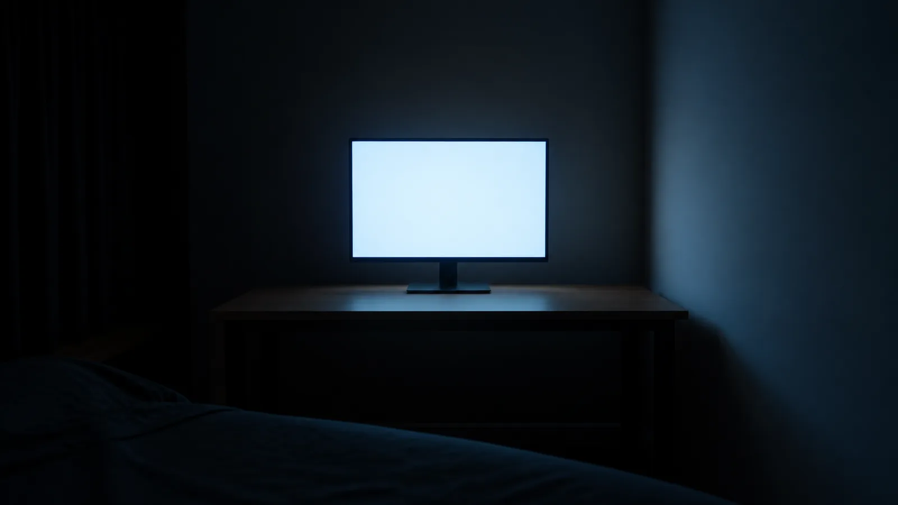

# Prescription — 《잔광 殘光》 온라인 뷰잉룸 (실전 4호-B)

## 1. Consulting Brief

```
THESIS:    꺼진 화면의 0.3초를 여덟 개의 방으로 관람시킨다 — 작품이 말하고 크롬은 침묵한다.
READER:    전시 링크를 받은 관람자(작가 SNS·전시 소식지 경유), 감상 자세, 첫 화면 5~10초
           판정 — "볼 만한 전시인가"를 이미지 한 장으로 판단.
GENRE:     포트폴리오/전시 (온라인 뷰잉룸). 계약: "형용사 말고 작품으로 설득하라."
           경험 부채: 1~3점의 작품 기억 + 작가에게 닿는 길.
GROUNDING: RICH — 단, 전면 픽션 선언 (Mode A: manuscript-catalog.md 정본. 작품 이미지는
           raw-N 픽스처로 생성 — fabrication 이 아니라 픽스처 제작)
TOKENS:    ./DESIGN.md ("Phosphor Gallery" — 이 처방과 함께 derive-and-emit, 단일 스킴 고정 선언)
DELIVER:   live frontend  ·  HOUSE SYSTEM: none
CORPUS:    3.0.1 (built 2026-08-28)
```

*(소재 분류표: ①현재 주장-대상 사실 = 없음 — 전시·작가·일정 전부 허구
이며 페이지가 이를 콜로폰에 명시 (test fixture 라벨). ④사용 금지 =
실존 갤러리·실존 작가 연상 요소 (실명·실주소 금지 — 준수). 관측 3
표적: 작품 raw 는 무스크림 콘텐츠, 씬 raw 는 트리트먼트 — 두 규율의
경계가 이 런의 시험 대상.)*

## 2. Page-as-Text verdict

- **Reader (R1):** 감상하러 온 독자 — 읽는 자세가 아니라 **보는 자세**.
  스크롤은 걸음이고 섹션은 방이다. 모바일 비중 높음(SNS 유입). 이탈
  트리거: 작품보다 말이 많은 페이지, 템플릿 SaaS 냄새, 작품 위에 얹힌
  UI.
- **Genre & experience debt (R2):** 전시 — 닫을 때 1~3점이 기억나야
  하고, 작가 이름을 재검색할 수 있어야 한다. 전형 실패 = 균등 그리드
  (8점 동일 질량 = 기억 0점).
- **Reading contract (R3a):** 첫 화면 약속 = "꺼진 화면들의 전시가
  여기 있다" (표제 + 무대 씬). 지불 = B3 컬렉션 월(전 작품)과 B5
  조명의 방(대표작 단독) — 기억은 낙차에서 생긴다.

## 3. Beat Map

| # | Beat | Move (breaks-test summary) | Intent | Mass | raw # | 씬 기법 | SIGNATURE? |
|---|------|---------------------------|--------|------|-------|---------|------------|
| 1 | 표제의 방 | 무대+표제로 전시 계약 — 없으면 방들이 목록이 됨 | I9 | full-bleed (D) | 09 | cover | quiet |
| 2 | 큐레이터 서문 | 관람 규칙과 프레임 제시 — 없으면 작품이 맥락 없는 이미지 | I3 | content (M) | — | — | quiet |
| 3 | 여덟 개의 방 | 전 작품 비대칭 월 — 없으면 전시가 아님 | I9 | wide (D) | 01–08 (콘텐츠) | frame (무씬) | **SIGNATURE** |
| 4 | 복도 | 고밀도→단독의 낙차를 만드는 호흡 — 없으면 B5 가 "아홉 번째 셀"로 읽혀 대표작 기억 실패 | I10 | full-bleed (M) | 10 | tone | quiet |
| 5 | 조명의 방 | 대표작 단독 조명 + 돋보기 — 없으면 경험 부채(1~3점 기억) 미지불 | I9 | wide (L) | 08 재사용 (콘텐츠) | frame+lens (무씬) | quiet |
| 6 | 작가 일지 | 제작의 시간축 — 없으면 작가가 유령(작품만 있는 익명전) | I7 | content (M) | — | — | quiet |
| 7 | 약력·관람 규칙 | 에토스+사실 — 없으면 작가에게 닿는 길(부채 후반) 부재 | I12/I2 | content (L) | — | — | quiet |
| 8 | 콜로폰 | 저압 퇴장("조용히 나가면 된다") | I11 | wide (exempt) | 09 재사용 (.18) | cover 에코 | quiet |

- 씬 기법 시퀀스: `cover → 무 → frame → tone → frame+lens → 무 → 무 →
  cover-echo` — 동일 기법 3연속 없음. **씬-SIGNATURE 없음 선언**:
  SIGNATURE 는 씬이 아니라 컬렉션 장치(B3)다. cover 재등장은 I3
  수미상관 재사용(op .18 에코)으로 허용.
- 밝기 시퀀스 (I4, 페이지-상대): **D M D M L M L D** — 3연속 없음.
  본문 다크 = B3 1곳 (B1 히어로·B8 에코 op≤.25 는 상한 산정 제외).
- **커버리지 회계 (F42)**: 무이미지 3/총8 (B2·B6·B7) = 상한 ⌈8/3⌉=3
  **경계 통과**. 질감 연속: B6→B7 2연속이 최대 ✓.
- 슬라이드 단위: B1–B7 100svh / B8 `data-slide-exempt`.
- 스킴: **단일 고정** (DESIGN.md 선언 — 다크 토큰 미emit, I2.7 비적용).

## 4. Token Constraint Card

- Accent: `{colors.key}` 인광 그린 사다리 (deep/base/soft/wash). 어두운
  벽 위 키 텍스트는 key-soft, 밝은 방 위는 key-deep (사다리 내 명도
  선택). 작품 위 사용 금지.
- Type roles: display/headline/work-title = **Noto Serif KR** (도록
  세리프 — R2 증명·display 전용) / body/label/caption = Pretendard.
  reject 목록 원문 대조 통과. 비율 1.333, base 17px, 무게 {400,700,900}.
- 폭 토큰 3: wide 72rem / content 50rem / prose 42rem.
- Elevation: borders-only — 액자 = 매트+1px 보더+헤어라인 아웃라인 3겹.
- Radius: 2px / pill(dots). `components:` 선결정: frame · caption-plate
  · room-dots · wayfinding.
- **작품 보존 계약**: 작품 `` 무필터·무스크림·무오버레이. 캡션은
  항상 별도 플레이트.

## 5. Per-Beat Recommendations

### BEAT 1 — 표제의 방   [I9 · full-bleed · quiet]

MOVE:        관람자를 어두운 무대에 세우고 전시명을 건다.
RECOMMENDED: **HAND-ROLL (declared)** — 전시/도록 표제 무대. 코퍼스 I1/I9
             히어로 전수가 SaaS 제품 무대 (실전 4호-A F48 과 동일 gap 의
             2번째 실측 — §6 기록). 근접 이웃 재열람: `tailark:dusk/
             call-to-action/one`(센터 스택) · `tailark:mist/hero-section/
             five`(프리뷰 카드 본체). 씬은 처방: **raw-09 · cover 기법**
             (3층 문법 — 층1 컬러풀 원본 / 층2 흑+인광 glow multiply /
             층3 표제).
WHY:         "장르 계약이 '작품으로 설득'이고 이 비트는 그 관람의 문턱
             이므로, 트리트먼트된 무대 씬 위 표제가 자리를 얻는다."
INNER ANATOMY: 전시 라벨(label) → 표제(display serif, 殘光 한자 병기) →
             부제 한 줄(caption) → 개요 카드 4항(기간·장소·작가·관람료
             — 사실 카드) → 스크롤 큐.
TOKEN MAPPING: 층2 스크림 = SCRIM 표 sc-cover (§8) · 표제 {colors.on-dark}
             · 라벨 {colors.key-soft}.
PLACEMENT MASS: full-bleed 100svh · 콘텐츠 박스 --w-content ·
             `--raw-pos: 62% 40%` / `--raw-pos-m: 70% 38%` (네거티브
             스페이스 center-left 프롬프트와 페어).
PRESERVE:    (씬) cover 3층 문법 관측 가능 — 층1 질감이 스크림 아래
             살아 있을 것 (RQ2-OBS 실측 대상).
DATA ATTRS:  data-scene="cover" (씬 섹션 계약 클래스 sc-cover)
REJECTED DEFAULT: SaaS 히어로 구조 이식 — 장르 배반.
STATES:      비인터랙티브. 스크롤 큐 aria-hidden.
MOBILE:      375: 표제 clamp 하한, 개요 카드 2×2 → 1열. raw-pos-m 재크롭.
BACKEND:     사실 카드는 픽션 값 — 콜로폰의 test-fixture 라벨과 쌍.
LICENSE:     (씬 raw = 생성 픽스처 — 갤러리 부품 아님)
STUB:        씬 CSS 는 image-prescription 부록 3층 정본을 토큰 치환해
             사용 (.sc-cover — §8 SCRIM 표와 동기).

### BEAT 2 — 큐레이터 서문   [I3 · content · quiet]

MOVE:        큐레이터의 목소리로 관람 프레임("작품은 작품의 벽에")을 건다.
RECOMMENDED: **Blockquote lead** — corpus id `tailark:mist/testimonials/one`
             (tailark, section→content 재질량) — blockquote+cite 골조.
             **BAN 1 회피 teardown**: 원본 `before:w-1` 좌 스트라이프
             슬롯 drop → 역할 라벨("큐레이터 서문")로 대체 (4호-A 와
             동일 처방 — F52 스캐너 사각 2번째 실측).
WHY:         "전시 서문은 남의 목소리(큐레이터)를 액자에 넣는 비트이므로
             인용 골조가 자리를 얻는다."
INNER ANATOMY: 역할 라벨 → 리드 인용("화면은 꺼진 뒤에도 0.3초…") →
             서문 3문단(prose) → cite (정한물, 큐레이터).
TOKEN MAPPING: 지면 {colors.wall-mid}(M 밴드) · 인용 display serif ·
             본문 {colors.ink} · 라벨 {colors.key-deep}.
PLACEMENT MASS: content — 말의 벽은 좁게.
PRESERVE:    blockquote 리드 + cite footer 골조.
DATA ATTRS:  data-gallery="tailark:mist-testimonials-one" data-component="testimonial"
REJECTED DEFAULT: 아이콘 3열 "전시 특징" 카드 — 도록에 마케팅 문법 이식.
STATES:      비인터랙티브.
MOBILE:      전 폭 1열 유지.
BACKEND:     정적 — 픽션 선언 하에 정직.
LICENSE:     MIT · AUTHOR: Tailark (Méschac Irung) ·
             SOURCE: corpus/vendor/tailark/mist/testimonials/one.tsx
STUB:        4호-A relic 스텁과 동일 골조 (code_path 동일) — 클래스
             네임스페이스 `.fore-*` 로 분리.

### BEAT 3 — 여덟 개의 방   [I9 · wide · **SIGNATURE**]

MOVE:        전 작품을 한 벽에 — 단 균등 격자가 아니라 질량이 다른
             여덟 개의 방으로.
RECOMMENDED: **Bento wall** — corpus id `magicui:bento-grid` (magicui,
             molecule) — 가변 스팬 셀 격자. **Recomposition (작품 보존
             계약과의 충돌 해소가 이 비트의 핵심 수술)**: 원본 BentoCard
             는 배경 이미지 위 하단 그라디언트+텍스트 오버레이 구조 —
             **작품 위 오버레이 금지**이므로 셀 내부를 [작품 ``
             (무필터) / 캡션 플레이트 (별도 띠)] 2단으로 재조합. 가변
             스팬 시그니처는 유지 (12컬럼: 대표작 8 = 7×2, 방1 = 5×2,
             방2·3 = 4×1, 방4 = 8×1?? — 실제 스팬 맵은 §6 리듬 맵).
             호버: 캡션 플레이트 키 라벨 점등 (작품 불변).
WHY:         "경험 부채가 '1~3점의 기억'이고 균등 격자는 기억을 지우
             므로, 질량 차이가 내장된 벤토 월이 자리를 얻는다."
INNER ANATOMY: 벽 라벨("여덟 개의 방") → 벤토 월 (셀 8 = frame + img +
             caption-plate{방 번호·작품명 serif·연도·매체}) → 벽 각주
             1줄 (클릭 안내 없음 — 전시는 만지지 않는다).
TOKEN MAPPING: 셀 배경 {colors.wall-deep} · 보더 {colors.line-dark} ·
             방 번호 {colors.key-soft} · 작품명 {typography.work-title}.
PLACEMENT MASS: wide · 12컬럼 비대칭. **모바일 1열 강등 선언**: 위계는
             순서(대표작 마지막 = 복도 직전)와 셀 높이가 승계.
PRESERVE:    가변 스팬 셀 격자 (bento 시그니처) — 균등화 = 세탁.
DATA ATTRS:  data-gallery="magicui:bento-grid" data-component="bento" ·
             각 작품 `` + data-work="01".."08"
REJECTED DEFAULT: 균등 3×3 썸네일 그리드 + 라이트박스 — 장르 전형 실패
             (genre-map: "14 works at one mass = no memory").
STATES:      hover: caption-plate 라벨 키 점등 + 헤어라인 아웃라인 강조
             · focus-visible 동일 · 터치: 상시 캡션(호버 은닉 없음).
MOBILE:      375: 1열(순서 위계) · 768: 2열 스팬 유지 · 1440: 12컬럼 풀.
BACKEND:     이미지 lazy-load (`loading="lazy"`) · alt 전수.
LICENSE:     MIT · AUTHOR: Magic UI (magicuidesign) ·
             SOURCE: corpus/vendor/magicui/bento-grid.tsx
STUB:        ↓ from bento-grid.tsx — 스팬 격자 골조 유지, 오버레이
             슬롯 → 캡션 플레이트로 교체(수술 선언), 토큰 리맵

```html
<div class="wall-grid"><!-- grid-cols-12, auto-rows, 비대칭 span -->
  <figure class="room" style="--span:5" data-work="01" data-gallery="magicui:bento-grid" data-component="bento">
    <span class="room-no">방 1</span>
    
    <figcaption class="plate"><b class="work-title">새벽 네 시의 모니터</b><span class="caption">2024 · 디지털 C-프린트</span></figcaption>
  </figure>
  …
</div>
```

### BEAT 4 — 복도   [I10 · full-bleed · quiet]

MOVE:        고밀도 벽과 단독 조명 사이의 호흡 — 관람의 걸음을 늦춘다.
RECOMMENDED: **씬 비트 (컴포넌트 없음 — 선언)** — raw-10 · tone 기법
             (mid 튜닝: 층2 흑 스크림을 회벽 톤으로 완화 — 밝기 축 M).
             콘텐츠는 wayfinding 플레이트 1개("다음 방 — 조명의 방")뿐.
WHY:         "경험 부채의 '기억'은 낙차가 만들고 낙차는 여백이 만든다
             — 이 비트가 없으면 대표작이 아홉 번째 셀이 된다."
             *(breaks-test 통과 근거를 이렇게 명시 — 분위기 비트가
             장식이 아니라 부채 상환 장치임을 논증. 관측 4 데이터.)*
INNER ANATOMY: 씬 전면 + wayfinding 플레이트 (label, 흑 @ .82 플레이트
             위 — 씬 위 나글자 금지 준수).
TOKEN MAPPING: SCRIM 표 sc-tone (§8) · 플레이트 {components.wayfinding}.
PLACEMENT MASS: full-bleed 100svh · `--raw-pos: 50% 55%` /
             `--raw-pos-m: 50% 60%`.
PRESERVE:    (씬) tone 층2 아래 복도 원근 질감 생존 (RQ2-OBS).
DATA ATTRS:  data-scene="tone" (sc-tone)
REJECTED DEFAULT: 인용/통계 밴드로 채우기 — 여백의 목적 상실.
STATES:      비인터랙티브.
MOBILE:      동일 (플레이트 중앙).
BACKEND:     정적.
LICENSE:     (씬 raw = 생성 픽스처)
STUB:        .sc-tone — 3층 정본 토큰 치환 (§8 SCRIM 동기).

### BEAT 5 — 조명의 방   [I9 · wide (L) · quiet]

MOVE:        대표작 《잔광》 단독 조명 — 화이트큐브 반전 + 돋보기.
RECOMMENDED: **Lens** — corpus id `magicui:lens` (magicui, molecule,
             ⚠ slop:initial-hidden) — 이미지 위 원형 돋보기 확대경.
             **WARN 이행 (모션 이식 정석 1)**: 돋보기는 `html.js` 스코프
             의 부가 도구 — no-JS/터치 무호버 시 **작품은 처음부터 전문
             표시** (은닉 대상은 콘텐츠가 아니라 도구). 바닐라 포트:
             pointermove 추적 + background-image 확대 원.
             작품은 frame 3겹 + 무필터 `` — **풀블리드 배경으로
             깔지 않는다** (작품 보존 계약; 관측 3 의 탈출구가 "배경화
             +스크림"이 아니라 "액자+플레이트"임을 실측).
WHY:         "부채의 본체가 대표작 1점의 기억이고 이 비트는 그 기억을
             밀도로 만들어야 하므로, 단독 벽 + 관람 돋보기가 자리를
             얻는다."
INNER ANATOMY: 방 라벨("방 8 — 조명의 방") → frame+img(잔광, 대형) +
             lens → 캡션 플레이트 (작품명 serif·연도·작가의 말 인용
             1줄) → 도록 문단 1개.
TOKEN MAPPING: 지면 {colors.cube-white} (L 반전) · 라벨 {colors.key-deep}
             · 플레이트 {colors.paper} + {colors.ink}.
PLACEMENT MASS: wide — 작품 폭 = content 초과 wide 이내 (단독 벽의 질량).
PRESERVE:    원형 돋보기 커서 추적 (lens 시그니처) — reduced-motion:
             정지(정적 1.0 배율).
DATA ATTRS:  data-gallery="magicui:lens" data-component="image-zoom" ·
             ``
REJECTED DEFAULT: 대표작 풀블리드 배경 + 흰 제목 오버레이 — 작품 훼손
             (관측 3 의 함정 그 자체).
STATES:      hover: 돋보기 발동 · 터치: 탭 토글 확대 · no-JS: 원본 전문
             표시(도구 부재만).
MOBILE:      375: 작품 전폭, lens → 탭 토글 · 768+: 점진 확대.
BACKEND:     원본 = raw-08 재사용 (I3 재사용 설계 — B3 셀과 동일 파일,
             표시 크기만 다름).
LICENSE:     MIT · AUTHOR: Magic UI · SOURCE: corpus/vendor/magicui/lens.tsx
STUB:        ↓ lens.tsx 바닐라 포트 골조

```html
<figure class="light-room-frame" data-gallery="magicui:lens" data-component="image-zoom">
  
  <div class="lens-glass" aria-hidden="true"></div><!-- html.js 에서만 표시 -->
</figure>
```

### BEAT 6 — 작가 일지   [I7 · content (M) · quiet]

MOVE:        네 개의 날짜로 제작의 시간축을 세운다 — 작품 뒤의 사람.
RECOMMENDED: **HAND-ROLL (declared) — I7 gap 정면 발화 (관측 1 예측
             적중 지점, §6 기록).** 코퍼스 I7 검토 전수: `smoothui:
             contribution-graph`(스트릭 히트맵 — 4개 일지 항목과 의미
             불일치) · `magicui:animated-list`(🚫 auto-cycle BAN +
             initial-hidden) · `smoothui:apple-invites`(드래그 리오더가
             본질 인터랙션 — 제거 시 세탁 + ATS risky) · 나머지 12행
             content 재분류. **일지 레일(날짜 라벨 + 엔트리)의 코퍼스
             부품 부재** → hand-roll: 좌측 날짜 컬럼 + 우측 엔트리
             2열 레일, 괘선 구분.
WHY:         "전시의 에토스는 이력서가 아니라 제작의 시간이므로, 날짜가
             앞장서는 일지 레일이 자리를 얻는다."
INNER ANATOMY: 섹션 라벨 → 일지 레일 4행 (날짜 label serif figures?
             날짜 = label · 본문 = body) → (각주: 발췌·픽션).
TOKEN MAPPING: 지면 {colors.wall-mid} · 날짜 {colors.key-deep} · 괘선
             {colors.line-light}.
PLACEMENT MASS: content.
PRESERVE:    n/a (hand-roll — 밀도 회계 서명 미계상).
DATA ATTRS:  data-component="log-rail" (hand-roll 표기 — data-gallery 없음)
REJECTED DEFAULT: 세로 타임라인 + 원형 노드 아이콘 — 관성 픽, 소재가
             4항뿐이라 장식 과잉.
STATES:      비인터랙티브.
MOBILE:      날짜 상단 배치 1열.
BACKEND:     정적 픽션 (콜로폰 라벨과 쌍).
LICENSE:     n/a (hand-roll)
STUB:        n/a — 근접 이웃 열람 기록으로 대체 (위 RECOMMENDED).

### BEAT 7 — 약력 · 관람 규칙   [I12/I2 · content (L) · quiet]

MOVE:        작가에게 닿는 길 + 이 갤러리의 규칙 3항.
RECOMMENDED: **Two-tone divided content** — corpus id
             `tailark:dusk/content/four` (tailark, section) — 두 톤
             헤딩 + not-last:border-b 구분 리스트 (관람 규칙 3항).
WHY:         "에토스는 조용해야 하고(장르: I12 quiet) 규칙은 나열이
             아니라 낙차로 읽혀야 하므로, 두 톤 + 괘선 리스트가 자리를
             얻는다."
INNER ANATOMY: 좌 두 톤 헤딩("작가는. 첫 전시다.") / 우 약력 prose +
             규칙 리스트 3항 (주소 없음·작품 위 글자 없음·방명록 없음).
TOKEN MAPPING: 지면 {colors.paper} · muted {colors.muted-on-light}.
PLACEMENT MASS: content.
PRESERVE:    두 톤 낙차 헤딩 + 괘선 리스트.
DATA ATTRS:  data-gallery="tailark:dusk-content-four" data-component="content"
REJECTED DEFAULT: 팀/프로필 카드 (아바타+SNS 아이콘) — 가상 인물에
             실존 냄새를 입히는 방향이라 픽션 윤리에도 역행.
STATES:      비인터랙티브.
MOBILE:      1열.
BACKEND:     정적.
LICENSE:     MIT · AUTHOR: Tailark (Méschac Irung) ·
             SOURCE: corpus/vendor/tailark/dusk/content/four.tsx
STUB:        4호-A B6 과 동일 code_path 골조 — 네임스페이스 `.bio-*`.

### BEAT 8 — 콜로폰   [I11 · wide · quiet · data-slide-exempt]

MOVE:        저압 퇴장 — "조용히 보고 조용히 나가면 된다" + 성분 표기.
RECOMMENDED: **Footer** — corpus id `tailark:mist/footer/one` (tailark,
             section) — 센터 스택. 씬: raw-09 재사용 **cover 에코**
             (op .18 — I3 수미상관).
WHY:         "전시의 출구는 CTA 가 아니라 여운이므로 센터 스택 + 무대
             에코가 자리를 얻는다."
INNER ANATOMY: 퇴장 문장(원고 §5) → 전시명 소형 재게 → 성분·귀속 전기
             (test fixture 명시 + 부품 저작자 전수) → 산출물 링크.
TOKEN MAPPING: SCRIM sc-echo (§8) · 텍스트 {colors.on-dark}.
PLACEMENT MASS: wide · data-slide-exempt 선언.
PRESERVE:    센터 수직 스택 골조 + (씬) 에코 저농도.
DATA ATTRS:  data-gallery="tailark:mist-footer-one" data-component="footer"
             · data-scene="cover-echo"
REJECTED DEFAULT: 멀티컬럼 사이트맵 푸터 (`dusk/footer/one` — 열람·기각).
STATES:      링크 hover/focus 키 점등.
MOBILE:      동일 센터 스택.
BACKEND:     상대 링크 실경로만.
LICENSE:     MIT · AUTHOR: Tailark (Méschac Irung) ·
             SOURCE: corpus/vendor/tailark/mist/footer/one.tsx
STUB:        4호-A B8 골조 — 네임스페이스 `.colo-*`.

### 페이지-레벨 — 방 인디케이터 (room dots)

RECOMMENDED: `smoothui:pagination` (molecule, satellite) — 페이지 번호
             +활성 필 인디케이터 골조를 **우측 고정 방 도트 레일**로
             재질량 (스크롤 연동 활성, 클릭 점프). prev/next 슬롯 drop
             선언 (스크롤이 걸음이므로).
PRESERVE:    활성 필 인디케이터 (현재 방 표시가 형태로 관측).
DATA ATTRS:  data-gallery="smoothui:pagination" data-component="pagination"
STATES:      hover 라벨 툴팁(방 이름) · click 점프 · no-JS: 레일 비표시
             (장식 위성 — 콘텐츠 은닉 아님).
LICENSE:     MIT · AUTHOR: Eduardo Calvo (educlopez) ·
             SOURCE: corpus/vendor/smoothui/pagination.tsx

## 5.5 RAW-PROMPTS emit

**`RAW-PROMPTS.md` 동봉 emit** — raw-01~08 = 작품(콘텐츠 이미지 —
프롬프트가 곧 작품 제작), raw-09·10 = 씬(무대·복도 — 골격 6요소 전항).
**HARD STOP (I6): 10장 전량 검수 통과 + 사용자 "RAW OK" 전에는 빌드
시작 금지.** 저장 경로: `60_Operational/output/test4b-virtual-exhibition/
assets/raw/raw-01.png` ~ `raw-10.png`.

## 6. Assembly Plan

- **Rhythm map**: full → content → wide → full → wide → content →
  content → wide(exempt). content 2연속(B6·B7)은 회벽→종이 밝기 전환
  이 리듬을 짊어짐 (동일 tier 3연속 없음).
- **벤토 스팬 맵 (12컬럼, G4)**: 방1 span5·row2 / 방2 span3 / 방3
  span4 / 방4 span4 / 방5 span3 / 방6 span5 / 방7 span4 / **방8(대표작)
  span7·row2** — 대표작이 최대 질량, 첫 방이 차대 질량 (연작의 시작과
  끝이 벽의 두 기둥).
- **Signature placement**: B3 — 첫 화면(약속) 직후 두 방 만에 전 작품
  벽이 나온다. 관람 시뮬레이션: 표제(기대) → 서문(프레임) → 벽(전모)
  → 복도(호흡) → 조명(기억) — 부채 상환 곡선.
- **Density accounting (blocking):**

| Metric | Floor | This page | Evidence |
|---|---|---|---|
| Recognizable gallery signatures | ≥ 6 | 6 (강) | bento 가변 스팬 월 · lens 돋보기 · blockquote-cite 서문 · two-tone divided · footer 센터 스택 · pagination 활성 필 — 씬 2종(cover/tone)·frame 3겹은 미계상 (hand-styled/씬) |
| Distinct form factors | ≥ 10 | 12 | stage(hand)·testimonial·bento·scene-tone·frame·caption-plate·image-zoom·log-rail(hand)·content·footer·pagination·wayfinding |
| Interaction layers | ≥ 3 | 3 | hover(lens·벤토 플레이트·링크) / scroll(dots 활성) / click(dots 점프·터치 lens 토글) |

- **Corpus gaps hit**:
  1. **전시/도록 표제 무대 부재** — F48 gap 2번째 실측 (B1 HAND-ROLL).
  2. **I7 일지 레일 부재** — 관측 1 이 예측한 지점에서 정면 발화 (B6
     HAND-ROLL, 후보 3종 기각 사유 기재). → sources 리프레시 후보:
     에디토리얼 히어로 + changelog/journal 부품.
  3. 갤러리 라이트박스/뷰잉룸 계열 부재 — image-gallery 1행뿐이며
     index-only (inspira, vue). 이번 런은 lens+bento 로 대체 성립.

## 7. Coherence Verdict

읽기 계약(작품으로 설득)과 부채(1~3점 기억 + 작가 경로)가 B3/B5 낙차
구조로 상환되고, 크롬은 캡션 플레이트·플레이트 규칙으로 침묵한다.
잔여 리스크: (a) 벤토 월 모바일 1열에서 "스크롤 피로" — 순서 위계
선언으로 완화, RQ3 확인 (b) cover/tone 스크림과 층1 질감의 균형 —
RQ2↔RQ2-OBS 양방향 실측 대상 (c) 작품 8장 + 씬 2장 총예산 ≤3MB —
webp 변환 시 확인. **PASS (빌드는 RAW OK 이후).**

## 8. Render QA 인수인계 계약 *(HARD — RAW OK 급, v3.6)*

```
AUDITOR:      render-audit — full 기본값 (3폭 × 2스킴, RQ1/RQ2/RQ2-OBS/RQ3 전 계층)
BLOCKING:     빌드 완료 선언 전 render-audit full PASS 를 이 처방문
              § Render QA 로 append (섹션×스킴 매트릭스·관측성 표 포함)
SCRIM:        sc-cover  { c:[10,14,12], a:0.55, op:1.00, mul:1 }
              sc-tone   { c:[38,46,41], a:0.45, op:1.00, mul:1 }
              sc-echo   { c:[10,14,12], a:0.72, op:0.18, mul:1 }
              (단일 스킴 고정 — dark override 없음. CSS 수리 시 이 표 동기 갱신)
WIDTH_TOKENS: DECLARED_WIDTH_TOKENS = 3 · --w-wide 72rem · --w-content 50rem
              · --w-prose 42rem
SCENES:       --raw-pos-m 선언 3 (B1 cover · B4 tone · B8 echo) = 씬 테이블
              3행 (RQ1-9 대조값). 작품 8장은  콘텐츠 이미지 — rposm 비대상.
RQ2-OBS:      적용 (면제 없음 — 씬 실재). 무이미지 회계 3/8 ≤ ⌈8/3⌉.
              단일 스킴이므로 두 스킴 실측값은 동일 예상 — 기록으로 확인.
```

---

**Build these next?** — **아직 아니다. HARD STOP:** `RAW-PROMPTS.md` 의
10장을 코덱스로 생성 → `assets/raw/raw-01.png~raw-10.png` 저장 → 검수
→ 사용자 **"RAW OK"** 후에 빌드가 시작된다.

---

# § RAW 검수 기록 (2026-08-30)

10/10 전량 멀티모달 검수 통과 (텍스트·로고·UI·얼굴 0 / 씬 2장 네거티브
스페이스 지정 위치 실재 / 16:9 전량). 사용자 "raw ok" 승인 → webp 변환
(PIL, q82, 1600px — cwebp 부재로 대체 실행 기록) 총 **0.25MB ≤ 3MB** ✓.

# § 개정 각주 (재진입 규칙 — 비트 구조 불변, 내용 갱신 2건)

1. **B6 작가 일지**: RQ2-OBS 실측(저질감 3연속 런)이 동인 — 일지 레일
   옆에 **raw-02 부분 재게** 콘텐츠 이미지 추가 (도록 관행: 노트 옆
   도판 · I3 재사용 명시 · 작품 무필터 원본). 비트의 move/intent 불변.
2. **B8 에코**: op .18 → **.25** (≤.25 상한 내), 스크림 .78/.60 으로
   완화 — 에코가 픽셀상 소거(sd 0.4)되어 씬 처방이 라벨로만 존재했던
   것의 수리. §8 SCRIM 표 동기 갱신 완료 (F39 의무).
- 무이미지 회계 확정판: 처방 라벨 3/8 (B2·B6·B7) → **실효 3/8
  (B2·B7·B8)** — B6 은 도판 재게로 textured, B8 에코는 강화 후에도
  저질감 회계 내 유지 (여운 의도 선언).

# § 풀 익스팬션 개정 v2 (2026-08-30 — Beat Map 재승인)

> **재승인 근거 (재진입 규칙: 비트 신설 = 재승인 필요).** 저자 지시
> 원문: "방이 8개인데 8번방만 전시되어 있으니까 아쉽다 / 8개 방 전부
> 다른 방식으로(여러 반응형 컴포넌트를 동원해서) 온라인 감상하는
> full exhibition / 복도는 누르면 3D 느낌으로 이동하는 섹션인 줄
> 알았는데 더미라 아쉽다 / 이미지 새로 만들지 말고 비트부터 재확장" —
> GitHub Achmage-Skills 쇼케이스 업로드 목적.

## Beat Map v2 (확정판 — 15비트)

| # | Beat | Intent | Mass | 밝기 | raw/기법 | 감상 장치 (전부 상이) |
|---|------|--------|------|------|----------|----------------------|
| 1 | 표제의 방 | I9 | full | D | 09 · cover | — |
| 2 | 서문 | I3 | content | M | — | blockquote (mist-testimonials-one) |
| 3 | 전관 인덱스 | I9/I10 | wide | D | 01–08 frame | **SIGNATURE — bento 월, 셀=방 앵커 링크로 승격** |
| 4 | 복도: 문을 연다 | I10 | full | M | 10 · tone | **shared-axis-z 3D 푸시-인** (클릭→방1) |
| 5 | 방1 새벽 네 시의 모니터 | I9 | wide | D | 01 | **exposure-slider** — 노출을 올려 어둠 살피기 |
| 6 | 방2 주사선 연습 I | I9 | wide | L | 02 | **lens** — 접사 위 돋보기 (satellite 도구) |
| 7 | 방3 번인 | I9 | content | M | 03 | **HAND-ROLL 닦기 분할기** — 닦아도 남는 잔상 |
| 8 | 방4 데드픽셀 성좌 | I9 | wide | D | 04 | **tooltip 관측 기록** (uiverse 아톰 ×3, 플레이트 위) |
| 9 | 방5 마지막 프레임 | I9 | content | L | 05 | **animated-tabs** — 원경/클로즈업 2크롭 |
| 10 | 방6 전원이 나간 방 | I9 | wide | D | 06 | **HAND-ROLL 암순응** — 누르고 있으면 눈이 적응 |
| 11 | 방7 부팅의 기억 | I9 | content | M | 07 | **animated-progress-bar** — 부팅 재연 |
| 12 | 방8 잔광 (대표작) | I9 | wide | L | 08 | **power-off-slide** — 밀어서 전원 끄기, 잔광 재연 |
| 13 | 작가 일지 | I7 | content | M | 02 재사용 | log rail (hand-roll) + 도판 재게 |
| 14 | 약력·관람 규칙 | I12 | content | L | — | two-tone divided (dusk-content-four) |
| 15 | 콜로폰 | I11 | wide·exempt | D | 09 재사용 .25 | footer (mist-footer-one) |

- **breaks (신설 방 공통)**: 방 비트가 없으면 그 작품은 인덱스 셀로만
  존재한다 — "8번방만 전시된 전시"라는 저자 지적 그 자체가 breaks 논증.
  복도 비트: 인터랙션 없으면 "문"이 더미 — 관람 동선의 물리감 실종.
- 밝기 시퀀스: **D M D M D L M D L D M L M L D** — 3연속 없음 (15섹션,
  페이지-상대). 기법 시퀀스: cover → … → tone → … → cover-echo (씬 3곳
  불변, rposm 3 유지).
- **one-signature 유지**: SIGNATURE = 전관 인덱스 월 (유일 loud). 방
  장치 8종은 전부 quiet 감상 도구 (power-off 는 quiet-강).

## 방 장치 소싱 기록 (diversity guard 분석 포함)

| 방 | RECOMMENDED (corpus id) | type | 티어 | 가드/게이트 노트 |
|---|---|---|---|---|
| 1 | `smoothui:exposure-slider` | slider | inline 도구 | 시그니처: 노치 티커+링 게이지+스냅. 노출값은 CSS filter — 기본값 = 원본 (작품 보존) |
| 2 | `magicui:lens` (방8→방2 이동) | effect | **satellite** 오버레이 도구 | WARN initial-hidden → 정석 1 (.js 스코프, 작품 상시 표시) |
| 3 | **HAND-ROLL 닦기 분할기** | — | — | 근접 이웃 전수 기각: `inspira:scratch-to-reveal`·`inspira:balance-slider` **둘 다 index-only** (code_path 없음 — STUB 불가), before-after-slider 타입 vendored 0 → F61 보강 |
| 4 | `uiverse:Tooltips/elijahgummer_brown-moose-94` ×3 | tooltip | atom | 마커는 **플레이트 위** (작품 위 오버레이 금지 준수 — 표본 라벨 방식) |
| 5 | `smoothui:animated-tabs` | tabs | inline | 시그니처: 슬라이딩 활성 인디케이터. 2크롭 = raw-05 재사용 (--crop 변주, I3) |
| 6 | **HAND-ROLL 암순응 장치** | — | — | dwell-reveal 계열 코퍼스 부재. filter 기본값 = 원본 |
| 7 | `smoothui:animated-progress-bar` | progress-bar | inline 유물 | 부팅 재연 — 작품과 분리된 유물 장치 (콘텐츠 은닉 없음) |
| 8 | `smoothui:power-off-slide` | effect | **inline 컨트롤** | ATS 조건 인용·이행: "되돌릴 수 없는 행동 앞의 의례적 마찰 용도 한정" — 전원 차단 의례의 재연이 이 작품의 주제 그 자체. 확정 시 지면 암전(작품 무변) 후 복귀 |
| 복도 | `smoothui:shared-axis-z` | effect | **full-bleed 전환** | WARN auto-cycle → 이식 시 **클릭 1회 발동으로 교체** (자동 순환 제거 — 모션 이식 정석 2 변형). 시그니처: 깊이 스케일 교대 |

- **가드 판정**: effect 타입 3회 등장 (lens·power-off·shared-axis-z)
  — F33 엄격 해석(type×tier)에 따라 티어를 satellite / inline 컨트롤 /
  full-bleed 전환으로 분리 배치 → 합법. slider 중복 후보였던
  `smoothui:scrubber` 는 기각 (exposure-slider 와 type×tier 동일 —
  watch 의 "I7 timeline-scrubber" 재배치 제안은 차기 코퍼스 재분류
  후보로 기록). `magicui:magic-card` 기각 — **ats cut** (커서
  스포트라이트가 콘텐츠를 덮음 = 작품 훼손 방향 그 자체, 방3 rejected
  default 로 기재).
- 신규 REJECTED DEFAULTS: 전 방 공통 — "라이트박스 모달" (모달 안
  모달 슬롭 + 관람 동선 파괴), 자동 슬라이드쇼 (BAN auto-advance).

## 밀도·리듬 재회계 (v2)

| Metric | Floor | v2 | Evidence |
|---|---|---|---|
| 서명 | ≥6 | **11 강** | bento 월 · shared-axis-z 전환 · exposure 노치+링 · lens · tooltip 셀 · tabs 인디케이터 · progress 트랙+라벨 · power-off 슬라이드 확정 · blockquote-cite · two-tone divided · footer 스택 (+pagination 필) |
| 폼팩터 | ≥10 | **17** | stage·testimonial·bento·scene-tone·transition·slider·effect(lens)·divider(hand)·tooltip·tabs·dwell(hand)·progress-bar·effect(power)·log-rail·content·footer·pagination |
| 층 | ≥3 | **4** | hover(lens·tooltip·bento) / drag(exposure·닦기·power-off) / click(복도·탭·재생·앵커) / scroll(dots·암순응 dwell) |

- Mass 리듬: full·content·wide·full·wide·wide·content·wide·content·
  wide·content·wide·content·content·wide — 동일 tier 3연속 없음.
- 무이미지 회계 v2: 라벨 2/15 (s2·s14) · 실효 예상 3/15 (s2·s14·s15
  에코) ≤ ⌈15/3⌉=5.

# § Render QA — render-audit 검사 기록 (2026-08-30)

## Verdict: **PASS** (REVISE 1루프 경유) · mode: full

- 검사관: `render-audit` [[render-audit]] 1.0.0 · 페이지 적응 하네스
  `_qa-harness-adapted.js`
- 대상: `index.html` @ http://localhost:8746 (test4b-exhibition-static)

## 하네스 조정 기록 (SKILL §5 의무)

1. SCRIM 표 = §8 계약값 (sc-cover/.55 · sc-tone/.45 · sc-echo/.60·op.25
   — 수리 후 동기 갱신 이력 포함).
2. `DECLARED_WIDTH_TOKENS` = 3 · RQ1-8 콘텐츠 박스 셀렉터 `.box-*` 폴백.
3. RQ2/RQOBS band = `bgRGB(sec)` 조상 워크 (F55 교정 사본 — 4호-A 발견
   결함, 정본 미수정 유지).

## Findings (4 — 상한 15 내)

1. **[MED · fixed — REVISE 루프 1]** RQ2-OBS 위반: 실효 저질감 4/8 >
   상한 3 + 질감 3연속 런 (s6→s7→s8). evidence: RQOBSALL 초회 —
   sd {s2:0 · s6:0 · s7:0 · s8:0.4}, s8 에코(op.18×스크림.72)가 픽셀
   소거. 수리 = 개정 각주 2건 (B6 도판 재게 + B8 에코 강화) → 재실측
   low 3/8 ≤ 3 · 런 0 → **PASS (양 스킴)**. RQ2↔RQ2-OBS 양방향 수렴의
   실전 재현 — 면제 없이 돌린 첫 크리에이티브 런에서 게이트가 실결함을
   잡았다 (F42/F45 정신 그대로).
2. **[LOW · 유지]** s8 에코 sd 0.9 — 강화 후에도 저질감 (회계 3/8 내).
   여운 의도 선언 + RQ3 육안으로 씬 실재 확인 (좌측 갤러리 윤곽 관측).
3. **[LOW · fixed]** 마이크로카피 em-dash 5곳 (스테이지 부제·복도
   플레이트·조명의 방 라벨/산문·서문 캡션) — v7 발행체 레지스터 오염.
   텍스트만 수정 (색·크기·박스 불변 — RQ 재실행 불요 판정. 전시 표제
   자체의 "—" 는 제호 표기 관행으로 유지 선언).
4. **[LOW · note]** 캡처 정석 폭 1100 이 이 페이지의 브레이크포인트
   (1100px)와 정확히 겹쳐 SIGNATURE 벤토의 데스크톱 형태가 태블릿
   분기로 캡처될 뻔함 — RQ3 를 1200×750 으로 상향해 순회 (F63 회부).

## RQ1 — 구조 9항 (3폭)

| 폭 | 위반 | brightness (상대 3분위) | 에지 | RQ1-9 rposm |
|---|---|---|---|---|
| 1440 | 0 | D M D M L M L D | 2 (136/312) ≤ 3 | declared 3 (=씬 테이블 3행) |
| 768 | 0 | 동일 | 1 (24) | — |
| 375 | 0 | 동일 | 1 (24) | **checked 3/3 — 선언·계산값 일치** |

- 가로 스크롤 0 (3폭) · 슬라이드 단위 충족 (footer exempt) · 밝기
  3연속 0. data-theme=dark 토글 상태 재실행 동일 (단일 스킴 고정).

## RQ2 — 픽셀 대비

| 폭 | checked | solid fail | scene fail |
|---|---|---|---|
| 1440 (2회: 수리 전/후) | 27 | 0 | 0 |
| 375 | 27 | 0 | 0 |

- 씬 3곳(cover/tone/echo)은 canvas 씬 샘플링 경로로 실측 — 표제·
  wayfinding·콜로폰 텍스트 전부 통과 (플레이트 solid 경로 설계 유효).

## RQ2-OBS (면제 없음 — 씬 실재)

| 실행 | verdict | low (sd<8, 콘텐츠 이미지 無) |
|---|---|---|
| 초회 (양 스킴) | **REVISE** | s2·s6·s7·s8 (4/8) + 런 s6→s8 |
| 수리 후 (양 스킴) | **PASS** | s2·s7·s8 (3/8 ≤ ⌈8/3⌉) · 런 0 |

- 수리 후 실측: s1 9.1 · s3 0\*(작품 8) · s4 33.4 · s5 0\*(대표작) ·
  s6 0\*(도판 재게) — \* = 콘텐츠 이미지 textured 회계.

## RQ3 — 섹션 순회 (단일 스킴)

| section | light | dark |
|---|---|---|
| s1 표제의 방 | ✓ (@1100) | 단일 스킴 고정 선언 — 미배선 (DESIGN.md) |
| s2 서문 | ✓ (@1100) | 〃 |
| s3 여덟 개의 방 (SIG) | ✓ (@1200 상·하 2캡처 + 375 스팟) | 〃 |
| s4 복도 | ✓ (@1200) | 〃 |
| s5 조명의 방 | ✓ (@1200 + lens hover 발동 캡처) | 〃 |
| s6 작가 일지 | ✓ (@1200, 수리 후) | 〃 |
| s7 약력·규칙 | ✓ (@1200) | 〃 |
| s8 콜로폰 | ✓ (@1200) | 〃 |

- 풀페이지 오버뷰 1회 (scale 축소) — 밝기 리듬 D M D M L M L D 육안
  확인. 캡처 규약: translateY 시프트 + 1s 대기 (프레임 지연 실측).
- 체크리스트: 작품 위 텍스트·스크림 0 (보존 계약 준수 육안 확인) ·
  도형-콘텐츠 충돌 0 · 인접 구분 ✓ · 데이터 위계 ✓ · **시그니처
  스팟체크**: 벤토 가변 스팬(대표작 7×2 압도) ✓ · lens 돋보기 발동 ✓ ·
  blockquote-cite ✓ · two-tone divided ✓ · footer 센터 스택 ✓ ·
  pagination 활성 필 ✓ — 세탁 0 · no-JS: 도트 레일·돋보기만 소거(장식
  위성), 작품·본문 전량 상시 표시 (은닉 연출 자체가 없음).

## Not reviewed

- 다크 스킴 계열 전부 — **단일 스킴 고정 선언** (DESIGN.md Overview,
  V5 합법 경로). RQ1/RQ2/RQOBS 는 data-theme 토글 상태로도 실행해
  동일값 확인 (스킴 미배선의 실측 확인이지 다크 디자인 검증이 아님).
- RQ2ALL @ 768 (375·1440 로 갈음 — 동일 solid/scene 경로) · 실기기
  터치 · 프린트 · CDN 폰트 차단 폴백 · 실전시장 아님(픽션) 명시.
- 저자 리뷰 (HIL 이월분) 미수행 — 테스트런 위임.

---

# § Render QA v2 — full exhibition 재검사 (2026-08-30)

## Verdict: **PASS** · mode: full (15섹션 · 3폭 · 전 계층)

- v2 빌드 (풀 익스팬션) 전면 재검사. 하네스: `_qa-harness-adapted.js`
  (SCRIM 표·폭 토큰 3·F55 교정 — **동 결함은 검사 후 정본
  `render-audit` 1.0.1 로 반영 완료**).

## RQ1 (3폭 · 15섹션)

| 폭 | 위반 | brightness (상대 3분위) | 에지 | rposm |
|---|---|---|---|---|
| 1440 | 0 | **D M D M D L M D L D M L M L D** (설계 일치) | 2 ≤ 3 | declared 3 |
| 768 | 0 | 동일 | 1 | — |
| 375 | 0 | 동일 | 1 | checked 3/3 일치 |

- 밝기 3연속 0 · 가로 스크롤 0 · 슬라이드 단위 15/15 (s15 exempt).

## RQ2

- 1440: 46 nodes/스킴, solid+scene fail **0/0** (양 토글 상태).
- 375: fail 0. 씬 3곳 canvas 샘플링 경로 실측.

## RQ2-OBS (면제 없음)

- **PASS 양 스킴** — low 3/15 (s2·s14·s15) ≤ ⌈15/3⌉=5 · 질감 런 0.
  방 8개 전부 contentImg textured (0\*), s1 9.1 · s4 33.4 실측.

## RQ3 — 15섹션 순회 + 장치 발동 증적 8종 (단일 스킴)

| 구간 | 캡처 | 장치 증적 |
|---|---|---|
| s1·s2·s3 | ✓ @1200 | 인덱스 셀 앵커화 육안 확인 |
| s4 복도 | ✓ 정지 + **walking 푸시-인 상태** | shared-axis-z 깊이 스케일+블러 발동 ✓ |
| room1 | ✓ (**노출 +7 상태**) | 노치 티커+링 게이지+작품 밝기 연동 ✓ |
| room2 | ✓ | lens 돋보기 (v1 검증 승계 + 정지 캡처) |
| room3 | ✓ (**wipe 62% 상태**) | 분할선·핸들·밝힌 쪽 유령 잔존 ✓ |
| room4 | ✓ (**툴팁 개방 상태**) | 관측 기록 툴팁 (플레이트 위 — 작품 무접촉) ✓ |
| room5 | ✓ (**클로즈업 탭 상태**) | 슬라이딩 인디케이터+2.4× 크롭 ✓ |
| room6 | ✓ (**암순응 3초 시점**) | 6s dwell 밝기 램프 진행 확인 ✓ |
| room7 | ✓ (**부팅 68% 상태**) | 트랙+채움+퍼센트 라벨 ✓ |
| room8 | ✓ (**powered 암전 상태**) | 슬라이드 확정→암전→잔광 부상 ✓ |
| s13·s14·s15 | ✓ @1200 | — |

- 캡처 규약: 1200×750 (F63 — 페이지 브레이크포인트 1100 과의 간섭
  회피) + translateY 시프트. **캡처 프레이밍 불안정 실측**: transform
  직후 첫 캡처가 간헐적으로 부분 프레임/타임아웃 — 2s 대기 + 재시도로
  회복 (도구 각주).
- 작품 보존 계약: 15섹션 전부 작품 위 텍스트·스크림·오버레이 0
  (장치 전부 플레이트/프레임 주변부 또는 사용자-발동 필터, 기본값 =
  원본). no-JS: 장치만 소거, 작품·본문 상시 표시.

## Not reviewed (v2)

- 다크 스킴 디자인 (단일 스킴 고정 선언 유지) · RQ2ALL @768 · 실기기
  터치 드래그(닦기·전원 슬라이드는 포인터 이벤트 구현 — 에뮬 검증만)
  · 프린트 · CDN 폰트 차단 폴백 · 저자 리뷰 (HIL 이월분).
