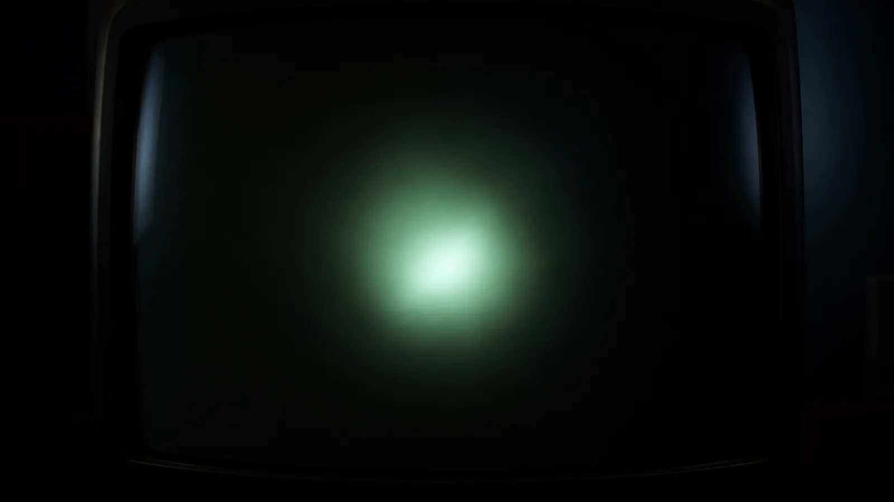
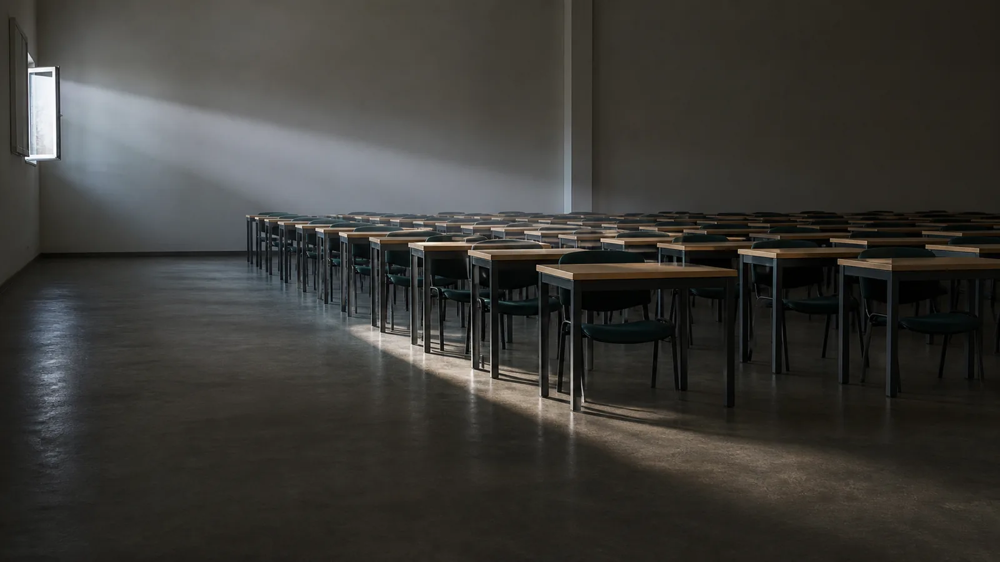

# Achmage-Skills

안창현 (Achmage) 의 Claude 스킬 모음.

## 📦 수록 스킬

### [`Image-HTML/raw-5-html`](Image-HTML/raw-5-html) — Raw5 이미지 임베드 HTML 덱
이미지를 **배경 재료**로만 쓰고 텍스트·숫자·차트는 전부 **HTML/SVG**로 유지하는 1920×1080 HTML 발표 덱(HTML PPT / 카드뉴스 / 키노트) 제작 스킬. GPTs “Raw5 v4” 프롬프트 팩을 Claude 스킬로 포팅했다. 4개 모드(V7 밝은 리포트 / V8 다크 / University AX / Street 에디토리얼) · 3단계 워크플로우(기획 → 이미지 5장 프롬프트[HARD STOP] → HTML 빌드).
→ 상세: **[Image-HTML/README.md](Image-HTML/README.md)**

### [`Design-Consulting/component-consulting-v3`](Design-Consulting/component-consulting-v3) — 페이지를 글처럼 설계하는 컴포넌트 컨설팅 (3.6.0)
로딩된 HTML 페이지 한 장 = 완결된 글 한 편. 독자(R1) → 장르(R2) → 비트 열(R3)을 먼저 판정하고, 각 비트를 **4,275행 vendored 컴포넌트 코퍼스**(uiverse · smoothui · magicui · tailark — 전량 MIT, 커밋 pin, 저자 귀속)에서 **결정적 retrieval** 로 채운다. live-scan 소싱도, 모델 기억 스텁도 없다 — 모든 STUB 은 `code_path` 실코드 복사. 5축 gates-first rubric + 밀도 하한 + 슬롭 밴 + 처방 완결성 게이트, 그리고 빌드 세션에 **§8 Render QA 인수인계 계약**을 emit 한다. v1/v2 를 승계·대체. Design.md posture: **consumes**.
→ 상세: **[Design-Consulting/README.md](Design-Consulting/README.md)**

### [`Design-Consulting/render-audit`](Design-Consulting/render-audit) — 렌더 실측 QA 검사관 (1.0.1)
빌드된 페이지의 **렌더된 픽셀**을 실측해 완료 선언을 게이트하는 검사관 스킬. RQ1 구조 9항(결정적 JS 하네스) · RQ2 캔버스 최악-픽셀 WCAG 대비 · RQ2-OBS 씬 관측성/커버리지 회계(스크림 단조 상승을 반대편에서 무는 쌍대 게이트) · RQ3 스크린샷 순회 + 섹션×스킴 매트릭스 기록 의무. **full(3폭×2스킴)이 기본값**, 축소는 선언식 예외. component-consulting-v3 와 짝이지만 어떤 프론트엔드 빌드에도 단독 사용 가능.
→ 상세: **[Design-Consulting/README.md](Design-Consulting/README.md)**

### [`Card-News/insta-cardnews`](Card-News/insta-cardnews) — 인스타그램 사진 카드뉴스
카드마다 **전용 AI 사진 1장 + 필터 1겹**을 씌워 만드는 **1080×1440 (3:4) 인스타 카드뉴스** 스킬. `raw-5-html`의 **정반대** — 이미지 5장 재사용이 아니라 **카드당 사진 1장** + wash/tone/blend/material 필터로 한글 가독성을 잡고, 텍스트·차트는 HTML/SVG 유지. 한 번의 빌드로 **카세로셀 PNG(1080×1440) + 모바일 한-장-씩 HTML 뷰어** 두 결과물이 나온다. 3 프리셋(Dark Wash / Brand Tone / Light Editorial) · 3단계 HARD-STOP 워크플로우.
→ 상세: **[Card-News/README.md](Card-News/README.md)** · 라이브 데모: [여름밤 카드뉴스(모바일)](https://laguna821.github.io/Achmage-Skills/Card-News/insta-cardnews/examples/summer-night/cardnews-proof.html)

### [`Video-Production/achmage-whiteboard-video`](Video-Production/achmage-whiteboard-video) — Achmage 화이트보드 비디오 (⚠ Codex CLI 전용)
한국어 마크다운·강의 원고 한 편을 **음성·번인 자막 포함 4K 화이트보드 강의 영상**으로 만드는 올인원 파이프라인. 장면별 이미지(Codex 네이티브 생성, 한글은 Noto Sans KR 로컬 합성) → **line-trace** 선 추적 애니메이션 → ElevenLabs/Typecast TTS(**음성 오디션 1회가 유일한 사람 게이트**, 3중 비용 보호) → 자막 번인 → 4K 병합, 프리미어식 **편집 패키지 내보내기**까지. `workflow-state.json` 상태머신 + `resume` 재진입으로 중단 안전. **Claude 플러그인이 아니므로** 마켓플레이스 미등록 — 설치·호출은 폴더 README 참조.
→ 상세: **[Video-Production/README.md](Video-Production/README.md)** · 쇼케이스: [4K 오프닝 시퀀스(53MB)](Video-Production/examples/opening-001-003-master-voiced-line-trace.mp4)

## 🚀 빠른 설치 (Claude Code)

> 아래 3법은 Claude 스킬 3종(`raw-5-html` · `component-consulting` · `insta-cardnews`)용. **Codex CLI 전용**인 `achmage-whiteboard-video` 는 [Video-Production/README.md](Video-Production/README.md)의 설치 절차를 따른다.

```bash
# 방법 A — npx (가장 간단)
npx skills add laguna821/Achmage-Skills
```

```text
# 방법 B — 플러그인 마켓플레이스 (공식 배포 경로)
/plugin marketplace add laguna821/Achmage-Skills
/plugin install raw-5-html@achmage-skills
/plugin install component-consulting-v3@achmage-skills
/plugin install render-audit@achmage-skills
/plugin install insta-cardnews@achmage-skills
```

```bash
# 방법 C — 수동 복사
git clone https://github.com/laguna821/Achmage-Skills
cp -r Achmage-Skills/Image-HTML/raw-5-html ~/.claude/skills/raw5-deck
```

설치 후엔 **“HTML 덱 / 카드뉴스 / 발표자료 만들어줘”** 라고 요청하면 자동 로드된다(또는 `/raw5-deck` 로 직접 호출). 옵션·상세는 [Image-HTML/README.md](Image-HTML/README.md#-설치-installation).

## 🖼 예시

- [`Image-HTML/examples/`](Image-HTML/examples) — 정전 샘플 덱(V7 / V8 / University AX / Street) + 원본 GPTs Raw5 프롬프트 팩 + 검증용 “민주주의” · “행동경제학” 덱
- [`Design-Consulting/examples/`](Design-Consulting/examples) — **v3 풀 파이프라인 쇼케이스 2종**: [잔광 殘光 — 가상 전시 full exhibition](https://laguna821.github.io/Achmage-Skills/Design-Consulting/examples/janggwang-exhibition/) (방 8개 × 상이한 감상 장치 + 3D 복도) · [Educational Harness Engineering](https://laguna821.github.io/Achmage-Skills/Design-Consulting/examples/educational-harness-engineering/) (Mode A 논증형 + 프릭션 로그) — 각각 도록/처방문/DESIGN.md/RAW-PROMPTS 전 과정 동봉. v1 계보: [골목 베이커리](https://laguna821.github.io/Achmage-Skills/Design-Consulting/examples/golmok-bakery-deck/) · [SURGE EV](https://laguna821.github.io/Achmage-Skills/Design-Consulting/examples/surge-ev/) · [Skill Landing](https://laguna821.github.io/Achmage-Skills/Design-Consulting/examples/skill-landing-ach/)

  [](https://laguna821.github.io/Achmage-Skills/Design-Consulting/examples/janggwang-exhibition/) [](https://laguna821.github.io/Achmage-Skills/Design-Consulting/examples/educational-harness-engineering/)
- [`Card-News/insta-cardnews/examples/`](Card-News/insta-cardnews/examples) — [여름밤 카드뉴스(모바일 뷰어)](https://laguna821.github.io/Achmage-Skills/Card-News/insta-cardnews/examples/summer-night/cardnews-proof.html) + 카세로셀 PNG 8장
- [`Video-Production/examples/`](Video-Production/examples) — [4K 화이트보드 오프닝 시퀀스 mp4](https://laguna821.github.io/Achmage-Skills/Video-Production/examples/opening-001-003-master-voiced-line-trace.mp4) (47.5s, line-trace + ElevenLabs 음성 + 번인 자막) + 스틸 WebP 3장

## License

Apache-2.0 — [LICENSE](LICENSE).
