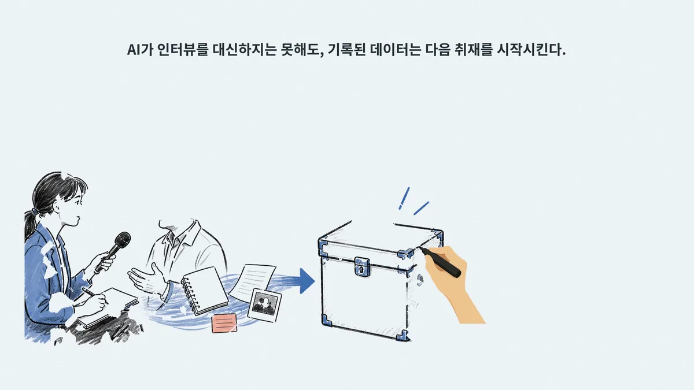
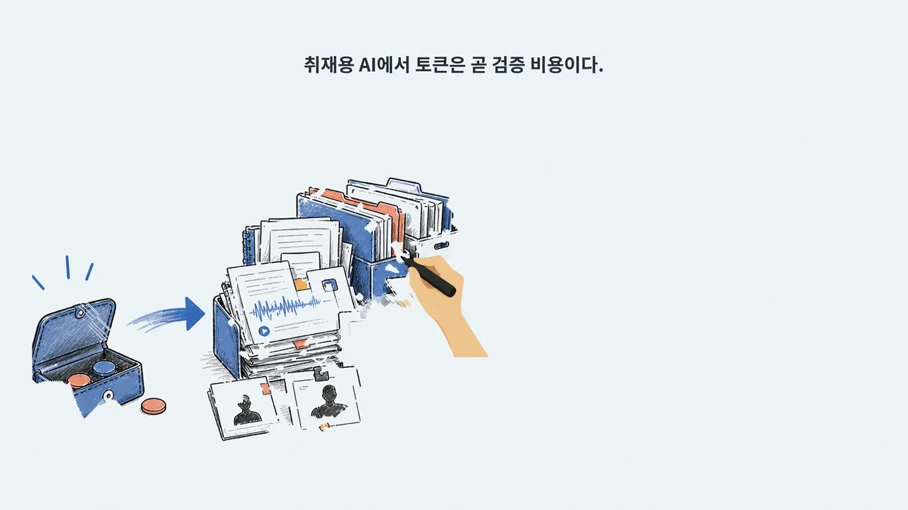
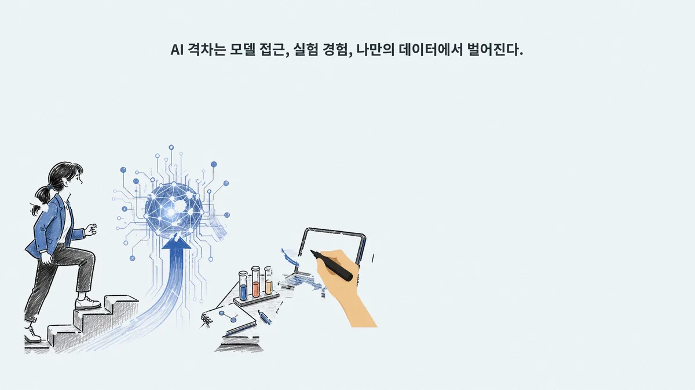

# Video-Production — Achmage 화이트보드 비디오

한국어 마크다운·강의 원고 한 편을 **음성·번인 자막 포함 4K(3840×2160) 화이트보드 강의 영상**으로 만드는 올인원 파이프라인 스킬. 장면별 이미지 생성 → 선 추적(line-trace) 애니메이션 → ElevenLabs/Typecast TTS → 자막 번인 → 시퀀스 병합, 그리고 프리미어식 후반작업용 **편집 패키지 내보내기**까지 한 번에 간다.

> **⚠ Codex CLI 전용.** 이 폴더의 스킬은 Claude 플러그인이 아니다 — 장면 설계와 이미지 생성이 **Codex 네이티브 이미지 도구**에 위임되어 있고, 상태머신이 `nextCodexAction` 필드로 Codex 에게 다음 행동을 지시한다. 그래서 이 리포의 `.claude-plugin/marketplace.json` 에도 **의도적으로 등록하지 않았다.**

## 🎯 무엇을 하나

- **입력**: 강의 노트·튜토리얼 마크다운 1편 (또는 기존 SRT — `import-srt`)
- **출력**: `*-4k-captioned.mp4` (3840×2160 H.264 High / AAC 48kHz, −16 LUFS) + `build-report.json`
- **사람 게이트는 단 1회** — 음성 오디션에서 화자 1명을 고르는 순간뿐. 승인 후에는 이미지 생성부터 최종 병합까지 무승인 자동 진행
- **중단 안전** — `workflow-state.json` 6-state 상태머신 + `resume` 재진입. 완성 파일 덮어쓰기·TTS 재호출 없이 이어간다

## 🖼 Showcase — 실제 산출물

47.5초 오프닝 시퀀스 (opening-001~003 병합, line-trace 모션, `achmage-newsroom-light` 테마, ElevenLabs 음성 + 번인 자막):

▶ **[opening-001-003-master-voiced-line-trace.mp4](examples/opening-001-003-master-voiced-line-trace.mp4)** (53 MB · 4K) · [Pages 직링크](https://laguna821.github.io/Achmage-Skills/Video-Production/examples/opening-001-003-master-voiced-line-trace.mp4)

| | | |
|---|---|---|
|  |  |  |

이미지 모델에는 **한글을 절대 그리게 하지 않는다** (`no text, no letters...` 프롬프트 원칙) — 실제 한글은 번들된 Noto Sans KR 로 로컬 합성하기 때문에 스틸에서 보듯 타이포가 깨지지 않는다.

## ⚙️ 파이프라인 하이라이트

1. `autobuild <원문.md> --project <폴더> --scenes all` — 원고 스테이징 (`--target-minutes` 로 목표 길이)
2. Codex 가 장면 계획·음성 대본·이미지 프롬프트 설계 (`references/scene-schema.md` v2)
3. `tts recommend` → `tts audition` → **★ 유일한 인간 게이트: 화자 선택** → `approve-voice`
4. Codex 네이티브 이미지 생성 + `attach-image` (외부 이미지 API/키 불사용)
5. `resume` — TTS 캐시 합성 · 한글 컴포지팅 · line-trace/marker-wipe 동적 길이 렌더 · 자막 · 4K 병합·검증
6. (선택) `export-edit-package` — 자막 없는 4K + 통합 SRT + 장면별 MP4·SRT + 편집 인덱스 (프리미어 후반작업용, API 재호출 0)

**3중 TTS 비용 보호**: 대본·화자·설정 해시 캐시 재사용 · 승인 시점 비용 상한 잠금(+10% 초과 시 안전 정지) · POST 실패 자동 재시도 금지(중복 과금 방지). API 키는 `ELEVENLABS_API_KEY` / `TYPECAST_API_KEY` **환경변수에서만** 읽는다 — 채팅·JSON·로그·명령행 인수에 키를 쓰지 않으며, 배포 패키지 빌드(`package-skill`)에는 키 패턴·개인 경로 검출 게이트가 내장돼 있다.

## 📁 `achmage-whiteboard-video/` — 패키지 구성

| 항목 | 내용 |
|---|---|
| `SKILL.md` | 오케스트레이터 — 10단계 기본 절차 · 이미지/음성·비용/자막·출력 원칙 · 6-state 상태 처리 · 명령 치트시트 · 완료 기준 |
| `scripts/` | Python 4개, **29 subcommands** — `whiteboard.py` CLI · `whiteboard_core.py` 렌더 엔진 · `tts_core.py` provider/캐시/예산 · `pipeline_core.py` 자막/번인/패키징 |
| `references/` | 6문서 — scene-schema v2 · image-prompts · line-trace · tts · themes · typography |
| `assets/` | Noto Sans KR VF (SIL OFL) · 마커/지우개 핸드 스프라이트 · 로컬 미리보기 편집기 |
| `templates/` · `tests/` | 프로젝트/장면 템플릿 · unittest 27개 (FakeProvider — 라이브 API 콜 0) |
| `setup.cmd` / `setup.ps1` / `setup.sh` | `.venv` 생성(uv 우선) + `requirements.lock` 설치 + `doctor` 환경 검증 |

## 🚀 설치 (Codex CLI)

```bash
git clone https://github.com/laguna821/Achmage-Skills
# 스킬 폴더를 Codex 가 스킬을 읽는 위치에 폴더째 복사
cp -r Achmage-Skills/Video-Production/achmage-whiteboard-video <codex-skills-dir>/achmage-whiteboard-video
cd <codex-skills-dir>/achmage-whiteboard-video
./setup.sh        # Windows: setup.cmd
```

API 키는 사용자 환경변수로만 (Windows PowerShell `SecureString` 절차는 `references/tts.md` 참조 — 설정 후 Codex 앱 재시작):

```text
ELEVENLABS_API_KEY   # 또는
TYPECAST_API_KEY
```

호출 (`agents/openai.yaml`):

```text
Use $achmage-whiteboard-video to turn this Korean markdown into a captioned and voiced 4K whiteboard lecture.
```

## License

- **Skill (`achmage-whiteboard-video/`)**: MIT — [geeklee/srt-whiteboard-animation](https://github.com/geeklee/srt-whiteboard-animation) 파생. 원 저작권 고지는 `LICENSE`, 파생 내역은 `NOTICE` — **재배포 시 두 파일 동반 필수**
- **폰트 (`assets/fonts/NotoSansKR-VF.ttf`)**: SIL OFL 1.1 (`assets/fonts/OFL.txt`)
- **Repo / showcase**: Apache-2.0 (루트 `LICENSE`) · 쇼케이스 영상: 안창현 (Achmage), 2026
